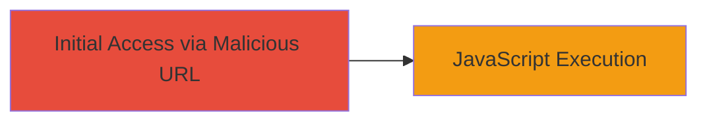

---
tags:
  - xss
  - reflected-xss
  - imgur
  - web-vulnerability
type: attack_chain
tools: []
tactics:
  - '[[Initial Access]]'
commands: []
platforms:
  - Web
complexity: low
procedures:
  - >-
    [[procedures/Exploit-Reflected-XSS-via-Username-Parameter-in-Imgur-Mobile-Site]]
step_count: 1
techniques:
  - '[[Drive-by Compromise]]'
description: >-
  A single-stage attack exploiting a reflected XSS vulnerability in the Imgur
  mobile site's user message page via an unsanitized username parameter,
  allowing JavaScript execution in victims' browsers.
skill_level: beginner
impact_level: medium
id: 5a388aa4-e828-469e-b7bf-cb98c7d321e7
created_at: '2025-12-14T17:24:39.247Z'
updated_at: '2025-12-14T17:24:39.247Z'
verified: false
validated: true
submitted: true
mitre_tactics:
  - '[[Initial Access]]'
mitre_techniques:
  - '[[Drive-by Compromise]]'
---
# Reflected XSS in Imgur Mobile User Message Page

Multi-stage attack chain demonstrating a complete attack workflow.

## Chain Metrics Dashboard

| Metric | Value |
|--------|-------|
| Chain Status | Unverified |
| Total Steps | 1 |
| Execution Time | ~1 minute |
| Skill Level | Beginner |
| Complexity | Low |
| Impact Level | Medium |

## Attack Flow Visualization

## Prerequisites & Requirements

### Required Tools

- Web browser (e.g., Chrome, Firefox)

### Target Environment

- Target: m.imgur.com mobile site
- Required services/ports: HTTP/HTTPS on port 80/443
- Network access requirements: Internet connectivity

### Initial Access Requirements

- No credentials required
- Victim must visit the malicious URL
- No prior access needed

## Detailed Attack Procedures

### Step 1: Trigger XSS Payload via Malicious URL
procedure: [[procedures/Exploit-Reflected-XSS-via-Username-Parameter-in-Imgur-Mobile-Site]]

**Objective**: Inject and execute arbitrary JavaScript in the victim's browser by crafting a malicious URL targeting the unsanitized username parameter in the Imgur mobile user message page.

**Instructions**: Construct the malicious URL by appending an encoded XSS payload to the username segment of the /user/<username>/message path. For example, use the payload "> encoded as %22%3E%3Cimg%20src=x%20onerror=alert(1)%3E. The full URL becomes http://m.imgur.com/user/%22%3E%3Cimg%20src=x%20onerror=alert(1)%3E/message. Have the victim navigate to this URL in their web browser.

**Expected Output**: Upon loading the page, the payload decodes and injects into the reflected username field, triggering the onerror event and executing alert(1), displaying a popup in the browser.

**Success Indicators**:
- JavaScript alert popup appears
- Browser console shows no sanitization errors; payload executes without blocking

## Attack Chain Summary

### Key Achievements

1. Successful injection of HTML/JavaScript via URL parameter
2. Arbitrary code execution in victim's browser context
3. Potential for session cookie theft or phishing if payload is modified

## Technique & Tactic Coverage

### MITRE ATT&CK Techniques

- [[Drive-by Compromise]]

### MITRE ATT&CK Tactics

- [[Initial Access]]

---
*Last updated: 2023-10-01*
