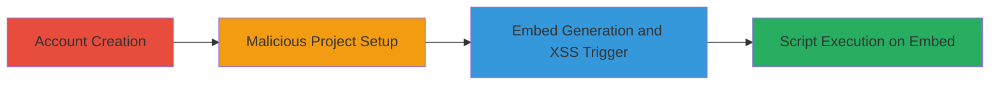

---
tags:
  - xss
  - reflected-xss
  - infogram
  - javascript-injection
  - embed-exploit
type: attack_chain
tools: []
tactics:
  - '[[Execution]]'
verified: false
platforms:
  - Web
submitted: true
complexity: medium
created_at: '2024-01-01T12:00:00Z'
procedures:
  - '[[procedures/Create-Infogram-Account]]'
  - '[[procedures/Create-Infogram-Project-with-Malicious-Title]]'
  - '[[procedures/Generate-Infogram-Share-Embed-to-Trigger-XSS]]'
step_count: 3
techniques:
  - '[[JavaScript]]'
updated_at: '2025-12-14T03:16:14.303Z'
description: >-
  A multi-step attack exploiting a reflected XSS vulnerability in Infogram's
  project sharing feature by injecting malicious JavaScript into the project
  title, which is then rendered unsanitized in the embed code, allowing
  execution on embedding pages.
skill_level: intermediate
impact_level: high
id: 129a6b53-a148-46b2-a0fb-f589a05426c8
validated: true
mitre_tactics:
  - '[[Execution]]'
mitre_techniques:
  - '[[JavaScript]]'
---
# Reflected XSS in Infogram Project Embed via Unsanitized Title

Multi-stage attack chain demonstrating a complete attack workflow exploiting a reflected Cross-Site Scripting (XSS) vulnerability in Infogram's project sharing feature. An attacker creates an account, crafts a project with a malicious title containing JavaScript, and generates an embed code that inserts the title without sanitization into HTML attributes and text, enabling script execution when the embed is loaded on a third-party page. This can mislead users into believing Infogram is malicious, damaging brand trust.

## Chain Metrics Dashboard

| Metric | Value |
|--------|-------|
| Chain Status | Unverified |
| Total Steps | 3 |
| Execution Time | ~5 minutes |
| Skill Level | Intermediate |
| Complexity | Medium |
| Impact Level | High |

## Attack Flow Visualization

## Prerequisites & Requirements

### Required Tools

- Web browser (e.g., Chrome, Firefox)

### Target Environment

- Infogram web platform (https://infogram.com)
- No specific services/ports required beyond standard HTTPS (443)
- Internet access for account creation and project management

### Initial Access Requirements

- No prior credentials needed; free account registration suffices
- Valid email for verification
- No special network position required

## Detailed Attack Procedures

### Step 1: Account Creation
procedure: [[procedures/Create-Infogram-Account]]

**Objective**: Gain access to Infogram's project creation features by registering a new user account.

**Instructions**: Navigate to the Infogram website and complete the standard registration process using an email address and password. Verify the account via email if prompted.

**Expected Output**: Successful login to the Infogram dashboard, enabling project creation.

**Success Indicators**:
- Dashboard accessible
- Project creation option available

### Step 2: Malicious Project Setup
procedure: [[procedures/Create-Infogram-Project-with-Malicious-Title]]

**Objective**: Create a new project and set its title to a payload that includes executable JavaScript, such as a script tag.

**Instructions**: From the dashboard, initiate a new project (e.g., a simple chart or infographic) and enter the malicious title '' in the title field. Save the project.

**Expected Output**: Project saved with the injected title, ready for sharing.

**Success Indicators**:
- Project title reflects the malicious input without immediate error
- Project details viewable in the dashboard

### Step 3: Embed Generation and XSS Trigger
procedure: [[procedures/Generate-Infogram-Share-Embed-to-Trigger-XSS]]

**Objective**: Generate the share embed code, which inserts the unsanitized title into HTML, allowing XSS execution when embedded elsewhere.

**Instructions**: Select the share option for the project, choose the embed code generation, and copy the provided snippet. The embed will include the title in attributes like data-title and as text in an <a> tag, e.g., . Paste this embed into an HTML file or third-party page and load it in a browser.

**Expected Output**: When the embedding page loads, the JavaScript alert(1) executes, confirming XSS.

**Success Indicators**:
- Alert box pops up on embed load
- Browser console shows script execution without errors

## Attack Chain Summary

### Key Achievements

1. Successful account creation for access
2. Injection of malicious JavaScript via project title
3. Generation of exploitable embed code leading to arbitrary JS execution on victim pages

## Technique & Tactic Coverage

### MITRE ATT&CK Techniques

- [[JavaScript]]

### MITRE ATT&CK Tactics

- [[Execution]]

---
*Last updated: 2024-01-01T12:00:00Z*
