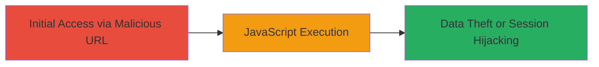

# Reflected XSS in JWT Parameter for Arbitrary JavaScript Execution on inDrive

Multi-stage attack chain demonstrating a complete attack workflow.

## Chain Metrics Dashboard

| Metric | Value |
|--------|-------|
| Chain Status | Unverified |
| Total Steps | 1 |
| Execution Time | ~1 minute |
| Skill Level | Beginner |
| Complexity | Low |
| Impact Level | High |

## Attack Flow Visualization



## Prerequisites & Requirements

### Required Tools

- Web browser (e.g., Chrome, Firefox)

### Target Environment

- Web platform
- Access to https://watchdocs.indriverapp.com
- No specific ports or services required beyond standard HTTPS (443)

### Initial Access Requirements

- Ability to trick a victim into accessing the crafted URL (e.g., via phishing email or social engineering)
- No prior credentials needed
- Network access to the public internet

## Detailed Attack Procedures

### Step 1: Craft and Deliver Malicious URL
procedure: [[procedures/Exploit-Reflected-XSS-in-JWT-Parameter]]

**Objective**: Inject a malicious payload into the JWT parameter to trigger reflected XSS, leading to arbitrary JavaScript execution in the victim's browser.

**Instructions**: Construct a URL targeting the vulnerable endpoint with an encoded XSS payload in the jwt parameter. The payload breaks out of the expected string context and injects an HTML element with an onerror handler to execute JavaScript.

Example crafted URL:

```url
https://watchdocs.indriverapp.com/webview/v1/transport-change?phone=██████&token=█████████&service=intercity3&jwt=fw%22%3E%3Cimg%20src=fwa%20onerror=alert(1)%3E
```

Send this URL to the victim via email, link shortening, or direct access in a controlled environment. Upon access, the server reflects the unsanitized jwt parameter into the page, executing the payload.

**Expected Output**: An alert box pops up displaying "1" in the victim's browser, confirming JavaScript execution. In a real attack, replace alert(1) with code to steal cookies or session data.

**Success Indicators**:
- Alert box or console log appears in the browser
- JavaScript executes without errors (verifiable via browser dev tools)
- Potential theft of sensitive data like session tokens

## Attack Chain Summary

### Key Achievements

1. Successful injection and reflection of XSS payload via JWT parameter
2. Arbitrary JavaScript execution in the context of the victim's session
3. Potential for session hijacking or data exfiltration from the inDrive webview

## Technique & Tactic Coverage

### MITRE ATT&CK Techniques

- [[JavaScript]]

### MITRE ATT&CK Tactics

- [[Initial Access]]
- [[Execution]]
- [[Collection]]

---
*Last updated: 2023-10-01T00:00:00Z*
