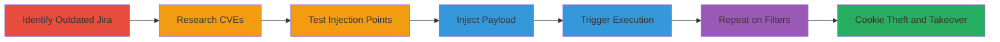

# Reflected XSS in Jira Issue Collector for Roblox Cookie Theft

Multi-stage attack chain demonstrating exploitation of a reflected XSS vulnerability in the Jira issue collector on jira.roblox.com, leading to cookie theft and potential account takeover.

## Chain Metrics Dashboard

| Metric | Value |
|--------|-------|
| Chain Status | Unverified |
| Total Steps | 6 |
| Execution Time | ~15 minutes |
| Skill Level | Intermediate |
| Complexity | Medium |
| Impact Level | High |

## Attack Flow Visualization

## Prerequisites & Requirements

### Required Tools

- Web browser (e.g., Chrome with developer tools)

### Target Environment

- Web platform
- Jira service running version 7.6.3 or vulnerable equivalent
- Public access to jira.roblox.com or similar instance

### Initial Access Requirements

- No credentials required
- Direct network access to the target Jira instance
- No prior access needed; attack is external

## Detailed Attack Procedures

### Step 1: Identify Outdated Jira Version
procedure: [[procedures/Identify-Outdated-Jira-Version]]

**Objective**: Determine if the target Jira instance is running a vulnerable version.

**Instructions**: Navigate to the Jira instance and inspect for version information, typically found in the footer or via browser developer tools.

**Expected Output**: Confirmation of Jira version 7.6.3.

**Success Indicators**:
- Version identified as outdated (pre-7.9.0 for CVE-2018-5230)
- Access to issue collector endpoints confirmed

### Step 2: Research CVEs for Jira Version
procedure: [[procedures/Research-CVEs-for-Jira-Version]]

**Objective**: Identify known vulnerabilities applicable to the detected version.

**Instructions**: Use public CVE databases to search for issues in Jira 7.6.3, focusing on XSS-related entries.

**Expected Output**: Discovery of CVE-2018-5230 detailing reflected XSS in issue collector.

**Success Indicators**:
- Relevant CVE found with exploitation details
- Confirmation of XSS vulnerability type

### Step 3: Test Jira Issue Collector for XSS
procedure: [[procedures/Test-Jira-Issue-Collector-for-XSS]]

**Objective**: Locate injectable input fields in the issue collector interface.

**Instructions**: Access search endpoints like https://jira.roblox.com/issues/?filter=-8 and explore fields such as 'Updated Date' for potential injection points.

**Expected Output**: Identification of vulnerable inputs like 'More than [] minutes ago' or range fields.

**Success Indicators**:
- Input fields that reflect user input without sanitization
- No immediate blocking on basic payloads

### Step 4: Inject XSS Payload into Search Filters
procedure: [[procedures/Inject-XSS-Payload-into-Search-Filters]]

**Objective**: Bypass filters and insert JavaScript payload for execution.

**Instructions**: Enter payloads such as `<iframe src='//google.com'></iframe>` into vulnerable fields, using single quotes to evade double-quote escaping.

**Expected Output**: Payload accepted without error.

**Success Indicators**:
- Payload injection successful
- No filter rejection observed

### Step 5: Trigger XSS Payload Execution
procedure: [[procedures/Trigger-XSS-Payload-Execution]]

**Objective**: Cause the injected payload to reflect and execute in the browser.

**Instructions**: Click the 'Update' button on the search form to process the input and trigger reflection.

**Expected Output**: JavaScript execution, e.g., iframe loading or alert popping.

**Success Indicators**:
- Payload executes, confirming XSS
- Potential for cookie access via document.cookie

### Step 6: Repeat Exploitation on Additional Filters
procedure: [[procedures/Repeat-Exploitation-on-Additional-Filters]]

**Objective**: Expand the attack surface by targeting multiple endpoints.

**Instructions**: Apply the same injection technique to other filters like https://jira.roblox.com/issues/?filter=-7 and -6.

**Expected Output**: Successful exploitation across endpoints.

**Success Indicators**:
- Multiple injection points confirmed vulnerable
- Broader impact potential

## Attack Chain Summary

### Key Achievements

1. Identified and confirmed outdated Jira version vulnerable to XSS.
2. Exploited reflected XSS to execute arbitrary JavaScript.
3. Enabled cookie theft from roblox.com subdomains, leading to account takeover risks.

## Technique & Tactic Coverage

### MITRE ATT&CK Techniques

- [[JavaScript]]
- [[Drive-by Compromise]]

### MITRE ATT&CK Tactics

- [[Initial Access]]
- [[Execution]]
- [[Collection]]

---
*Last updated: 2023-10-01T00:00:00Z*
