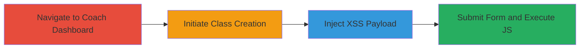

# Reflected XSS in Khan Academy Class Title for Self-JavaScript Execution

Multi-stage attack chain demonstrating a complete attack workflow exploiting a reflected Cross-Site Scripting (XSS) vulnerability in the Khan Academy web application.

## Chain Metrics Dashboard

| Metric | Value |
|--------|-------|
| Chain Status | Unverified |
| Total Steps | 4 |
| Execution Time | ~2 minutes |
| Skill Level | Beginner |
| Complexity | Low |
| Impact Level | Low |

## Attack Flow Visualization

## Prerequisites & Requirements

### Required Tools

- Web browser (e.g., Chrome, Firefox)

### Target Environment

- Khan Academy web application
- Authenticated teacher/coach account
- Access to '/coach/roster/' endpoint

### Initial Access Requirements

- Valid Khan Academy login credentials for a coach/teacher role
- Direct network access to khanacademy.org
- No prior access needed beyond authentication

## Detailed Attack Procedures

### Step 1: Navigate to Manage Students Section
procedure: [[procedures/Inject-Malicious-Payload-in-Class-Title]]

**Objective**: Access the coach dashboard to reach the student management area where class creation is available.

**Instructions**: Log in to Khan Academy with coach credentials, then navigate to the 'Coach' section and select 'Manage students' from the dashboard menu.

**Expected Output**: Arrival at the student management interface, typically under '/coach' paths.

**Success Indicators**:
- Coach dashboard loads successfully
- 'Manage students' option is visible and clickable

### Step 2: Initiate Class Creation
procedure: [[procedures/Inject-Malicious-Payload-in-Class-Title]]

**Objective**: Trigger the class creation form to expose the vulnerable title input field.

**Instructions**: In the 'Manage students' section, click on 'Create your first class' or the equivalent option to open the form at '/coach/roster/'.

**Expected Output**: The class creation form appears with fields for class title and other details.

**Success Indicators**:
- Form loads without errors
- Title input field is present and editable

### Step 3: Inject Malicious Payload in Title Field
procedure: [[procedures/Inject-Malicious-Payload-in-Class-Title]]

**Objective**: Insert a JavaScript payload into the unsanitized class title field to break out of the HTML context.

**Instructions**: In the class title input field, enter the payload: `'>'`. This payload closes any open HTML tags and injects an image element that executes JavaScript on error.

**Expected Output**: The payload is accepted in the field without immediate validation errors.

**Success Indicators**:
- Payload text is entered and visible in the form
- No client-side sanitization blocks the input

### Step 4: Submit Form to Trigger Execution
procedure: [[procedures/Inject-Malicious-Payload-in-Class-Title]]

**Objective**: Submit the form to reflect the payload in the response, causing JavaScript execution in the current browser session.

**Instructions**: Fill any required fields if needed, then click 'Create class' to submit the form.

**Expected Output**: The response page renders the injected payload, triggering the `prompt(0)` dialog box, confirming JavaScript execution.

**Success Indicators**:
- Alert or prompt box appears immediately after submission
- JavaScript executes only in the attacker's browser (self-XSS confirmed)

## Attack Chain Summary

### Key Achievements

1. Successful navigation to the vulnerable class creation form
2. Injection and reflection of XSS payload in the title field
3. Limited JavaScript execution demonstrating the vulnerability, though confined to self-XSS without persistence or impact on other users

## Technique & Tactic Coverage

### MITRE ATT&CK Techniques

- [[JavaScript]]

### MITRE ATT&CK Tactics

- [[Execution]]

---
*Last updated: 2023-10-01T00:00:00Z*
