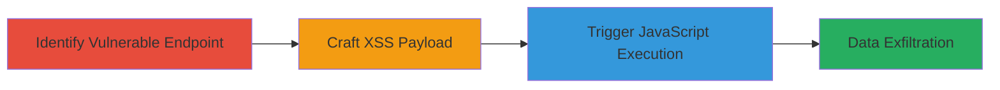

# Reflected XSS in Khan Academy Flash SWF via iceID Parameter

Multi-stage attack chain demonstrating exploitation of a cross-site scripting (XSS) vulnerability in a Flash SWF file, allowing arbitrary JavaScript execution to steal session data or perform other client-side attacks.

## Chain Metrics Dashboard

| Metric | Value |
|--------|-------|
| Chain Status | Unverified |
| Total Steps | 3 |
| Execution Time | ~5 minutes |
| Skill Level | Intermediate |
| Complexity | Medium |
| Impact Level | High |

## Attack Flow Visualization

## Prerequisites & Requirements

### Required Tools

- Web browser with Adobe Flash enabled (e.g., older Chrome or Firefox versions supporting Flash)

### Target Environment

- Web platform
- Adobe Flash Player installed and enabled
- Access to http://smarthistory.khanacademy.org subdomain

### Initial Access Requirements

- No credentials required
- Direct network access to the target URL
- No prior access needed; publicly accessible

## Detailed Attack Procedures

### Step 1: Identify Vulnerable Endpoint
procedure: [[procedures/Identify-Vulnerable-Flash-SWF-Endpoint]]

**Objective**: Locate the Flash SWF file and identify the injectable 'iceID' parameter to prepare for payload injection.

**Instructions**: Manually examine the target site's assets for Flash files. Navigate to or inspect http://smarthistory.khanacademy.org/assets/flash/cozimo.swf and test the 'iceID' parameter by appending simple inputs to observe behavior.

**Expected Output**: Confirmation that 'iceID' is processed by the SWF without sanitization, allowing string context manipulation.

**Success Indicators**:
- SWF file loads with parameter visible in URL
- Basic input in 'iceID' alters Flash behavior without errors

### Step 2: Craft XSS Payload
procedure: [[procedures/Craft-XSS-Payload-for-Flash-iceID]]

**Objective**: Develop a payload that escapes the string context in the Flash application's JavaScript handling to execute arbitrary code.

**Instructions**: Construct the payload to close open strings and invoke a try-catch block for JavaScript execution. Use URL-encoded form: %5C%22%29%29%7Dcatch%28e%29%7Balert%28%27XSS%27%29;%7D// which decodes to \"'))}catch(e){alert('XSS');}//.

**Expected Output**: Payload that, when injected, breaks out and executes alert('XSS') upon SWF loading in a Flash-enabled browser simulator or tool.

**Success Indicators**:
- Payload decodes correctly and syntax is valid for Flash JS context
- Test in a local Flash environment shows execution without crashes

### Step 3: Trigger Vulnerability
procedure: [[procedures/Trigger-Flash-XSS-by-Loading-Malicious-URL]]

**Objective**: Load the malicious URL to execute the XSS payload, demonstrating JavaScript control in the victim's browser.

**Instructions**: Open the full URL http://smarthistory.khanacademy.org/assets/flash/cozimo.swf?iceID=%5C%22%29%29%7Dcatch%28e%29%7Balert%28%27XSS%27%29;%7D// in a browser with Flash enabled. Observe the alert box popping up.

**Expected Output**: JavaScript alert('XSS') executes immediately upon SWF loading.

**Success Indicators**:
- Alert dialog appears confirming JS execution
- Browser console shows no Flash errors; payload runs client-side

## Attack Chain Summary

### Key Achievements

1. Identified unsanitized 'iceID' parameter in legacy Flash SWF
2. Escaped string context to inject and execute JavaScript via try-catch
3. Demonstrated potential for session hijacking or data theft in Flash-enabled environments

## Technique & Tactic Coverage

### MITRE ATT&CK Techniques

- [[JavaScript]]

### MITRE ATT&CK Tactics

- [[Initial Access]]
- [[Execution]]
- [[Collection]]

---
*Last updated: 2023-10-01T00:00:00Z*
