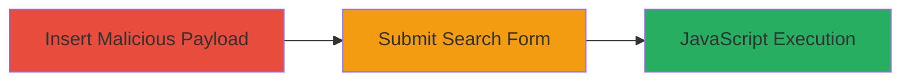

---
tags:
  - xss
  - reflected-xss
  - web-vulnerability
type: attack_chain
tools: []
tactics:
  - '[[Execution]]'
  - '[[Collection]]'
verified: false
platforms:
  - Web
submitted: true
complexity: low
created_at: '2024-01-01T12:00:00Z'
procedures:
  - '[[procedures/Exploit-Reflected-XSS-in-Search-Parameter]]'
step_count: 2
techniques:
  - '[[Exploit Public-Facing Application]]'
  - '[[JavaScript]]'
updated_at: '2025-12-14T03:47:12.590Z'
description: >-
  A multi-step attack chain exploiting a reflected XSS vulnerability in the
  search functionality of the Khan Academy Turkish website, allowing arbitrary
  JavaScript execution in victims' browsers.
skill_level: beginner
impact_level: high
id: b9f03ff7-3c6c-4b97-8ab9-5a43c8fb37c2
validated: true
mitre_tactics:
  - '[[Execution]]'
  - '[[Collection]]'
mitre_techniques:
  - '[[Exploit Public-Facing Application]]'
  - '[[JavaScript]]'
---
# Reflected XSS in Khan Academy Turkish Search via page_search_query Parameter

Multi-stage attack chain demonstrating a complete attack workflow for exploiting reflected XSS in the search functionality.

## Chain Metrics Dashboard

| Metric | Value |
|--------|-------|
| Chain Status | Unverified |
| Total Steps | 2 |
| Execution Time | ~1 minutes |
| Skill Level | Beginner |
| Complexity | Low |
| Impact Level | High |

## Attack Flow Visualization

## Prerequisites & Requirements

### Required Tools

- Web browser (e.g., Chrome, Firefox)

### Target Environment

- Web platform
- Access to www.khanacademy.org.tr
- No specific ports or services required beyond HTTP/HTTPS

### Initial Access Requirements

- Public internet access
- No credentials needed
- Victim must visit the search page

## Detailed Attack Procedures

### Step 1: Navigate and Insert Payload
procedure: [[procedures/Exploit-Reflected-XSS-in-Search-Parameter]]

**Objective**: Access the search page and inject a malicious payload into the page_search_query parameter to break out of the input attribute.

**Instructions**: Open a web browser and navigate to https://www.khanacademy.org.tr/arama.asp. Locate the search input field in the form that submits via POST to /arama.asp. Manually enter the payload `"--!><Svg/OnLoad=(confirm)(/xss/)>" into the search box. This payload uses quote breakout and an SVG element to execute JavaScript on load.

**Expected Output**: The payload is accepted without sanitization, setting up for reflection on submission.

**Success Indicators**:
- Payload entered successfully in the input field
- No immediate errors or blocking

### Step 2: Submit Form to Trigger XSS
procedure: [[procedures/Exploit-Reflected-XSS-in-Search-Parameter]]

**Objective**: Submit the form to reflect the unsanitized payload in the HTML response, executing arbitrary JavaScript in the browser.

**Instructions**: Submit the search form. The server reflects the input as <input ... value="\"--!><Svg/OnLoad=(confirm)(/xss/)>" ...>, allowing the SVG onload to trigger a confirm dialog displaying "xss".

**Expected Output**: A browser confirm dialog pops up with "xss", confirming JavaScript execution.

**Success Indicators**:
- Alert or confirm dialog appears
- Arbitrary script executes without errors

## Attack Chain Summary

### Key Achievements

1. Successful payload injection into search parameter
2. Reflection and execution of JavaScript via attribute breakout
3. Demonstration of potential for session hijacking or defacement

## Technique & Tactic Coverage

### MITRE ATT&CK Techniques

- [[Exploit Public-Facing Application]]
- [[JavaScript]]

### MITRE ATT&CK Tactics

- [[Execution]]
- [[Collection]]

---
*Last updated: 2024-01-01T12:00:00Z*
