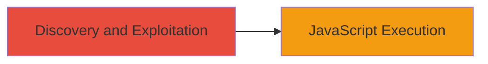

# Reflected XSS in LINE Recruitment Portal via companyNm Parameter

Multi-stage attack chain demonstrating a complete attack workflow.

## Chain Metrics Dashboard

| Metric | Value |
|--------|-------|
| Chain Status | Unverified |
| Total Steps | 1 |
| Execution Time | ~1 minutes |
| Skill Level | Beginner |
| Complexity | Low |
| Impact Level | Low |

## Attack Flow Visualization



## Prerequisites & Requirements

### Required Tools

- Web browser (e.g., Chrome with Developer Tools)

### Target Environment

- Web platform
- Access to the recruitment portal at https://recruit.linepluscorp.com/
- No specific services or ports required beyond standard HTTP/HTTPS

### Initial Access Requirements

- Public internet access
- No credentials needed for the vulnerable endpoint

## Detailed Attack Procedures

### Step 1: Discovery and Exploitation
procedure: [[procedures/Exploit-Reflected-XSS-in-Query-Parameter]]

**Objective**: Identify the reflected XSS vulnerability in the 'companyNm' query parameter and execute arbitrary JavaScript code on the client side.

**Instructions**: Navigate to the recruitment portal and append a malicious payload to the 'companyNm' query parameter. For example, use the browser address bar or a tool like curl to craft the URL:

First, test with a simple alert payload using [[commands/curl-xss-test]]:

```bash
curl "https://recruit.linepluscorp.com/?companyNm=%3Cscript%3Ealert%28%27XSS%27%29%3C%2Fscript%3E"
```

Observe the response in the browser; if the parameter is reflected unsanitized, the script will execute, popping an alert. In a real browser session, load the URL directly to trigger client-side execution.

**Expected Output**: The page loads with the injected JavaScript executing, such as an alert box displaying 'XSS' or any custom payload (e.g., for cookie theft: `alert(document.cookie)`).

**Success Indicators**:
- JavaScript alert or console log appears
- Reflected input visible in the page source without escaping

## Attack Chain Summary

### Key Achievements

1. Successful identification of unsanitized query parameter reflection
2. Arbitrary JavaScript execution on the victim’s browser
3. Demonstration of low-severity impact leading to potential phishing or session hijacking

## Technique & Tactic Coverage

### MITRE ATT&CK Techniques

- [[JavaScript]]

### MITRE ATT&CK Tactics

- [[Execution]]

---
*Last updated: 2024-10-01T00:00:00Z*
