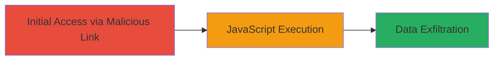

# Reflected XSS in Lark Suite Login via redirect_uri Parameter

Multi-stage attack chain demonstrating a complete attack workflow exploiting a reflected XSS vulnerability in the Lark Suite login endpoint.

## Chain Metrics Dashboard

| Metric | Value |
|--------|-------|
| Chain Status | Unverified |
| Total Steps | 1 |
| Execution Time | ~1 minutes |
| Skill Level | Intermediate |
| Complexity | Low |
| Impact Level | High |

## Attack Flow Visualization



## Prerequisites & Requirements

### Required Tools

- Browser developer tools for payload testing

### Target Environment

- Web platform
- Access to Lark Suite login endpoint (e.g., https://open.larksuite.com/authen/login)
- No specific ports or services beyond standard HTTPS (443)

### Initial Access Requirements

- Ability to craft and deliver a malicious URL to the victim (e.g., via phishing email or social engineering)
- Victim must be a user of Lark Suite and interact with the login flow
- No prior credentials needed, but victim authentication context enables session hijacking

## Detailed Attack Procedures

### Step 1: Exploit Reflected XSS
procedure: [[procedures/Exploit-Reflected-XSS-in-redirect_uri]]

**Objective**: Inject malicious JavaScript via the redirect_uri parameter to execute arbitrary code in the victim's browser during the login process, potentially stealing session tokens or cookies.

**Instructions**: Craft a malicious URL by appending a JavaScript payload to the redirect_uri parameter in the Lark Suite login endpoint. For example, use a payload like javascript:alert(document.cookie) to test for XSS. Deliver the URL to the victim, who will click it and be redirected to the login page, triggering the reflection.

```url
https://open.larksuite.com/authen/login?redirect_uri=javascript:alert('XSS%20Test')
```

Monitor the victim's browser for execution. In a real attack, replace the alert with code to exfiltrate data, such as sending cookies to an attacker-controlled server.

**Expected Output**: Upon clicking the link and reaching the login page, the payload executes, displaying an alert or performing the intended action (e.g., data theft).

**Success Indicators**:
- JavaScript alert or payload execution observed in the browser
- Victim's cookies or session data captured by the attacker

## Attack Chain Summary

### Key Achievements

1. Successful injection of unsanitized user input into the redirect_uri parameter
2. Execution of arbitrary JavaScript in the context of the Lark Suite domain
3. Potential for session hijacking or sensitive data theft without direct server access

## Technique & Tactic Coverage

### MITRE ATT&CK Techniques

- [[JavaScript]]

### MITRE ATT&CK Tactics

- [[Execution]]
- [[Collection]]

---
*Last updated: 2023-10-01T00:00:00Z*
