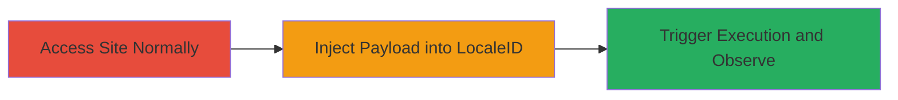

---
tags:
  - xss
  - reflected-xss
  - javascript-injection
  - teavana
  - demandware
type: attack_chain
tools: []
tactics:
  - '[[Execution]]'
  - '[[Collection]]'
commands:
  - '[[commands/send-xss-payload-to-locale-change-endpoint]]'
verified: false
platforms:
  - Web
submitted: true
complexity: medium
created_at: '2023-10-01T00:00:00Z'
procedures:
  - '[[procedures/Access-Teavana-Website-to-Establish-Session]]'
  - '[[procedures/Inject-XSS-Payload-into-LocaleID-Parameter]]'
  - '[[procedures/Trigger-and-Observe-XSS-Execution]]'
step_count: 3
techniques:
  - '[[JavaScript]]'
updated_at: '2025-12-14T03:47:18.064Z'
description: >-
  A multi-step attack exploiting a reflected XSS vulnerability in the LocaleID
  parameter of the Locale-Change endpoint on teavana.com, allowing arbitrary
  JavaScript execution to steal cookies or perform redirects.
skill_level: intermediate
impact_level: high
id: 51f92cf3-959c-4337-bf6f-91ca82d38b95
validated: true
mitre_tactics:
  - '[[Execution]]'
  - '[[Collection]]'
mitre_techniques:
  - '[[JavaScript]]'
---
---
id: 123e4567-e89b-12d3-a456-426614174000
name: Reflected XSS in LocaleID Parameter Leading to JavaScript Execution on Teavana.com
type: attack_chain
description: A multi-step attack exploiting a reflected XSS vulnerability in the LocaleID parameter of the Locale-Change endpoint on teavana.com, allowing arbitrary JavaScript execution to steal cookies or perform redirects.
verified: false
submitted: false
step_count: 3
created_at: 2023-10-01T00:00:00Z
updated_at: 2023-10-01T00:00:00Z
procedures: [[procedures/Access-Teavana-Website-to-Establish-Session]], [[procedures/Inject-XSS-Payload-into-LocaleID-Parameter]], [[procedures/Trigger-and-Observe-XSS-Execution]]
techniques: [[JavaScript]]
tactics: [[Execution]], [[Collection]]
tags: xss, reflected-xss, javascript-injection, teavana, demandware
platforms: Web
tools: []
---

# Reflected XSS in LocaleID Parameter Leading to JavaScript Execution on Teavana.com

Multi-stage attack chain demonstrating a complete attack workflow exploiting reflected XSS on teavana.com.

## Chain Metrics Dashboard

| Metric | Value |
|--------|-------|
| Chain Status | Unverified |
| Total Steps | 3 |
| Execution Time | ~2 minutes |
| Skill Level | Intermediate |
| Complexity | Medium |
| Impact Level | High |

## Attack Flow Visualization



## Prerequisites & Requirements

### Required Tools

- Browser (e.g., Chrome, Firefox)
- HTTP client like curl or Burp Suite for crafting requests

### Target Environment

- Web platform
- Demandware (Salesforce Commerce Cloud) backend
- JavaScript-enabled browser

### Initial Access Requirements

- Public internet access to teavana.com
- No authentication required
- Valid session cookie from initial site visit

## Detailed Attack Procedures

### Step 1: Access Teavana Website to Establish Session
procedure: [[procedures/Access-Teavana-Website-to-Establish-Session]]

**Objective**: Visit the main teavana.com site to establish a browser session and cookie context, which is necessary for the XSS payload to execute in the correct context.

**Instructions**: Open a web browser and navigate to the homepage of teavana.com. This step sets up the session without any malicious activity.

**Expected Output**: The homepage loads normally, and browser developer tools (F12) show any session cookies being set.

**Success Indicators**:
- Site loads without errors
- Session cookies (e.g., for locale or tracking) are present in browser storage

### Step 2: Inject XSS Payload into LocaleID Parameter
procedure: [[procedures/Inject-XSS-Payload-into-LocaleID-Parameter]]

**Objective**: Craft a malicious GET request to the Locale-Change endpoint, injecting a JavaScript payload into the LocaleID parameter before the required '_CA' suffix to break out of the reflected JavaScript string.

**Instructions**: Use an HTTP client to send a GET request to the Locale-Change endpoint. The payload 'eas%27;alert(1);//dasdsan_CA' injects ';alert(1);// before '_CA', where %27 is URL-encoded single quote.

Execute [[commands/send-xss-payload-to-locale-change-endpoint]]:

```bash
curl -X GET "https://www.teavana.com/on/demandware.store/Sites-Teavana-Site/default/Locale-Change?LocaleID=eas%27;alert(1);//dasdsan_CA" -v
```

**Expected Output**: HTTP 200 response containing a script tag with the reflected payload, such as var uri = 'https:///on/demandware.store/Sites-StarbucksCA-Site/eas';alert(1);//dasdsan_CA/Home-Show';

**Success Indicators**:
- Payload reflected unescaped in response
- No server-side validation errors

### Step 3: Trigger and Observe XSS Execution
procedure: [[procedures/Trigger-and-Observe-XSS-Execution]]

**Objective**: Visit the malicious URL in a browser after initial site access to trigger JavaScript execution, demonstrating the vulnerability's impact like cookie theft.

**Instructions**: After sending the request, visit the full malicious URL in the browser where the session was established. Monitor the browser console or use developer tools to observe execution.

**Expected Output**: An alert box pops up with '1' (from alert(1)), or in a real attack, document.cookie could be exfiltrated.

**Success Indicators**:
- JavaScript executes (e.g., alert triggers)
- Arbitrary code runs in victim's browser context
- Cookies or session data accessible via executed JS

## Attack Chain Summary

### Key Achievements

1. Established session context on teavana.com
2. Injected and reflected XSS payload without sanitization
3. Executed arbitrary JavaScript, enabling data theft or redirects

## Technique & Tactic Coverage

### MITRE ATT&CK Techniques

- [[JavaScript]]

### MITRE ATT&CK Tactics

- [[Execution]]
- [[Collection]]

---
*Last updated: 2023-10-01T00:00:00Z*
