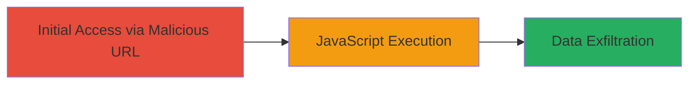

# Reflected XSS in Login Form via URL Injection on Upserve Inventory

Multi-stage attack chain demonstrating a complete attack workflow.

## Chain Metrics Dashboard

| Metric | Value |
|--------|-------|
| Chain Status | Unverified |
| Total Steps | 1 |
| Execution Time | ~1 minute |
| Skill Level | Beginner |
| Complexity | Low |
| Impact Level | Medium |

## Attack Flow Visualization



## Prerequisites & Requirements

### Required Tools

- Web browser (e.g., Internet Explorer with XSS protection disabled)

### Target Environment

- Web platform
- Accessible login endpoint at https://inventory.upserve.com/login/
- No specific services/ports beyond standard HTTPS (443)

### Initial Access Requirements

- Public network access to the target URL
- No credentials required
- Victim must use vulnerable browser (IE with XSS filter off)

## Detailed Attack Procedures

### Step 1: Craft and Access Malicious URL
procedure: [[procedures/Exploit-Reflected-XSS-in-Hidden-Field-via-REQUEST-URI]]

**Objective**: Inject a malicious payload into the login form's URL to break out of a hidden field and execute arbitrary JavaScript in the victim's browser.

**Instructions**: Construct the target URL by appending the payload to the login endpoint. The payload uses double quotes to escape the hidden field attribute and injects a script tag. Access the URL in a vulnerable browser to trigger the reflection and execution.

Use a browser to navigate to the malicious URL:

```url
https://inventory.upserve.com/login/?'"--><script>confirm(document.cookie)</script>
```

**Expected Output**: The page loads with the injected script executing, displaying a confirmation dialog containing the document's cookies.

**Success Indicators**:
- Alert or confirm dialog appears showing cookie data
- JavaScript executes without errors in the browser console
- Only triggers in Internet Explorer with XSS protection disabled

## Attack Chain Summary

### Key Achievements

1. Successful breakout from hidden field using unescaped double quotes in REQUEST_URI
2. Arbitrary JavaScript execution, demonstrating potential for cookie theft or session hijacking
3. Targeted impact on legacy browsers, highlighting incomplete input sanitization

## Technique & Tactic Coverage

### MITRE ATT&CK Techniques

- [[JavaScript]]

### MITRE ATT&CK Tactics

- [[Execution]]
- [[Collection]]

---
*Last updated: 2023-10-01T00:00:00Z*
