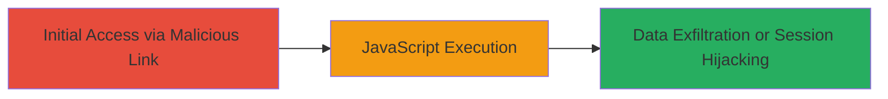

---
tags:
  - xss
  - reflected-xss
  - web
  - javascript-execution
type: attack_chain
tools: []
tactics:
  - '[[Execution]]'
  - '[[Collection]]'
commands: []
platforms:
  - Web
complexity: low
procedures:
  - '[[procedures/Exploit-Reflected-XSS-in-Username-Parameter]]'
step_count: 1
techniques:
  - '[[JavaScript]]'
description: >-
  A single-stage attack exploiting a reflected XSS vulnerability in the username
  parameter of the Recorded Future login page to execute arbitrary JavaScript in
  the victim's browser.
skill_level: beginner
impact_level: high
id: 45319a60-c34d-4943-8dea-79198cc12924
created_at: '2025-12-13T23:52:39.226Z'
updated_at: '2025-12-13T23:52:39.226Z'
verified: false
validated: true
submitted: true
mitre_tactics:
  - '[[Execution]]'
  - '[[Collection]]'
mitre_techniques:
  - '[[JavaScript]]'
---
# Reflected XSS in Login Username Parameter for JavaScript Execution

Multi-stage attack chain demonstrating a complete attack workflow.

## Chain Metrics Dashboard

| Metric | Value |
|--------|-------|
| Chain Status | Unverified |
| Total Steps | 1 |
| Execution Time | ~1 minute |
| Skill Level | Beginner |
| Complexity | Low |
| Impact Level | High |

## Attack Flow Visualization



## Prerequisites & Requirements

### Required Tools

- Web browser (e.g., Chrome, Firefox)

### Target Environment

- Web application at https://app.recordedfuture.com/live/login/
- No specific services or ports beyond standard HTTPS (443)
- Publicly accessible login page

### Initial Access Requirements

- Ability to trick victim into visiting malicious URL (e.g., via phishing email or social engineering)
- No prior credentials or network access needed

## Detailed Attack Procedures

### Step 1: Trigger Reflected XSS
procedure: [[procedures/Exploit-Reflected-XSS-in-Username-Parameter]]

**Objective**: Inject and execute malicious JavaScript by crafting a URL with a payload in the username parameter, leading to arbitrary code execution in the victim's browser.

**Instructions**: Construct a malicious URL targeting the login endpoint with an XSS payload in the username parameter. For testing, use a simple alert payload to verify execution. In a real attack, replace with code to steal cookies (e.g., document.cookie) or perform other actions.

Example malicious URL:

```url
https://app.recordedfuture.com/live/login/?reset=x&username=xss%22%3E%3Cimg+src=x+onerror=alert(document.domain)%3E
```

Visit the URL in a browser. The payload reflects unsanitized into the HTML, triggering the onerror handler on the img tag to execute the JavaScript.

**Expected Output**: An alert box pops up displaying the document domain (e.g., "app.recordedfuture.com"), confirming XSS execution.

**Success Indicators**:
- JavaScript alert or other payload effect triggers on page load
- No sanitization errors; payload executes without breaking the page
- In advanced payloads, session cookies or other data can be exfiltrated to an attacker-controlled server
