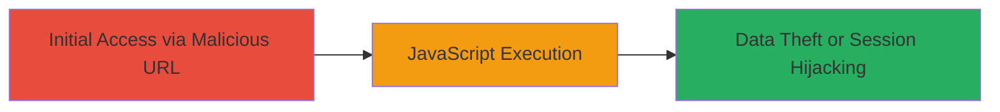

# Reflected XSS in MTN Online Search Suggestion Endpoint

Multi-stage attack chain demonstrating a complete attack workflow.

## Chain Metrics Dashboard

| Metric | Value |
|--------|-------|
| Chain Status | Unverified |
| Total Steps | 1 |
| Execution Time | ~1 minutes |
| Skill Level | Intermediate |
| Complexity | Medium |
| Impact Level | High |

## Attack Flow Visualization



## Prerequisites & Requirements

### Required Tools

- Browser (e.g., Chrome, Firefox) for testing
- [[tools/curl]] (optional for automated testing)

### Target Environment

- Web platform
- Accessible public-facing search suggestion endpoint at http://nextapps.mtnonline.com/search/suggest/q/
- No specific ports required (HTTP/80)

### Initial Access Requirements

- Public internet access to the target URL
- No credentials needed
- Ability to craft and share URLs (e.g., via phishing)

## Detailed Attack Procedures

### Step 1: Inject and Trigger XSS Payload
procedure: [[procedures/Exploit-Reflected-XSS-in-Search-Suggestion]]

**Objective**: Inject a malicious payload into the 'q' parameter of the search suggestion endpoint to reflect unsanitized input, executing JavaScript in the victim's browser.

**Instructions**: Construct a URL with the XSS payload in the 'q' parameter, such as http://nextapps.mtnonline.com/search/suggest/q/xss1337. Access this URL in a browser or use [[commands/curl-xss-test]] to verify the response:

```bash
curl "http://nextapps.mtnonline.com/search/suggest/q/xss" -H "Accept: text/html"
```

When rendered as text/html, the payload executes, triggering an alert or other JavaScript.

**Expected Output**: The response includes the reflected payload, e.g., unescaped  tag that executes onerror=alert() upon rendering.

**Success Indicators**:
- JavaScript alert pops up in the browser
- Arbitrary code (e.g., document.cookie) can be executed and observed

## Attack Chain Summary

### Key Achievements

1. Successful injection and reflection of HTML/JavaScript payload without sanitization
2. Execution of arbitrary code in the context of the victim's browser session
3. Potential for session hijacking or data exfiltration via crafted payloads

## Technique & Tactic Coverage

### MITRE ATT&CK Techniques

- [[Exploit Public-Facing Application]]
- [[JavaScript]]

### MITRE ATT&CK Tactics

- [[Initial Access]]
- [[Execution]]

---
*Last updated: 2023-10-01T00:00:00Z*
