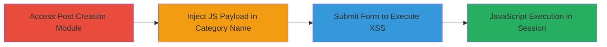

# Reflected XSS in MainWP Post Creation Category Name Field

Multi-stage attack chain demonstrating exploitation of a reflected Cross-Site Scripting (XSS) vulnerability in the 'Create Category' feature of the MainWP WordPress plugin's post creation module. The attack involves injecting a malicious JavaScript payload into the Category Name field, which is reflected unsanitized in the HTML response and executed in the attacker's browser session. While the impact is self-contained, it highlights inadequate input sanitization that could indicate broader security risks in a multi-site management interface.

## Chain Metrics Dashboard

| Metric | Value |
|--------|-------|
| Chain Status | Unverified |
| Total Steps | 3 |
| Execution Time | ~1 minute |
| Skill Level | Beginner |
| Complexity | Low |
| Impact Level | Low |

## Attack Flow Visualization

## Prerequisites & Requirements

### Required Tools

- Web browser (e.g., Chrome with developer tools for payload testing)

### Target Environment

- WordPress site with MainWP plugin installed and configured for post creation
- Admin access to the MainWP dashboard
- PHP-based web server hosting the WordPress instance

### Initial Access Requirements

- Valid admin credentials for the MainWP dashboard
- Direct network access to the target WordPress admin interface (typically port 80/443)
- No prior access needed beyond login

## Detailed Attack Procedures

### Step 1: Access the Post Creation Module
procedure: [[procedures/Access-MainWP-Post-Creation-Module]]

**Objective**: Navigate to the admin interface to reach the 'Create Category' functionality within the post creation feature.

**Instructions**: Log in to the MainWP dashboard using admin credentials. From the main menu, select the post creation or content management section where categories can be managed.

**Expected Output**: The post creation interface loads, displaying the 'Create Category' form or option.

**Success Indicators**:
- Dashboard accessible without errors
- 'Create Category' field visible in the UI

### Step 2: Inject Malicious Payload in Category Name
procedure: [[procedures/Inject-Malicious-Payload-in-Category-Name]]

**Objective**: Enter a JavaScript payload into the Category Name input field to test for reflection.

**Instructions**: In the Category Name field, input a malicious payload such as ``. This payload is designed to execute if not sanitized. Refer to the POC video (POC2.mp4) for visual demonstration.

**Expected Output**: The payload is accepted in the form without immediate validation errors.

**Success Indicators**:
- Payload entered successfully
- No client-side blocking of script tags

### Step 3: Submit Form to Trigger XSS Execution
procedure: [[procedures/Submit-Form-to-Trigger-XSS-Execution]]

**Objective**: Submit the form to cause the payload to be reflected in the HTML response and execute in the browser.

**Instructions**: Click the submit button on the 'Create Category' form. Monitor the browser's developer console or page response for execution.

**Expected Output**: The alert box or JavaScript effect triggers, confirming execution in the current session.

**Success Indicators**:
- JavaScript payload executes (e.g., alert pops up)
- HTML source shows unsanitized reflection of the input

## Attack Chain Summary

### Key Achievements

1. Successful injection and reflection of JavaScript in the admin interface
2. Demonstration of inadequate input sanitization in MainWP's post creation module
3. Highlighting potential risks to client-side security in multi-site environments

## Technique & Tactic Coverage

### MITRE ATT&CK Techniques

- [[JavaScript]]

### MITRE ATT&CK Tactics

- [[Execution]]

---
*Last updated: 2023-10-01T00:00:00Z*
