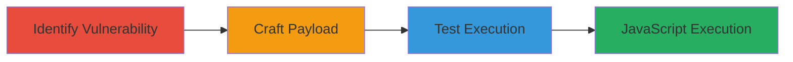

# Reflected XSS in Mapbox API via Unescaped Underscore Template Affecting Firefox Users

Multi-stage attack chain demonstrating a reflected XSS workflow in the Mapbox API, exploiting unescaped template interpolation in the access_token parameter to inject and execute JavaScript, primarily affecting Firefox users due to unique handling of single quotes in the address bar.

## Chain Metrics Dashboard

| Metric | Value |
|--------|-------|
| Chain Status | Unverified |
| Total Steps | 3 |
| Execution Time | ~5 minutes |
| Skill Level | Intermediate |
| Complexity | Medium |
| Impact Level | High |

## Attack Flow Visualization

## Prerequisites & Requirements

### Required Tools

- [[tools/Firefox]]
- [[tools/Underscore-js]]

### Target Environment

- Web platform with Mapbox API endpoints (api.tiles.mapbox.com and api.mapbox.com)
- Services: Mapbox API for map tiles and embeds
- Tech stack: JavaScript with Underscore.js templates
- No specific ports required; accessed via HTTPS

### Initial Access Requirements

- Public access to Mapbox API URLs
- No credentials needed; vulnerability is unauthenticated
- Firefox browser (versions like 38.0.5 or 46.0) for exploitation

## Detailed Attack Procedures

### Step 1: Identify Vulnerability
procedure: [[procedures/Identify-Reflected-XSS-in-Access-Token-Parameter]]

**Objective**: Examine the Mapbox API endpoint to identify the reflected XSS in the access_token parameter due to unescaped Underscore.js template interpolation.

**Instructions**: Navigate to the page.html endpoint on api.tiles.mapbox.com/v4/{mapid}/page.html and inspect how the access_token is inserted into the template without HTML escaping, allowing potential injection.

**Expected Output**: Confirmation that the access_token is reflected via '<%=' in the Underscore template, vulnerable to XSS.

**Success Indicators**:
- Template code visible in source showing unescaped interpolation
- Parameter reflection without sanitization

### Step 2: Craft Payload
procedure: [[procedures/Craft-XSS-Payload-for-Underscore-Template-Breakout]]

**Objective**: Construct a proof-of-concept payload that breaks out of meta HTML elements using a single quote, exploiting Firefox's address bar behavior to inject a script tag.

**Instructions**: Append a payload to the access_token, such as: pk.eyJ1IjoiY3Rzd2VicmVxdWVzdCIsImEiOiJTb19VUHM0In0.muGg6tMDG4NOGrV4qQQ8yw.htaccess.aspx'%3E%3Cscript%3Ealert(document.domain)%3C/script%3E. URL-encode where necessary but rely on Firefox not encoding the single quote.

**Expected Output**: A malformed URL that, when loaded, attempts to inject the script.

**Success Indicators**:
- Payload crafted with breakout using single quote
- Script tag injection prepared

### Step 3: Test Execution
procedure: [[procedures/Test-XSS-Execution-in-Firefox-Browser]]

**Objective**: Load the crafted URL in Firefox to trigger JavaScript execution, confirming the XSS vulnerability.

**Instructions**: Open the full POC URL in Firefox (e.g., https://api.tiles.mapbox.com/v4/ctswebrequest.m4ga59jd/page.html?access_token=pk.eyJ1IjoiY3Rzd2VicmVxdWVzdCIsImEiOiJTb19VUHM0In0.muGg6tMDG4NOGrV4qQQ8yw.htaccess.aspx'%3E%3Cscript%3Ealert(document.domain)%3C/script%3E).

**Expected Output**: Alert box displaying the document domain, indicating successful JavaScript execution.

**Success Indicators**:
- Alert triggered in Firefox
- No execution in other browsers like Chrome

## Attack Chain Summary

### Key Achievements

1. Identified unescaped template vulnerability in Mapbox API
2. Crafted browser-specific payload exploiting Firefox's quote handling
3. Achieved arbitrary JavaScript execution for session hijacking potential

## Technique & Tactic Coverage

### MITRE ATT&CK Techniques

- [[Exploit Public-Facing Application]]
- [[JavaScript]]

### MITRE ATT&CK Tactics

- [[Execution]]
- [[Collection]]

---
*Last updated: 2023-10-01T00:00:00Z*
