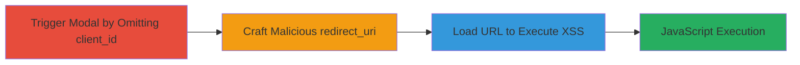

---
tags:
  - xss
  - reflected-xss
  - javascript
  - web-vulnerability
type: attack_chain
tools:
  - '[[tools/Web-Browser]]'
  - '[[tools/Vimeo]]'
tactics:
  - '[[Execution]]'
verified: false
platforms:
  - Web
submitted: true
complexity: medium
created_at: '2023-10-01T00:00:00Z'
procedures:
  - '[[procedures/Trigger-Unauthorized-Modal-by-Omitting-client_id]]'
  - '[[procedures/Craft-Malicious-redirect_uri-Payload]]'
  - '[[procedures/Execute-XSS-by-Loading-Crafted-URL]]'
step_count: 3
techniques:
  - '[[JavaScript]]'
updated_at: '2025-12-14T03:47:12.703Z'
description: >-
  A multi-step attack exploiting a reflected XSS vulnerability in the Mapbox
  /authorize endpoint by omitting the client_id parameter and injecting a
  malicious redirect_uri, leading to arbitrary JavaScript execution.
skill_level: intermediate
impact_level: high
id: b1c71928-1f1b-47a7-8802-24b672740201
validated: true
mitre_tactics:
  - '[[Execution]]'
mitre_techniques:
  - '[[JavaScript]]'
---
# Reflected XSS in Mapbox Authorize Endpoint via Unescaped redirect_uri

Multi-stage attack chain demonstrating exploitation of a reflected XSS vulnerability in the Mapbox authorization flow, allowing arbitrary JavaScript execution in the victim's browser.

## Chain Metrics Dashboard

| Metric | Value |
|--------|-------|
| Chain Status | Unverified |
| Total Steps | 3 |
| Execution Time | ~2 minutes |
| Skill Level | Intermediate |
| Complexity | Medium |
| Impact Level | High |

## Attack Flow Visualization

## Prerequisites & Requirements

### Required Tools

- [[tools/Web-Browser]]
- [[tools/Vimeo]] (for demo video)

### Target Environment

- Web platform
- Access to https://www.mapbox.com/authorize/
- No authentication required

### Initial Access Requirements

- Public internet access
- Victim tricked into clicking the crafted URL (e.g., via phishing)

## Detailed Attack Procedures

### Step 1: Trigger Unauthorized Modal
procedure: [[procedures/Trigger-Unauthorized-Modal-by-Omitting-client_id]]

**Objective**: Omit the client_id parameter to force the server to render the unauthorized modal template using the redirect_uri.

**Instructions**: Construct a request to the /authorize endpoint without the client_id parameter. This triggers the server-side rendering of the 'template-modal-unauthorized' template, which inserts the redirect_uri unescaped into an anchor tag.

**Expected Output**: A modal dialog appears on the page displaying the unauthorized message with the redirect_uri in the 'Back' link.

**Success Indicators**:
- Modal with unauthorized message loads
- redirect_uri value is visible in the page source as part of the anchor href without escaping

### Step 2: Craft Malicious redirect_uri Payload
procedure: [[procedures/Craft-Malicious-redirect_uri-Payload]]

**Objective**: Create a URL-encoded payload that breaks out of the anchor tag and injects executable JavaScript.

**Instructions**: Encode the payload to close the quote and anchor tag, then inject an SVG element with an onload handler: %27%3E%3Csvg%20onload=%27alert%28document.domain%29%27%3E (decodes to '><svg onload='alert(document.domain)'>).

**Expected Output**: A fully formed malicious URL ready for loading.

**Success Indicators**:
- Payload decodes correctly without syntax errors
- JavaScript snippet is valid and non-breaking

### Step 3: Execute XSS by Loading Crafted URL
procedure: [[procedures/Execute-XSS-by-Loading-Crafted-URL]]

**Objective**: Load the crafted URL in a browser to trigger the XSS payload execution.

**Instructions**: Open the URL https://www.mapbox.com/authorize/?redirect_uri=%27%3E%3Csvg%20onload=%27alert%28document.domain%29%27%3E in a web browser. The client-side code Views.modal.show('unauthorized',{msg: err.statusText,redirect:(App.param('redirect_uri'))? App.param('redirect_uri'):false}); renders the payload, executing the alert.

**Expected Output**: An alert box pops up displaying the document domain (mapbox.com).

**Success Indicators**:
- JavaScript alert executes
- No errors in browser console; payload renders in the modal

## Attack Chain Summary

### Key Achievements

1. Triggered unescaped template rendering by omitting client_id
2. Injected and executed arbitrary JavaScript via redirect_uri
3. Demonstrated potential for session theft or data exfiltration

## Technique & Tactic Coverage

### MITRE ATT&CK Techniques

- [[JavaScript]]

### MITRE ATT&CK Tactics

- [[Execution]]

---

*Last updated: 2023-10-01T00:00:00Z*
