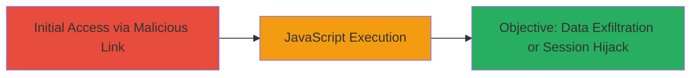

---
tags:
  - xss
  - reflected-xss
  - javascript-execution
type: attack_chain
tools: []
tactics:
  - '[[Execution]]'
commands: []
platforms:
  - Web
complexity: low
procedures:
  - '[[procedures/Exploit-Reflected-XSS-for-JavaScript-Execution]]'
step_count: 1
techniques:
  - '[[JavaScript]]'
description: >-
  A simple attack chain exploiting a reflected XSS vulnerability in
  MercadoLibre's web application to execute arbitrary JavaScript in the victim's
  browser.
skill_level: beginner
impact_level: medium
id: b1fc7d67-7354-437a-bf08-dba466fb933e
created_at: '2025-12-13T23:52:34.292Z'
updated_at: '2025-12-13T23:52:34.292Z'
verified: false
validated: true
submitted: true
mitre_tactics:
  - '[[Execution]]'
mitre_techniques:
  - '[[JavaScript]]'
---
# Reflected XSS in MercadoLibre Web Application for Arbitrary JavaScript Execution

## Overview

This attack chain demonstrates a reflected Cross-Site Scripting (XSS) vulnerability in MercadoLibre's web application, where user input is reflected back without proper sanitization, allowing attackers to inject and execute malicious JavaScript in the browser of unsuspecting users. The vulnerability was reported via HackerOne with reproduction steps and a proof-of-concept, leading to a medium-severity triage, internal fix, and bounty reward. The chain focuses on initial access and execution via the injected script, potentially enabling session hijacking, data theft, or phishing.

## Chain Metrics Dashboard

| Metric | Value |
|--------|-------|
| Chain Status | Unverified |
| Total Steps | 1 |
| Execution Time | ~1 minute |
| Skill Level | Beginner |
| Complexity | Low |
| Impact Level | Medium |

## Attack Flow Visualization

## Prerequisites & Requirements

### Required Tools

- Web browser (e.g., Chrome Developer Tools for testing)

### Target Environment

- Web platform
- Vulnerable endpoint in MercadoLibre application (e.g., search or parameter-reflecting page)
- No specific ports or services required beyond HTTP/HTTPS

### Initial Access Requirements

- Ability to send a malicious link to the victim (e.g., via email or social engineering)
- No prior credentials needed; relies on social engineering for link click

## Detailed Attack Procedures

### Step 1: Craft and Deliver Malicious Payload
procedure: [[procedures/Exploit-Reflected-XSS-for-JavaScript-Execution]]

**Objective**: Inject a malicious script via a reflected parameter to execute arbitrary JavaScript in the victim's browser context.

**Instructions**: Identify a vulnerable input field (e.g., a search parameter) that reflects user input without encoding. Craft a URL with a payload like `` appended to the parameter. For example, if the vulnerable URL is `https://example.mercadolibre.com/search?q=`, append the payload: `https://example.mercadolibre.com/search?q=`. Send this link to the victim via phishing. Upon clicking and submitting, the script executes.

To test locally, use browser dev tools or a proxy like Burp Suite to intercept and modify requests, ensuring the payload bypasses any basic filters.

**Expected Output**: An alert box or console log appears in the victim's browser, confirming JavaScript execution. In a real attack, this could be replaced with code to steal cookies (e.g., `document.cookie`).

**Success Indicators**:
- JavaScript alert or action triggers in the browser
- No server-side errors; payload reflects and executes client-side

## Attack Chain Summary

### Key Achievements

1. Successful injection and execution of arbitrary JavaScript
2. Potential for session theft or data exfiltration
3. Demonstration of vulnerability leading to responsible disclosure and fix

## Technique & Tactic Coverage

### MITRE ATT&CK Techniques

- [[JavaScript]]

### MITRE ATT&CK Tactics

- [[Execution]]

---
*Last updated: 2023-10-01*
