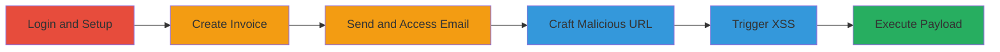

---
tags:
  - xss
  - reflected-xss
  - web
  - account-takeover
  - moneybird
type: attack_chain
tools: []
tactics:
  - '[[Initial Access]]'
  - '[[Execution]]'
verified: false
platforms:
  - Web
submitted: true
complexity: medium
created_at: '2023-10-01T00:00:00Z'
procedures:
  - '[[procedures/Create-Test-Invoice-for-XSS-Setup]]'
  - '[[procedures/Obtain-Account-ID-via-Invoice-Email]]'
  - '[[procedures/Craft-and-Trigger-Reflected-XSS-in-Search]]'
step_count: 9
techniques:
  - '[[Exploit Public-Facing Application]]'
  - '[[JavaScript]]'
updated_at: '2025-12-14T03:15:31.435Z'
description: >-
  A multi-step attack exploiting a reflected XSS vulnerability in Moneybird's
  backend search to inject JavaScript, enabling credential theft, admin
  addition, or invoice manipulation for full account takeover.
skill_level: intermediate
impact_level: high
id: 23b00c5e-b81f-4e11-8f6a-4c6b4c18ee32
validated: true
mitre_tactics:
  - '[[Initial Access]]'
  - '[[Execution]]'
mitre_techniques:
  - '[[Exploit Public-Facing Application]]'
  - '[[JavaScript]]'
---
# Reflected XSS in Moneybird Backend Search for Account Takeover

Multi-stage attack chain demonstrating a complete attack workflow exploiting a reflected XSS in Moneybird's search functionality to inject malicious JavaScript, leading to potential account takeover via phishing, admin escalation, or financial manipulation.

## Chain Metrics Dashboard

| Metric | Value |
|--------|-------|
| Chain Status | Unverified |
| Total Steps | 9 |
| Execution Time | ~10 minutes |
| Skill Level | Intermediate |
| Complexity | Medium |
| Impact Level | High |

## Attack Flow Visualization

## Prerequisites & Requirements

### Required Tools

- Web browser (e.g., Chrome, Firefox)
- Valid Moneybird account credentials

### Target Environment

- Moneybird web application (https://moneybird.com)
- No specific ports or services beyond standard HTTPS (443)
- Internet access for email delivery and URL loading

### Initial Access Requirements

- Authenticated user account in Moneybird
- Ability to create and send invoices
- Access to email inbox for receiving invoice links

## Detailed Attack Procedures

### Step 1: Login to Moneybird

**Objective**: Gain authenticated access to the Moneybird dashboard to initiate invoice creation.

**Instructions**: Navigate to the Moneybird login page and enter valid credentials to authenticate.

**Expected Output**: Redirect to the dashboard with user session established.

**Success Indicators**:
- Successful login without errors
- Access to invoice creation features

### Step 2: Create an Invoice
procedure: [[procedures/Create-Test-Invoice-for-XSS-Setup]]

**Objective**: Generate a searchable invoice containing a test string to serve as a trigger for the later search-based XSS.

**Instructions**: Follow the procedure to navigate to invoice creation, input 'test' in details, fill required fields, and prepare for sending.

**Expected Output**: Invoice draft ready for submission.

**Success Indicators**:
- Invoice form populated with 'test' in details
- All required fields validated

### Step 3: Enter Test String in Invoice Details
procedure: [[procedures/Create-Test-Invoice-for-XSS-Setup]]

**Objective**: Ensure the invoice includes searchable content ('test') for the backend search vulnerability.

**Instructions**: As part of invoice creation, input the string 'test' specifically in the details field.

**Expected Output**: 'test' saved in invoice details.

**Success Indicators**:
- 'test' visible in invoice preview

### Step 4: Fill Remaining Invoice Fields
procedure: [[procedures/Create-Test-Invoice-for-XSS-Setup]]

**Objective**: Complete the invoice with valid data to allow submission.

**Instructions**: Add arbitrary but valid values for amount, date, customer details, etc.

**Expected Output**: Fully formed invoice ready to send.

**Success Indicators**:
- No validation errors on form

### Step 5: Send the Invoice
procedure: [[procedures/Create-Test-Invoice-for-XSS-Setup]]

**Objective**: Submit the invoice to trigger email delivery and obtain the public viewing link.

**Instructions**: Enter a valid email address (e.g., attacker's controlled inbox) and send the invoice.

**Expected Output**: Confirmation of send and email dispatched.

**Success Indicators**:
- Email received in inbox

### Step 6: Receive and Access Invoice Email
procedure: [[procedures/Obtain-Account-ID-via-Invoice-Email]]

**Objective**: Retrieve the account ID from the invoice viewing link in the email.

**Instructions**: Open the received email, click the link in the format https://moneybird.com/[id]/sales_invoices/[invoice_id]/[hash], and extract the [id] from the URL.

**Expected Output**: Account ID (e.g., a numeric or string identifier) copied from URL.

**Success Indicators**:
- Invoice loads in browser
- [id] successfully extracted

### Step 7: Craft Malicious Search URL
procedure: [[procedures/Craft-and-Trigger-Reflected-XSS-in-Search]]

**Objective**: Construct a URL that injects a JavaScript payload via the unquoted search_query parameter.

**Instructions**: Use the extracted [id] to build the URL: https://moneybird.com/[id]/search?search_query=test%22%20onclick%3Dalert%28document.domain%29. The payload closes the attribute and adds an onclick handler.

**Expected Output**: Valid URL with encoded payload ready for access.

**Success Indicators**:
- URL decodes correctly to include the injection

### Step 8: Access the Crafted URL
procedure: [[procedures/Craft-and-Trigger-Reflected-XSS-in-Search]]

**Objective**: Load the search page to reflect the malicious query without proper quoting.

**Instructions**: Paste the URL into a browser and load it, performing the search.

**Expected Output**: Search results page displays, with the query reflected in HTML sans quotes.

**Success Indicators**:
- Page loads without errors
- Search results include the 'test' invoice

### Step 9: Trigger the XSS Payload
procedure: [[procedures/Craft-and-Trigger-Reflected-XSS-in-Search]]

**Objective**: Execute the injected JavaScript by interacting with the reflected content.

**Instructions**: Click on the search result link containing the injected onclick handler.

**Expected Output**: JavaScript alert pops up showing the document domain (e.g., moneybird.com).

**Success Indicators**:
- Alert box appears confirming XSS execution
- Potential for further payload escalation (e.g., credential phishing)

## Attack Chain Summary

### Key Achievements

1. Successful injection of JavaScript via unquoted search parameter
2. Execution of arbitrary code in the victim's browser context
3. Pathway to account takeover through phishing or admin manipulation

## Technique & Tactic Coverage

### MITRE ATT&CK Techniques

- [[Exploit Public-Facing Application]] Exploit Public-Facing Application
- [[JavaScript]] JavaScript

### MITRE ATT&CK Tactics

- [[Initial Access]] Initial Access
- [[Execution]] Execution

---

*Last updated: 2023-10-01T00:00:00Z*
