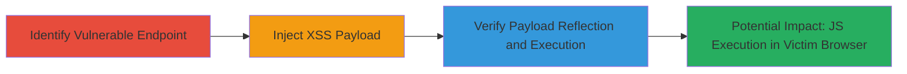

---
tags:
  - xss
  - reflected-xss
  - javascript
  - web-vulnerability
type: attack_chain
tools:
  - '[[tools/curl]]'
  - '[[tools/grep]]'
tactics:
  - '[[Execution]]'
  - '[[Collection]]'
verified: false
platforms:
  - Web
submitted: true
complexity: medium
created_at: '2023-10-01T00:00:00Z'
procedures:
  - '[[procedures/Exploit-Reflected-XSS-in-Query-Parameter]]'
step_count: 3
techniques:
  - '[[JavaScript]]'
updated_at: '2025-12-13T23:52:55.344Z'
description: >-
  A multi-step attack chain exploiting a reflected XSS vulnerability in the
  'nin' query parameter of the MTN NIN success endpoint to inject and execute
  arbitrary JavaScript in a victim's browser.
skill_level: intermediate
impact_level: high
id: ab6d79fd-27b0-4c9c-a62c-9f99a1998a9e
validated: true
mitre_tactics:
  - '[[Execution]]'
  - '[[Collection]]'
mitre_techniques:
  - '[[JavaScript]]'
---
# Reflected XSS in NIN Parameter for Arbitrary JavaScript Execution

Multi-stage attack chain demonstrating the exploitation of a reflected Cross-Site Scripting (XSS) vulnerability in the 'nin' query parameter of https://nin.mtn.ng/nin/success, allowing attackers to inject and execute arbitrary JavaScript code in victims' browsers via malicious URLs. This can lead to session hijacking, data theft, or phishing attacks.

## Chain Metrics Dashboard

| Metric | Value |
|--------|-------|
| Chain Status | Unverified |
| Total Steps | 3 |
| Execution Time | ~5 minutes |
| Skill Level | Intermediate |
| Complexity | Medium |
| Impact Level | High |

## Attack Flow Visualization



## Prerequisites & Requirements

### Required Tools

- [[tools/curl]]
- [[tools/grep]]

### Target Environment

- Web platform
- Access to public-facing URL: https://nin.mtn.ng/nin/success
- No authentication required

### Initial Access Requirements

- Internet connectivity
- Ability to craft and send URLs (e.g., via email or social engineering for victim targeting)
- No prior credentials needed

## Detailed Attack Procedures

### Step 1: Identify Vulnerable Endpoint
procedure: [[procedures/Exploit-Reflected-XSS-in-Query-Parameter]]

**Objective**: Examine the target URL to identify the 'nin' query parameter that reflects user input without sanitization.

**Instructions**: Manually inspect the endpoint https://nin.mtn.ng/nin/success?message=msg&nin= by appending test values to the 'nin' parameter and observing if they are echoed back in the response HTML.

**Expected Output**: Confirmation that the 'nin' value appears unsanitized in the page content.

**Success Indicators**:
- Parameter reflection observed in browser or response body
- No encoding or escaping applied to input

### Step 2: Inject XSS Payload
procedure: [[procedures/Exploit-Reflected-XSS-in-Query-Parameter]]

**Objective**: Craft a malicious URL by injecting a JavaScript payload into the 'nin' parameter to test for XSS execution.

**Instructions**: Modify the URL to include a script tag: https://nin.mtn.ng/nin/success?message=lol&nin=<script>alert(1)</script>. In a real attack, distribute this URL to victims via phishing.

**Expected Output**: When accessed in a browser, an alert box pops up if executed, or the script is reflected in the HTML source.

**Success Indicators**:
- Payload appears in response without sanitization
- JavaScript executes in browser context

### Step 3: Verify Payload Reflection
procedure: [[procedures/Exploit-Reflected-XSS-in-Query-Parameter]]

**Objective**: Use command-line tools to confirm the payload is reflected unsanitized in the server response.

**Instructions**: Execute [[commands/curl-grep-xss-reflection]] to send the request and search for the payload:

```bash
curl -ski "https://nin.mtn.ng/nin/success?message=lol&nin=<script>alert(1)</script>" | grep "alert"
```

**Expected Output**: A line from the HTML response containing '<script>alert(1)</script>' or the 'alert' keyword, confirming reflection.

**Success Indicators**:
- Grep matches the 'alert' string in output
- Full payload visible in response body

## Attack Chain Summary

### Key Achievements

1. Identified unsanitized reflection in 'nin' parameter
2. Successfully injected and verified XSS payload
3. Demonstrated potential for arbitrary JS execution leading to client-side attacks

## Technique & Tactic Coverage

### MITRE ATT&CK Techniques

- [[JavaScript]]

### MITRE ATT&CK Tactics

- [[Execution]]
- [[Collection]]

---

*Last updated: 2023-10-01T00:00:00Z*
