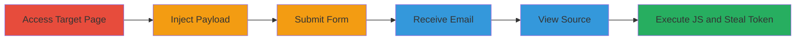

---
tags:
  - xss
  - reflected-xss
  - xsrf-token-theft
  - nextcloud
  - contact-form
type: attack_chain
tools: []
tactics:
  - '[[Execution]]'
  - '[[Collection]]'
verified: false
platforms:
  - Web
submitted: true
complexity: low
created_at: '2023-10-01T00:00:00Z'
procedures:
  - '[[procedures/Access-Nextcloud-Enterprise-Buy-Page]]'
  - '[[procedures/Inject-XSS-Payload-into-Contact-Form]]'
  - '[[procedures/Submit-Contact-Form-to-Trigger-Email]]'
  - '[[procedures/Access-and-View-Email-Source]]'
  - '[[procedures/Execute-XSS-Payload-to-Steal-XSRF-Token]]'
step_count: 6
techniques:
  - '[[JavaScript]]'
updated_at: '2025-12-14T17:27:50.067Z'
description: >-
  A multi-step attack exploiting reflected XSS in the Nextcloud enterprise buy
  contact form to inject JavaScript payloads, trigger an email, and steal the
  victim's XSRF token upon viewing the email source.
skill_level: intermediate
impact_level: medium
id: 7e443122-f659-481c-aa39-fe15b56faf35
validated: true
mitre_tactics:
  - '[[Execution]]'
  - '[[Collection]]'
mitre_techniques:
  - '[[JavaScript]]'
---
# Reflected XSS in Nextcloud Contact Form to Steal XSRF Token

Multi-stage attack chain demonstrating exploitation of insufficient input sanitization in Nextcloud's enterprise buy contact form, allowing injection of JavaScript payloads that reflect in a confirmation email. Viewing the email source in a browser executes the payload, alerting the document.cookie to steal the XSRF token, enabling CSRF attacks by bypassing anti-CSRF protections.

## Chain Metrics Dashboard

| Metric | Value |
|--------|-------|
| Chain Status | Unverified |
| Total Steps | 6 |
| Execution Time | ~5 minutes |
| Skill Level | Intermediate |
| Complexity | Low |
| Impact Level | Medium |

## Attack Flow Visualization

## Prerequisites & Requirements

### Required Tools

- Web browser (e.g., Chrome, Firefox)
- Email client or webmail interface that supports viewing raw HTML source in a browser

### Target Environment

- Web platform
- Access to https://nextcloud.com/enterprise/buy/
- Valid email address for receiving the confirmation

### Initial Access Requirements

- No credentials required
- Public internet access to the target URL
- No prior access needed

## Detailed Attack Procedures

### Step 1: Access Nextcloud Enterprise Buy Page
procedure: [[procedures/Access-Nextcloud-Enterprise-Buy-Page]]

**Objective**: Navigate to the vulnerable contact form page to begin the exploitation.

**Instructions**: Open a web browser and directly access the target URL.

**Expected Output**: The enterprise buy page loads with the contact form visible.

**Success Indicators**:
- Page loads successfully without errors
- Contact form fields (name, email, message, company) are present

### Step 2: Inject XSS Payload into Contact Form
procedure: [[procedures/Inject-XSS-Payload-into-Contact-Form]]

**Objective**: Fill the form with valid data in required fields and inject JavaScript payloads into optional fields to test for reflection.

**Instructions**: Enter legitimate values in name and email fields. In message or company fields, inject payloads like `` or `<svg/onload=alert(document.cookie);>`.

**Expected Output**: Form accepts the input without validation errors.

**Success Indicators**:
- Payloads are entered without form rejection
- No client-side sanitization blocks the submission

### Step 3: Submit Contact Form to Trigger Email
procedure: [[procedures/Submit-Contact-Form-to-Trigger-Email]]

**Objective**: Send the form data to the server, causing the unsanitized payload to be included in the confirmation email.

**Instructions**: Click the submit button on the form.

**Expected Output**: Form submission succeeds, and a confirmation message may appear on the page.

**Success Indicators**:
- Submission completes without server errors
- Email delivery is initiated (check inbox shortly after)

### Step 4: Access and View Email Source
procedure: [[procedures/Access-and-View-Email-Source]]

**Objective**: Retrieve the sent confirmation email and inspect its raw HTML source in a browser context.

**Instructions**: Open the email inbox using the provided email address. Locate the confirmation email from Nextcloud and use the client's "View Source" or "View Raw Message" feature to display the HTML.

**Expected Output**: Raw HTML source of the email is visible, containing the reflected form inputs.

**Success Indicators**:
- Email received within 1-2 minutes
- Source view loads in a browser-like environment

### Step 5: Execute XSS Payload to Steal XSRF Token
procedure: [[procedures/Execute-XSS-Payload-to-Steal-XSRF-Token]]

**Objective**: Trigger the injected JavaScript to execute and capture the XSRF token from document.cookie.

**Instructions**: In the email source view, the payload should auto-execute if rendered as HTML. Observe the alert dialog displaying the cookie contents.

**Expected Output**: JavaScript alert pops up revealing document.cookie, including the XSRF token value.

**Success Indicators**:
- Alert executes showing cookie data
- XSRF token is visible and can be extracted for further use

## Attack Chain Summary

### Key Achievements

1. Successful injection of XSS payload into contact form fields without sanitization.
2. Reflection of payload in confirmation email HTML body.
3. Execution of JavaScript in victim's browser when viewing email source, stealing XSRF token.
4. Potential for follow-on CSRF attacks using the stolen token.

## Technique & Tactic Coverage

### MITRE ATT&CK Techniques

- [[JavaScript]]

### MITRE ATT&CK Tactics

- [[Execution]]
- [[Collection]]

---
*Last updated: 2023-10-01T00:00:00Z*
