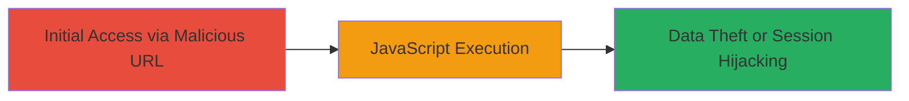

---
tags:
  - xss
  - nextcloud
  - javascript
  - browser
type: attack_chain
tools:
  - '[[tools/Firefox]]'
tactics:
  - '[[Execution]]'
  - '[[Collection]]'
verified: false
platforms:
  - Web
submitted: true
complexity: low
created_at: '2023-10-01T00:00:00Z'
procedures:
  - '[[procedures/Trigger-Reflected-XSS-in-Nextcloud-Gallery-App]]'
step_count: 1
techniques:
  - '[[JavaScript]]'
updated_at: '2025-12-14T03:16:25.264Z'
description: >-
  A single-stage attack exploiting a reflected XSS vulnerability in the
  Nextcloud Gallery App by injecting malicious JavaScript via the URL hash
  fragment, leading to arbitrary code execution in the victim's browser.
skill_level: beginner
impact_level: high
id: 175eb296-5594-4b26-808f-ef930ea89749
validated: true
mitre_tactics:
  - '[[Execution]]'
  - '[[Collection]]'
mitre_techniques:
  - '[[JavaScript]]'
---
# Reflected XSS in Nextcloud Gallery App via Unsanitized URL Hash

Multi-stage attack chain demonstrating a complete attack workflow.

## Chain Metrics Dashboard

| Metric | Value |
|--------|-------|
| Chain Status | Unverified |
| Total Steps | 1 |
| Execution Time | ~1 minute |
| Skill Level | Beginner |
| Complexity | Low |
| Impact Level | High |

## Attack Flow Visualization



## Prerequisites & Requirements

### Required Tools

- [[tools/Firefox]]

### Target Environment

- Web platform with Nextcloud instance
- Gallery App enabled
- Access to the /index.php/apps/gallery/ endpoint
- No specific ports or services beyond standard HTTP/HTTPS

### Initial Access Requirements

- Valid URL to the Nextcloud Gallery App
- Victim must be authenticated or the app must be publicly accessible
- Browser access to load the malicious URL

## Detailed Attack Procedures

### Step 1: Trigger XSS Payload
procedure: [[procedures/Trigger-Reflected-XSS-in-Nextcloud-Gallery-App]]

**Objective**: Inject and execute arbitrary JavaScript in the victim's browser by crafting a malicious URL with an unsanitized hash fragment.

**Instructions**: Use [[tools/Firefox]] to navigate to the Nextcloud Gallery App endpoint with the malicious payload in the URL hash. The payload exploits the lack of sanitization in the hash fragment, causing immediate JavaScript execution upon page load.

Construct the URL as follows:

```url
https://target-nextcloud.com/index.php/apps/gallery/#%3E%3Cscript%3Ealert%28document.domain%29%3C/script%3Ejavascript:alert%280%29//%00
```

This decodes to `#><script>alert(document.domain)</script>javascript:alert(0)//\u0000`, where the script tag injects and executes the alert showing the document domain.

**Expected Output**: An alert box pops up in the browser displaying the domain (e.g., "target-nextcloud.com"), confirming JavaScript execution.

**Success Indicators**:
- Alert dialog appears immediately upon loading the URL
- Browser console shows no errors, and the script runs in the context of the Nextcloud page
- Potential for further payloads to steal cookies or session data

## Attack Chain Summary

### Key Achievements

1. Successful injection of JavaScript via URL hash without server-side validation
2. Immediate execution in the authenticated user's browser context
3. Demonstration of potential for session hijacking or data exfiltration

## Technique & Tactic Coverage

### MITRE ATT&CK Techniques

- [[JavaScript]]

### MITRE ATT&CK Tactics

- [[Execution]]
- [[Collection]]

---
*Last updated: 2023-10-01T00:00:00Z*
