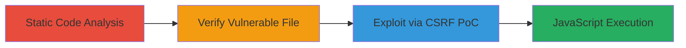

# Reflected XSS in Nextcloud U2F Plugin via Unsanitized Yubico Example File

Multi-stage attack chain demonstrating the discovery and exploitation of a reflected XSS vulnerability in the Nextcloud U2F plugin. The chain begins with static code analysis to identify the flaw in an included example PHP file from the Yubico U2F library, verifies its presence in the production release, and culminates in crafting a CSRF proof-of-concept to inject and execute JavaScript, potentially leading to session theft or arbitrary code execution in the victim's browser.

## Chain Metrics Dashboard

| Metric | Value |
|--------|-------|
| Chain Status | Unverified |
| Total Steps | 3 |
| Execution Time | ~30 minutes |
| Skill Level | Intermediate |
| Complexity | Medium |
| Impact Level | High |

## Attack Flow Visualization

## Prerequisites & Requirements

### Required Tools

- [[tools/RIPS]]
- [[tools/Burp-Suite-Professional]]

### Target Environment

- Nextcloud instance with U2F two-factor authentication plugin installed (version including the vulnerable app release from apps.nextcloud.com)
- Access to the Nextcloud source code for analysis
- Web browser for PoC testing

### Initial Access Requirements

- No prior credentials needed for discovery phase
- Network access to the Nextcloud instance for exploitation
- Ability to send crafted HTTP requests (e.g., via Burp Suite)

## Detailed Attack Procedures

### Step 1: Static Code Analysis
procedure: [[procedures/Static-Code-Analysis-for-XSS-Detection-using-RIPS]]

**Objective**: Identify potential XSS vulnerabilities in the Nextcloud U2F plugin source code through automated static analysis.

**Instructions**: Instrument the Nextcloud source code if necessary, then run a RIPS scan targeting the PHP files in the U2F plugin. Focus on the vendor directory for third-party libraries like Yubico U2F.

**Expected Output**: Scan report highlighting unsafe output functions, such as echoing user input without sanitization in /apps/twofactor_u2f/vendor/yubico/u2flib-server/examples/localstorage/index.php.

**Success Indicators**:
- Detection of reflected XSS in the 'certificate' field processing
- Report confirms lack of HTML/JS escaping

### Step 2: Verify Vulnerable File Presence
procedure: [[procedures/Verify-Presence-of-Vulnerable-File-in-Nextcloud-Release]]

**Objective**: Confirm that the identified vulnerable example file is shipped in the production app release, despite its removal from the Git repository.

**Instructions**: Download the U2F plugin release package from apps.nextcloud.com and inspect the file structure, specifically checking for the presence of /apps/twofactor_u2f/vendor/yubico/u2flib-server/examples/localstorage/index.php.

**Expected Output**: File confirmed in the release archive, accessible via the web endpoint in a deployed Nextcloud instance.

**Success Indicators**:
- Vulnerable PHP file extracted and readable
- Endpoint responds to HTTP requests without errors

### Step 3: Craft and Test CSRF PoC
procedure: [[procedures/Craft-CSRF-POC-for-XSS-Exploitation-using-Burp-Suite]]

**Objective**: Develop and deliver a CSRF payload to exploit the XSS, injecting JavaScript into the victim's browser context.

**Instructions**: Use Burp Suite to intercept and modify requests to the vulnerable endpoint. Craft an HTML form that POSTs encoded payloads to parameters like 'doAuthenticate', 'request', and 'registrations', injecting a payload such as 'wzh87'-alert(1)-'k50k8' into the 'certificate' field to bypass basic sanity checks and trigger execution.

**Expected Output**: Alert popup in the victim's browser executing the injected JavaScript, confirming XSS success.

**Success Indicators**:
- JavaScript alert triggers on payload delivery
- Potential for session cookie theft or further payload chaining

## Attack Chain Summary

### Key Achievements

1. Discovered hidden XSS in bundled third-party example code via static analysis
2. Verified persistence of vulnerability in production releases
3. Demonstrated practical exploitation leading to arbitrary JS execution in Nextcloud

## Technique & Tactic Coverage

### MITRE ATT&CK Techniques

- [[Exploit Public-Facing Application]]
- [[JavaScript]]

### MITRE ATT&CK Tactics

- [[Initial Access]]
- [[Execution]]

---
*Last updated: 2023-10-01T00:00:00Z*
