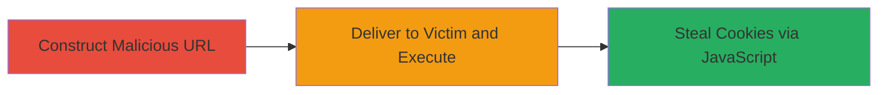

---
id: ac-456333-xss-oauth2
name: Reflected XSS in OAuth2 Fallback Error Page for Cookie Theft
type: attack_chain
description: A multi-step attack exploiting a reflected XSS vulnerability in the OAuth2 fallback error page of auth2.zomato.com to steal user cookies by tricking a logged-in victim into visiting a malicious URL.
verified: false
submitted: false
step_count: 2
created_at: 2024-01-01T00:00:00Z
updated_at: 2024-01-01T00:00:00Z
procedures: [[procedures/Exploit-Reflected-XSS-in-OAuth2-Error-Page]]
techniques: [[JavaScript]], [[Drive-by Compromise]]
tactics: [[Initial Access]], [[Collection]]
tags: xss, reflected-xss, oauth2, cookie-theft, javascript-execution
platforms: Web
tools: [[tools/Firefox]]
---

# Reflected XSS in OAuth2 Fallback Error Page for Cookie Theft

Multi-stage attack chain demonstrating a complete attack workflow exploiting unsanitized reflection of OAuth2 error parameters in the fallback error page.

## Chain Metrics Dashboard

| Metric | Value |
|--------|-------|
| Chain Status | Unverified |
| Total Steps | 2 |
| Execution Time | ~2 minutes |
| Skill Level | Intermediate |
| Complexity | Medium |
| Impact Level | High |

## Attack Flow Visualization



## Prerequisites & Requirements

### Required Tools

- [[tools/Firefox]]

### Target Environment

- Web platform with OAuth2 services
- Access to auth2.zomato.com or similar ORY Hydra-based OAuth2 endpoint
- No specific ports required; standard HTTPS (443)
- Network access to send phishing links to victims

### Initial Access Requirements

- No credentials needed for exploitation
- Victim must be a logged-in user of the OAuth2 service (e.g., Zomato)
- Ability to deliver a crafted URL via email, social engineering, or other phishing vector

## Detailed Attack Procedures

### Step 1: Construct the Vulnerable URL with XSS Payload
procedure: [[procedures/Exploit-Reflected-XSS-in-OAuth2-Error-Page]]

**Objective**: Create a malicious URL that injects and reflects an XSS payload in the error parameters, leading to JavaScript execution on the fallback error page.

**Instructions**: Manually construct the URL using the endpoint https://auth2.zomato.com/oauth2/fallbacks/error. Set the parameters error, error_description, and error_hint to a URL-encoded XSS payload, such as a marquee tag that triggers a confirm dialog with document cookies. Example payload: <marquee loop=1 width=0 onfinish=confirm(document.cookie)>XSS</marquee>, encoded as %3Cmarquee%20loop%3d1%20width%3d0%20onfinish%3dconfirm(document.cookie)%3EXSS%3C%2fmarquee%3E.

Full example URL:

```url
https://auth2.zomato.com/oauth2/fallbacks/error?error=%3Cmarquee%20loop%3d1%20width%3d0%20onfinish%3dconfirm(document.cookie)%3EXSS%3C%2fmarquee%3E&error_description=%3Cmarquee%20loop%3d1%20width%3d0%20onfinish%3dconfirm(document.cookie)%3EXSS%3C%2fmarquee%3E&error_hint=%3Cmarquee%20loop%3d1%20width%3d0%20onfinish%3dconfirm(document.cookie)%3EXSS%3C%2fmarquee%3E
```

**Expected Output**: A valid URL ready for delivery to the victim.

**Success Indicators**:
- URL is properly formed and encodes the payload without errors
- Payload includes JavaScript execution (e.g., confirm(document.cookie))

### Step 2: Load the URL in a Browser to Trigger the XSS
procedure: [[procedures/Exploit-Reflected-XSS-in-OAuth2-Error-Page]]

**Objective**: Trick the victim into visiting the URL, causing the browser to load the error page and execute the reflected XSS payload, resulting in cookie theft.

**Instructions**: Send the crafted URL to a logged-in user via phishing (e.g., email or link). When the victim loads it in their browser, the parameters are reflected unsanitized into the HTML, executing the JavaScript. Use [[tools/Firefox]] to test and verify the payload triggers a popup displaying cookies.

Paste the full URL into the browser address bar and navigate to it.

**Expected Output**: The error page loads, the marquee tag executes onfinish, and a confirmation dialog pops up showing the victim's document cookies.

**Success Indicators**:
- JavaScript executes without errors
- Cookies are displayed in the confirm popup, confirming theft potential
- No CSP or other protections block the execution

## Attack Chain Summary

### Key Achievements

1. Successful injection of XSS payload via OAuth2 error parameters
2. Reflection and execution of arbitrary JavaScript in the victim's browser
3. Potential for cookie theft, session hijacking, or further client-side attacks on logged-in users

## Technique & Tactic Coverage

### MITRE ATT&CK Techniques

- [[JavaScript]]
- [[Drive-by Compromise]]

### MITRE ATT&CK Tactics

- [[Initial Access]]
- [[Collection]]

---
*Last updated: 2024-01-01T00:00:00Z*
