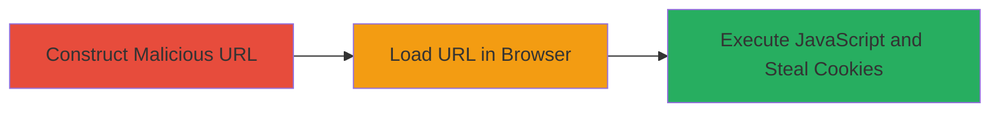

---
tags:
  - xss
  - reflected-xss
  - oauth
  - cookie-theft
  - session-hijacking
type: attack_chain
tools:
  - '[[tools/Firefox-Browser]]'
tactics:
  - '[[Collection]]'
verified: false
platforms:
  - Web
submitted: true
complexity: medium
created_at: '2023-10-01T00:00:00Z'
procedures:
  - '[[procedures/Construct-Malicious-XSS-URL-for-OAuth-Error-Endpoint]]'
  - '[[procedures/Load-Malicious-URL-to-Execute-XSS-Payload]]'
step_count: 2
techniques:
  - '[[JavaScript]]'
updated_at: '2025-12-14T17:24:38.925Z'
description: >-
  A multi-step attack exploiting a reflected XSS vulnerability in the ORY Hydra
  OAuth 2.0 error endpoint to steal user cookies via phishing.
skill_level: intermediate
impact_level: high
id: 7b669d60-c890-41ce-932e-8067a6ba6943
validated: true
mitre_tactics:
  - '[[Collection]]'
mitre_techniques:
  - '[[JavaScript]]'
---
# Reflected XSS in ORY Hydra OAuth Error Endpoint for Cookie Theft

Multi-stage attack chain demonstrating a complete attack workflow exploiting a reflected XSS vulnerability in the ORY Hydra OAuth 2.0 error endpoint at auth2.zomato.com.

## Chain Metrics Dashboard

| Metric | Value |
|--------|-------|
| Chain Status | Unverified |
| Total Steps | 2 |
| Execution Time | ~1 minutes |
| Skill Level | Intermediate |
| Complexity | Medium |
| Impact Level | High |

## Attack Flow Visualization

## Prerequisites & Requirements

### Required Tools

- [[tools/Firefox-Browser]]

### Target Environment

- Web platform
- OAuth2 services using ORY Hydra
- Access to the error endpoint: https://auth2.zomato.com/oauth2/fallbacks/error

### Initial Access Requirements

- No credentials required
- Network access to the target domain
- Ability to phish users to visit the malicious URL

## Detailed Attack Procedures

### Step 1: Construct Malicious URL
procedure: [[procedures/Construct-Malicious-XSS-URL-for-OAuth-Error-Endpoint]]

**Objective**: Create a crafted URL with a JavaScript payload injected into the query parameters to exploit the reflected XSS vulnerability.

**Instructions**: Manually construct the URL using the endpoint https://auth2.zomato.com/oauth2/fallbacks/error. Append query parameters: error=xss, error_description=xsssy, and error_hint=%3Cmarquee%20loop%3d1%20width%3d0%20onfinish%3dconfirm(document.cookie)%3EXSS%3C%2fmarquee%3E. This URL-encodes a marquee tag that triggers confirm(document.cookie) upon finishing its animation, executing the payload when reflected.

**Expected Output**: A fully formed malicious URL ready for delivery via phishing.

**Success Indicators**:
- URL is correctly encoded and includes the payload
- Payload syntax is valid HTML/JavaScript

### Step 2: Load Malicious URL in Browser
procedure: [[procedures/Load-Malicious-URL-to-Execute-XSS-Payload]]

**Objective**: Deliver and execute the XSS payload by loading the URL in a browser, simulating a victim visit to trigger cookie theft.

**Instructions**: Open the Firefox browser and paste the malicious URL into the address bar. Access the page, which renders the HTML and reflects the parameters, executing the JavaScript payload. A popup will display the document cookies if successful.

**Expected Output**: Browser popup showing stolen cookies, confirming payload execution.

**Success Indicators**:
- JavaScript executes without errors
- Cookies are displayed in the confirm dialog
- No sanitization blocks the payload

## Attack Chain Summary

### Key Achievements

1. Successful construction of a phishing URL exploiting unsanitized query parameters
2. Reflection and execution of arbitrary JavaScript in the OAuth error page context
3. Demonstration of cookie theft leading to potential session hijacking for authenticated users

## Technique & Tactic Coverage

### MITRE ATT&CK Techniques

- [[JavaScript]]

### MITRE ATT&CK Tactics

- [[Collection]]

---
*Last updated: 2023-10-01T00:00:00Z*
