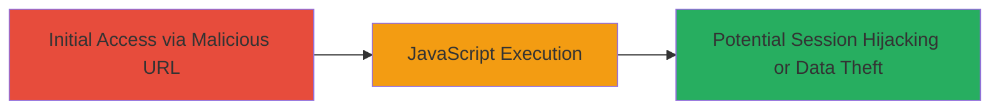

---
tags:
  - xss
  - reflected-xss
  - otrs
  - web
  - javascript
type: attack_chain
tools: []
tactics:
  - '[[Execution]]'
  - '[[Initial Access]]'
commands:
  - '[[commands/curl-xss-payload-injection]]'
platforms:
  - Web
complexity: low
procedures:
  - '[[procedures/Exploit-Reflected-XSS-in-OTRS-Lang-Parameter]]'
step_count: 1
techniques:
  - '[[JavaScript]]'
description: >-
  A single-stage attack exploiting a reflected XSS vulnerability in the OTRS
  login page by injecting a JavaScript payload into the Lang parameter, leading
  to arbitrary code execution in the victim's browser.
skill_level: beginner
impact_level: medium
id: 907450c0-af47-41d1-8154-3f8ec67fc605
created_at: '2025-12-14T03:15:10.472Z'
updated_at: '2025-12-14T03:15:10.472Z'
verified: false
validated: true
submitted: true
mitre_tactics:
  - '[[Execution]]'
  - '[[Initial Access]]'
mitre_techniques:
  - '[[JavaScript]]'
---
# Reflected XSS in OTRS Login Page via Lang Parameter

## Overview

This attack chain demonstrates a reflected Cross-Site Scripting (XSS) vulnerability in the OTRS (Open Ticket Request System) login page hosted on otrs.owncloud.com. The vulnerability occurs due to insufficient input validation and output encoding for the 'Lang' parameter in the login endpoint (/otrs/index.pl?Action=Login). By injecting a malicious JavaScript payload into this parameter, an attacker can cause arbitrary JavaScript to execute in the context of the victim's browser when they access the crafted URL. This could lead to session hijacking, data theft, or phishing attacks, though the report focuses on proof-of-concept execution via an alert box.

The attack requires no authentication and targets public-facing web applications using OTRS. It was reported via HackerOne (Report #108288) and highlights a common web security flaw in Perl-based ticketing systems.

## Chain Metrics Dashboard

| Metric | Value |
|--------|-------|
| Chain Status | Unverified |
| Total Steps | 1 |
| Execution Time | ~1 minute |
| Skill Level | Beginner |
| Complexity | Low |
| Impact Level | Medium |

## Attack Flow Visualization



## Prerequisites & Requirements

### Required Tools

- Browser (e.g., Chrome, Firefox) or [[commands/curl-xss-payload-injection]] for testing

### Target Environment

- Web platform running OTRS (Perl-based ticketing system)
- Accessible login endpoint: /otrs/index.pl?Action=Login
- No specific ports required beyond standard HTTP/HTTPS (80/443)

### Initial Access Requirements

- Public network access to the target URL (otrs.owncloud.com or similar)
- No credentials needed
- Victim must click or access the malicious URL

## Detailed Attack Procedures

### Step 1: Inject XSS Payload into Lang Parameter
procedure: [[procedures/Exploit-Reflected-XSS-in-OTRS-Lang-Parameter]]

**Objective**: Craft a malicious URL with an XSS payload in the Lang parameter to trigger JavaScript execution upon access.

**Instructions**: Construct the URL by appending the payload to the Lang parameter. The payload 'rue6587"><script>alert(1)</script>60730d78bc6' breaks out of the attribute context and injects a script tag. Use [[commands/curl-xss-payload-injection]] to test via command line, or paste the URL directly into a browser for social engineering scenarios.

```bash
curl "https://otrs.owncloud.com/otrs/index.pl?Action=Login&Lang=rue6587%22%3E%3Cscript%3Ealert(1)%3C/script%3E60730d78bc6" -v
```

Alternatively, access the URL in a browser: https://otrs.owncloud.com/otrs/index.pl?Action=Login&Lang=rue6587"><script>alert(1)</script>60730d78bc6

**Expected Output**: The page loads with an alert box displaying '1', confirming JavaScript execution. In curl, look for the reflected payload in the HTML response without sanitization.

**Success Indicators**:
- Alert box pops up in the browser
- Reflected payload visible in page source (e.g., <script>alert(1)</script> executes)
- No server-side errors blocking the injection

## Attack Chain Summary

### Key Achievements

1. Successful injection and execution of arbitrary JavaScript via reflected XSS
2. Demonstration of vulnerability in OTRS login without authentication
3. Potential for browser-context attacks like session theft

## Technique & Tactic Coverage

### MITRE ATT&CK Techniques

- [[JavaScript]]

### MITRE ATT&CK Tactics

- [[Execution]]
- [[Initial Access]]

---
*Last updated: 2023-10-01*
