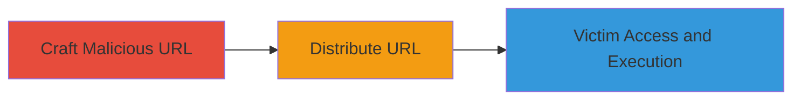

---
tags:
  - xss
  - reflected-xss
  - web-vulnerability
  - javascript-injection
type: attack_chain
tools:
  - '[[tools/Firefox]]'
  - '[[tools/Chrome]]'
tactics:
  - '[[Initial Access]]'
  - '[[Execution]]'
verified: false
platforms:
  - Web
submitted: true
complexity: medium
created_at: '2023-10-01T00:00:00Z'
procedures:
  - '[[procedures/Craft-Malicious-URL-with-XSS-Payload]]'
  - '[[procedures/Distribute-Malicious-URL-via-Social-Engineering]]'
  - '[[procedures/Trigger-XSS-Execution-upon-Victim-Login]]'
step_count: 3
techniques:
  - '[[Drive-by Compromise]]'
  - '[[JavaScript]]'
updated_at: '2025-12-14T00:11:09.674Z'
description: >-
  A multi-stage attack exploiting a reflected XSS vulnerability in the OWOX BI
  dashboard URL path to inject and execute arbitrary JavaScript, leading to
  session hijacking or data theft upon victim interaction.
skill_level: intermediate
impact_level: high
id: 496e1511-206c-4d7c-a792-c2c9d585490f
validated: true
mitre_tactics:
  - '[[Initial Access]]'
  - '[[Execution]]'
mitre_techniques:
  - '[[Drive-by Compromise]]'
  - '[[JavaScript]]'
---
# Reflected XSS in OWOX BI Dashboard Path for Arbitrary JavaScript Execution

Multi-stage attack chain demonstrating a complete reflected XSS workflow targeting the OWOX BI application at bi.owox.com.

## Chain Metrics Dashboard

| Metric | Value |
|--------|-------|
| Chain Status | Unverified |
| Total Steps | 3 |
| Execution Time | ~5 minutes |
| Skill Level | Intermediate |
| Complexity | Medium |
| Impact Level | High |

## Attack Flow Visualization

## Prerequisites & Requirements

### Required Tools

- [[tools/Firefox]]
- [[tools/Chrome]]

### Target Environment

- Web platform
- Access to OWOX BI at https://bi.owox.com
- No specific ports or services beyond standard HTTPS (443)

### Initial Access Requirements

- No prior credentials needed for crafting/distributing
- Victim must have access to the dashboard and be willing to log in
- Network access to the internet for URL sharing

## Detailed Attack Procedures

### Step 1: Craft Malicious URL
procedure: [[procedures/Craft-Malicious-URL-with-XSS-Payload]]

**Objective**: Inject an XSS payload into the dashboard URL path to create a malicious link that reflects unsanitized input.

**Instructions**: Manually construct the URL by appending a URL-encoded XSS payload to the path ID segment. For example, use the payload `` encoded as `%3Cimg%20src=xss%20onerror=prompt('XSS')%3E`.

Resulting URL: `https://bi.owox.com/ui/6177527534dc114eb07fa829e4ce4d28%3Cimg%20src=xss%20onerror=prompt('XSS')%3E/dashboard/?trial=activated`

**Expected Output**: A valid-looking URL that includes the encoded payload in the path.

**Success Indicators**:
- URL is crafted without syntax errors
- Payload is properly URL-encoded and appended to the ID

### Step 2: Distribute Malicious URL
procedure: [[procedures/Distribute-Malicious-URL-via-Social-Engineering]]

**Objective**: Deliver the malicious URL to a target user via phishing or social engineering to lure them into clicking and logging in.

**Instructions**: Share the crafted URL through email, messaging, or other channels, disguising it as a legitimate dashboard link. No specific tools required beyond standard communication methods.

**Expected Output**: Victim receives and interacts with the URL.

**Success Indicators**:
- URL is sent successfully
- Victim clicks the link (verified by monitoring or follow-up)

### Step 3: Trigger XSS Execution
procedure: [[procedures/Trigger-XSS-Execution-upon-Victim-Login]]

**Objective**: Cause the payload to execute in the victim's browser context after they access the URL and authenticate, allowing arbitrary JavaScript to run.

**Instructions**: The victim visits the URL in [[tools/Firefox]] or [[tools/Chrome]], logs in, and the reflected path payload triggers the `onerror` event, executing `prompt('XSS')` or custom JS for session theft.

**Expected Output**: Alert box or JS execution in the victim's browser, potentially stealing cookies or session data.

**Success Indicators**:
- JavaScript alert or payload execution observed
- Access to victim's session data or further browser actions

## Attack Chain Summary

### Key Achievements

1. Successful injection of XSS payload into URL path without server-side sanitization
2. Delivery of malicious link leading to victim interaction
3. Execution of arbitrary JavaScript post-login, enabling high-impact attacks like session hijacking

## Technique & Tactic Coverage

### MITRE ATT&CK Techniques

- [[Drive-by Compromise]]
- [[JavaScript]]

### MITRE ATT&CK Tactics

- [[Initial Access]]
- [[Execution]]

---
*Last updated: 2023-10-01T00:00:00Z*
