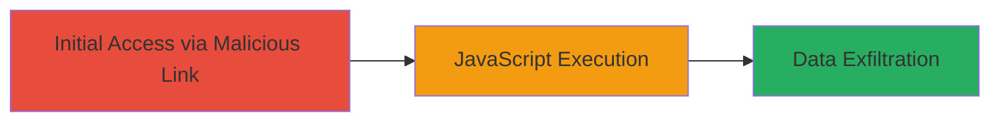

---
id: a1b2c3d4-e5f6-7890-abcd-ef1234567890
name: Reflected XSS in Oberlo Auth Endpoint to Steal Authentication Data
type: attack_chain
description: "A single-stage attack exploiting a reflected XSS vulnerability in the Oberlo authentication endpoint to execute JavaScript and potentially steal user cookies or tokens."
verified: false
submitted: false
step_count: 1
created_at: 2024-10-01T00:00:00Z
updated_at: 2024-10-01T00:00:00Z
procedures: [[procedures/Exploit-Reflected-XSS-via-Shop-Parameter]]
techniques: [[Drive-by Compromise]], [[JavaScript]]
tactics: [[Initial Access]], [[Collection]]
tags: xss, reflected-xss, javascript, authentication, oberlo, shopify
platforms: Web
tools: [[tools/Firefox]]
---

# Reflected XSS in Oberlo Auth Endpoint to Steal Authentication Data

Multi-stage attack chain demonstrating a complete attack workflow.

## Chain Metrics Dashboard

| Metric | Value |
|--------|-------|
| Chain Status | Unverified |
| Total Steps | 1 |
| Execution Time | ~1 minute |
| Skill Level | Beginner |
| Complexity | Low |
| Impact Level | High |

## Attack Flow Visualization



## Prerequisites & Requirements

### Required Tools

- [[tools/Firefox]]

### Target Environment

- Target Platform: Web application (app.oberlo.com)
- Required services/ports: HTTPS (443)
- Network access requirements: Internet access to visit the malicious URL

### Initial Access Requirements

- Credential requirements: None (anonymous access to auth endpoint)
- Network position: External attacker
- Prior access needed: None

## Detailed Attack Procedures

### Step 1: Exploit Reflected XSS
procedure: [[procedures/Exploit-Reflected-XSS-via-Shop-Parameter]]

**Objective**: Inject and execute arbitrary JavaScript in the victim's browser by tricking them into visiting a malicious URL, leading to potential theft of authentication tokens or cookies.

**Instructions**: Craft a malicious URL with a JavaScript payload in the 'shop' parameter and have the victim visit it using [[tools/Firefox]]. The payload injects an HTML img tag with an onerror handler to execute JavaScript, such as prompting the document domain for proof-of-concept.

Example malicious URL:

```url
https://app.oberlo.com/auth?shop=%3C/noscript%3E%3Cimg%20src=x%20onerror=prompt(document.domain)%3E
```

In a real attack, replace the prompt with code to exfiltrate cookies or tokens, e.g., sending them to an attacker-controlled server.

**Expected Output**: JavaScript execution, such as an alert popup displaying 'app.oberlo.com' (document domain), confirming the XSS.

**Success Indicators**:
- Alert popup or JavaScript execution observed
- No sanitization errors; payload reflects unsanitized into the page

## Attack Chain Summary

### Key Achievements

1. Successful reflection of unsanitized 'shop' parameter leading to JavaScript execution
2. Demonstration of potential for cookie/token theft in authentication flow
3. Exploitation via simple URL crafting without authentication

## Technique & Tactic Coverage

### MITRE ATT&CK Techniques

- [[Drive-by Compromise]]
- [[JavaScript]]

### MITRE ATT&CK Tactics

- [[Initial Access]]
- [[Collection]]

---
*Last updated: 2024-10-01T00:00:00Z*
