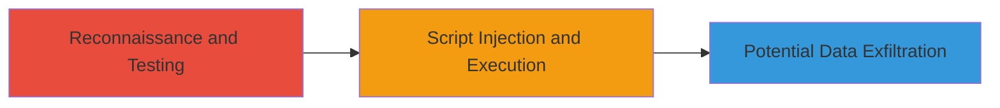

# Reflected XSS in Outdated WSO2 Data Analytics Server on 8x8 API Manager

Multi-stage attack chain demonstrating a complete attack workflow.

## Chain Metrics Dashboard

| Metric | Value |
|--------|-------|
| Chain Status | Unverified |
| Total Steps | 1 |
| Execution Time | ~5 minutes |
| Skill Level | Intermediate |
| Complexity | Medium |
| Impact Level | Medium |

## Attack Flow Visualization



## Prerequisites & Requirements

### Required Tools

- [[tools/Burp-Suite]]

### Target Environment

- Web platform
- Exposed service on port 443 (HTTPS)
- Outdated WSO2 Data Analytics Server

### Initial Access Requirements

- Network access to https://apimgr.8x8.com
- No credentials required for reflected XSS testing
- Browser or proxy tool for payload delivery

## Detailed Attack Procedures

### Step 1: Exploit Reflected XSS
procedure: [[procedures/Exploit-Reflected-XSS-in-WSO2]]

**Objective**: Inject and execute malicious JavaScript in a victim's browser by exploiting unsanitized reflected inputs in the WSO2 Data Analytics Server interface.

**Instructions**: Identify a vulnerable endpoint during reconnaissance, such as a search or parameter field that reflects user input without sanitization. Use [[commands/curl-xss-payload]] to test for reflection:

```bash
curl -X GET "https://apimgr.8x8.com/vulnerable-endpoint?search=<script>alert('XSS')</script>" -v
```

If the payload reflects in the response, craft a malicious URL and deliver it via phishing or social engineering. Intercept traffic with Burp Suite to modify requests and confirm execution in a browser context.

**Expected Output**: The injected script appears in the HTML response and executes when loaded in a browser, e.g., an alert box pops up.

**Success Indicators**:
- Payload reflected without encoding in server response
- JavaScript executes in browser (e.g., alert fires)
- Potential for cookie theft or session hijacking

## Attack Chain Summary

### Key Achievements

1. Identified outdated WSO2 server vulnerable to reflected XSS
2. Demonstrated script injection leading to browser execution
3. Highlighted medium-impact risk for user data compromise

## Technique & Tactic Coverage

### MITRE ATT&CK Techniques

- [[JavaScript]]

### MITRE ATT&CK Tactics

- [[Execution]]

---
*Last updated: 2023-10-01T00:00:00Z*
