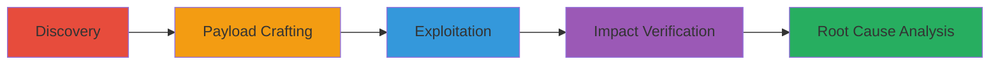

# Reflected XSS in Pagination Links with WAF and Browser Bypass on data.gov

Multi-stage attack chain demonstrating a reflected XSS vulnerability exploitation on data.gov, where insufficient sanitization of query parameters like 'q' allows breakout from single-quoted href attributes in pagination links, bypassed via payloads with multiple '&' characters.

## Chain Metrics Dashboard

| Metric | Value |
|--------|-------|
| Chain Status | Unverified |
| Total Steps | 5 |
| Execution Time | ~15 minutes |
| Skill Level | Intermediate |
| Complexity | Medium |
| Impact Level | Medium |

## Attack Flow Visualization

## Prerequisites & Requirements

### Required Tools

- [[tools/Google-Search]]

### Target Environment

- Web platform running PHP
- Publicly accessible endpoints with pagination features (e.g., /local/)
- No authentication required

### Initial Access Requirements

- Internet access to data.gov
- Browser for testing (Chrome, Firefox, IE)
- No prior credentials or network position needed

## Detailed Attack Procedures

### Step 1: Discovery of Reflected XSS
procedure: [[procedures/Discover-Reflected-XSS-in-Query-Parameters]]

**Objective**: Identify the reflected XSS vulnerability by testing query parameters on endpoints like /local/.

**Instructions**: Navigate to https://www.data.gov/local/ and append payloads to the 'q' parameter, such as ?q=test'. Observe if the input reflects unsanitized in the pagination 
. Use trial-and-error with payloads containing increasing numbers of '&' characters (start with 1, increment to 3+). For example, test ?q=abc'&def to check for single quote breakout from href='...'

**Expected Output**: Payload reflection in pagination links without proper escaping, allowing attribute breakout.

**Success Indicators**:
- Input from 'q' appears in href attributes
- Single quotes break out of quoted strings

### Step 2: Payload Crafting for Bypasses
procedure: [[procedures/Craft-Payload-to-Bypass-Kona-WAF-and-Chrome-XSS-Auditor]]

**Objective**: Develop a payload that evades Kona WAF and Chrome XSS Auditor using multiple '&' to manipulate FILTER_SANITIZE_STRING stripping.

**Instructions**: Use [[tools/Google-Search]] to research PHP FILTER_SANITIZE_STRING behavior. Craft encoded payload like zzz'onmou<seover=1&ale<rt('xsp'<)<;1; // and append to URL as ?&q&zzz'onmou<seover=1&ale<rt('xsp'<)<;1; //. The three+ '&' cause partial stripping, neutralizing WAF rules while preserving the onmouseover=alert('xsp') injection.

**Expected Output**: Payload passes through WAF without blocking and avoids browser auditor flagging.

**Success Indicators**:
- No WAF block or redirect
- Payload reflects intact for execution

### Step 3: Exploitation via Interaction
procedure: [[procedures/Exploit-XSS-by-Hovering-over-Pagination-Links]]

**Objective**: Trigger JavaScript execution by interacting with the vulnerable pagination links.

**Instructions**: Visit the crafted URL https://www.data.gov/local/?&q&zzz'onmou<seover=1&ale<rt('xsp'<)<;1; //. Hover the mouse over a pagination link like 'Page 2' to activate the onmouseover event, executing alert('xsp'). Test in Chrome, Firefox, and IE to confirm cross-browser compatibility.

**Expected Output**: Alert box pops up displaying 'xsp' upon hover.

**Success Indicators**:
- JavaScript alert triggers
- No errors in browser console

### Step 4: Site-Wide Impact Verification
procedure: [[procedures/Verify-Site-Wide-Impact-on-Multiple-Endpoints]]

**Objective**: Confirm the vulnerability affects over 80 endpoints with pagination.

**Instructions**: Use [[tools/Google-Search]] with queries like "site:data.gov pagination" to enumerate endpoints (e.g., /food/, /consumer/). Apply the same payload ?&q&zzz'onmou<seover=1&ale<rt('xsp'<)<;1; // to each and test hover on pagination links.

**Expected Output**: Consistent reflection and execution across tested endpoints.

**Success Indicators**:
- 80+ endpoints identified and vulnerable
- Uniform payload success rate

### Step 5: Root Cause Analysis
procedure: [[procedures/Analyze-Root-Cause-in-Source-Code]]

**Objective**: Examine the PHP source to understand and confirm the vulnerability root.

**Instructions**: Access the GitHub repo at https://github.com/GSA/data.gov and review roots-nextdatagov/templates/content-all-apps-pagination.php around line 368. Note the use of single quotes in href attributes and $query = filter_var($_GET['q'], FILTER_SANITIZE_STRING); which fails to escape single quotes.

**Expected Output**: Identification of unescaped user input in HTML attributes.

**Success Indicators**:
- Confirmed improper sanitization
- Matches observed behavior

## Attack Chain Summary

### Key Achievements

1. Discovered reflected XSS via query parameter reflection in pagination.
2. Bypassed Kona WAF and Chrome XSS Auditor with multi-'&' payloads.
3. Achieved cross-browser JavaScript execution on hover.
4. Verified impact on 80+ site-wide endpoints.
5. Analyzed PHP root cause for remediation insights.

## Technique & Tactic Coverage

### MITRE ATT&CK Techniques

- [[Drive-by Compromise]] Drive-by Compromise
- [[JavaScript]] JavaScript

### MITRE ATT&CK Tactics

- [[Initial Access]] Initial Access
- [[Execution]] Execution

---
*Last updated: 2023-10-01T00:00:00Z*
