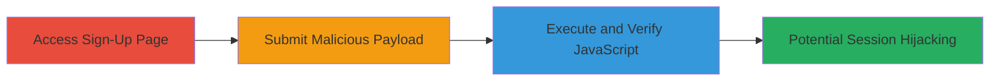

# Reflected XSS in Password Field on Localize Sign-Up Page

Multi-stage attack chain demonstrating a complete attack workflow for exploiting a reflected XSS vulnerability in the password parameter during user registration on the Localize platform.

## Chain Metrics Dashboard

| Metric | Value |
|--------|-------|
| Chain Status | Unverified |
| Total Steps | 3 |
| Execution Time | ~2 minutes |
| Skill Level | Beginner |
| Complexity | Low |
| Impact Level | Medium |

## Attack Flow Visualization



## Prerequisites & Requirements

### Required Tools

- Web browser (e.g., Chrome with Developer Tools)
- Optional: Proxy tool like Burp Suite for crafting requests

### Target Environment

- Web application: Localize sign-up page at http://www.localize.io/pages/sign_up
- Required services/ports: HTTP/HTTPS on port 80/443
- Network access requirements: Direct internet access to the target URL

### Initial Access Requirements

- No credentials required
- Publicly accessible web page
- No prior access needed

## Detailed Attack Procedures

### Step 1: Access Sign-Up Page
procedure: [[procedures/Access-Localize-Sign-Up-Page]]

**Objective**: Navigate to the vulnerable sign-up form to prepare for payload submission.

**Instructions**: Open a web browser and directly access the sign-up endpoint. No special commands are needed; use the browser's address bar.

**Expected Output**: The sign-up form loads, displaying fields for registration including the password input.

**Success Indicators**:
- Sign-up page renders without errors
- Password field is visible and editable

### Step 2: Submit XSS Payload to Password Field
procedure: [[procedures/Submit-XSS-Payload-to-Password-Field]]

**Objective**: Inject a polyglot XSS payload into the password parameter via a POST request to trigger reflection.

**Instructions**: Use a tool like curl or a browser form submission to send the payload. For reproducibility, execute [[commands/curl-submit-xss-payload]] with the provided polyglot payload:

```bash
curl -X POST http://www.localize.io/pages/sign_up \
  -d "password=/*-->\\]\]>%>?></object></script></title></textarea></noscript></style></xmp>'-/\"/-alert(1)//>" \
  -d "email=test@example.com" \
  -d "other_fields=values"
```

Adjust other form fields as needed to mimic a valid submission.

**Expected Output**: The server processes the request and reflects the payload in the response, potentially executing JavaScript.

**Success Indicators**:
- Request accepted without server error
- Payload appears in the HTML response unescaped

### Step 3: Verify XSS Execution
procedure: [[procedures/Verify-XSS-Execution]]

**Objective**: Confirm JavaScript execution by observing the alert dialog or inspecting the reflected payload.

**Instructions**: After submission, inspect the page source or wait for client-side rendering. The payload should trigger an alert(1) box. Capture a screenshot for proof.

**Expected Output**: JavaScript alert box pops up displaying "1", indicating successful execution.

**Success Indicators**:
- Alert dialog appears
- No sanitization errors in browser console
- Screenshot confirms execution (e.g., localize.jpg)

## Attack Chain Summary

### Key Achievements

1. Successfully accessed the vulnerable sign-up form
2. Injected and reflected a polyglot XSS payload in the password field
3. Verified JavaScript execution, enabling potential attacks like session cookie theft

## Technique & Tactic Coverage

### MITRE ATT&CK Techniques

- [[JavaScript]]

### MITRE ATT&CK Tactics

- [[Execution]]

---
*Last updated: 2023-10-01T00:00:00Z*
