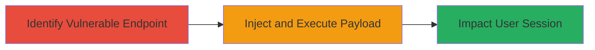

# Reflected XSS in PayPal Credit Application Endpoint

Multi-stage attack chain demonstrating exploitation of a reflected XSS vulnerability in PayPal's credit application endpoint.

## Chain Metrics Dashboard

| Metric | Value |
|--------|-------|
| Chain Status | Unverified |
| Total Steps | 1 |
| Execution Time | ~5 minutes |
| Skill Level | Intermediate |
| Complexity | Low |
| Impact Level | Medium |

## Attack Flow Visualization



## Prerequisites & Requirements

### Required Tools

- Browser with developer tools (e.g., Chrome DevTools)
- Optional: Proxy tool like Burp Suite for payload crafting

### Target Environment

- Web platform
- Access to public-facing PayPal credit application URL
- No specific ports or services beyond standard HTTPS (443)

### Initial Access Requirements

- Public internet access
- No credentials required for initial payload injection (reflected XSS targets tricked users)
- Victim must visit the maliciously crafted URL

## Detailed Attack Procedures

### Step 1: Exploit Reflected XSS
procedure: [[procedures/Exploit-Reflected-XSS-Vulnerability]]

**Objective**: Inject a malicious JavaScript payload into the credit application endpoint to execute arbitrary code in the victim's browser, potentially stealing session cookies or altering page content.

**Instructions**: Navigate to the vulnerable endpoint and append a reflected parameter (e.g., a search or redirect query) with an XSS payload. Use a simple alert payload for testing:

First, construct the URL with payload using browser or [[commands/curl-xss-test]]:

```bash
curl "https://www.paypal.com/ppcreditapply/da/us?param=<script>alert('XSS')</script>" -v
```

Observe the response to confirm reflection without sanitization. For live exploitation, send the URL to a victim via phishing.

**Expected Output**: The page renders the injected script, triggering an alert box or executing JS (e.g., cookie theft via `document.cookie`).

**Success Indicators**:
- Payload executes in browser (e.g., alert pops up)
- No sanitization errors; script tag renders as executable
- Potential session data exfiltration if payload is advanced (e.g., sending cookies to attacker server)

## Attack Chain Summary

### Key Achievements

1. Successful injection and execution of client-side script via reflected parameter.
2. Demonstration of impact on user browser session without server-side compromise.
3. Reporting and resolution via HackerOne, highlighting vulnerability triage process.

## Technique & Tactic Coverage

### MITRE ATT&CK Techniques

- [[Exploit Public-Facing Application]]
- [[JavaScript]]

### MITRE ATT&CK Tactics

- [[Initial Access]]
- [[Execution]]

---
*Last updated: 2023-10-01T00:00:00Z*
