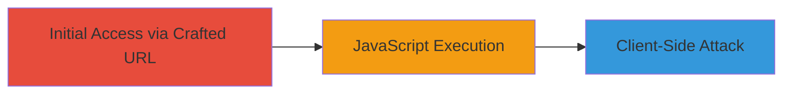

---
tags:
  - xss
  - reflected-xss
  - javascript
  - web-vulnerability
type: attack_chain
tools: []
tactics:
  - '[[Execution]]'
verified: false
platforms:
  - Web
submitted: true
complexity: low
created_at: '2020-09-22T00:00:00Z'
procedures:
  - '[[procedures/Exploit-Reflected-XSS-in-Photogallery]]'
step_count: 1
techniques:
  - '[[JavaScript]]'
updated_at: '2025-12-13T23:52:33.919Z'
description: >-
  A single-stage attack exploiting a reflected XSS vulnerability in the
  photogallery component of https://market.av.ru to execute arbitrary JavaScript
  in a victim's browser.
skill_level: beginner
impact_level: high
id: 0985408f-92bd-4d99-828a-4e1be308d9a2
validated: true
mitre_tactics:
  - '[[Execution]]'
mitre_techniques:
  - '[[JavaScript]]'
---
# Reflected XSS in Photogallery Component for JavaScript Execution

Multi-stage attack chain demonstrating a complete attack workflow.

## Chain Metrics Dashboard

| Metric | Value |
|--------|-------|
| Chain Status | Unverified |
| Total Steps | 1 |
| Execution Time | ~1 minutes |
| Skill Level | Beginner |
| Complexity | Low |
| Impact Level | High |

## Attack Flow Visualization

## Prerequisites & Requirements

### Required Tools

- Web browser (e.g., Chrome, Firefox)

### Target Environment

- Web platform
- Access to https://market.av.ru photogallery component
- No specific ports or services required beyond HTTP/HTTPS

### Initial Access Requirements

- Ability to craft and distribute URLs (e.g., via email, social engineering)
- Victim must visit the malicious URL in their browser
- No prior credentials needed

## Detailed Attack Procedures

### Step 1: Craft and Deliver Malicious URL
procedure: [[procedures/Exploit-Reflected-XSS-in-Photogallery]]

**Objective**: Inject malicious JavaScript into the photogallery component via a reflected parameter to execute code in the victim's browser context.

**Instructions**: Identify a vulnerable parameter in the photogallery (e.g., a search or ID field). Construct a URL with a payload like ``. For example, if the vulnerable endpoint is https://market.av.ru/photogallery/search?q=, append the payload: https://market.av.ru/photogallery/search?q=%3Cscript%3Ealert%28%27XSS%27%29%3C%2Fscript%3E. Send this URL to the victim via phishing or other means. When visited, the payload reflects and executes.

**Expected Output**: JavaScript alert or other payload effects in the browser, such as DOM manipulation or data exfiltration.

**Success Indicators**:
- Payload executes (e.g., alert pops up)
- Browser console shows script execution
- Potential for session cookie theft if payload is adapted (e.g., sending document.cookie to attacker server)

## Attack Chain Summary

### Key Achievements

1. Successful injection and execution of arbitrary JavaScript
2. Potential for session hijacking or phishing attacks
3. Demonstration of client-side vulnerability exploitation

## Technique & Tactic Coverage

### MITRE ATT&CK Techniques

- [[JavaScript]]

### MITRE ATT&CK Tactics

- [[Execution]]

---
*Last updated: 2020-09-22T00:00:00Z*
