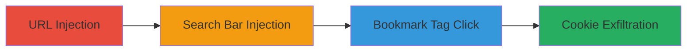

# Reflected XSS in Pixiv.net Mobile URLs, Search, and Bookmarks for Cookie Theft

Multi-stage attack chain demonstrating reflected XSS exploitation on pixiv.net's mobile web version to execute arbitrary JavaScript and steal cookies.

## Chain Metrics Dashboard

| Metric | Value |
|--------|-------|
| Chain Status | Unverified |
| Total Steps | 4 |
| Execution Time | ~2 minutes |
| Skill Level | Beginner |
| Complexity | Low |
| Impact Level | High |

## Attack Flow Visualization



## Prerequisites & Requirements

### Required Tools

- [[tools/Chrome-iOS-13-1]]

### Target Environment

- Web platform (pixiv.net mobile version)
- iOS 13.1 device with Chrome browser
- No authentication required for initial access

### Initial Access Requirements

- Public internet access to pixiv.net
- Mobile user agent (Chrome on iOS 13.1)
- No prior credentials needed

## Detailed Attack Procedures

### Step 1: Inject Payload into Main URL
procedure: [[procedures/Inject-XSS-Payload-into-Pixiv-URL]]

**Objective**: Trigger basic XSS execution via URL parameter to confirm vulnerability.

**Instructions**: Open Chrome on iOS 13.1 and navigate to the crafted URL with the payload.

Access the URL using [[tools/Chrome-iOS-13-1]]:

```url
https://www.pixiv.net/en/['-confirm(3)-']
```

**Expected Output**: A confirmation dialog with value 3 appears, indicating JavaScript execution.

**Success Indicators**:
- JavaScript alert or confirm dialog triggers
- No server-side blocking of the payload

### Step 2: Steal Cookies via URL Injection
procedure: [[procedures/Inject-XSS-Payload-into-Pixiv-URL]]

**Objective**: Execute payload to capture and display user cookies for potential session hijacking.

**Instructions**: In the same browser session, access another crafted URL to alert cookies.

Access the URL using [[tools/Chrome-iOS-13-1]]:

```url
https://www.pixiv.net/en/['-alert(document.cookie)-']
```

**Expected Output**: An alert box displays the site's cookies, such as session tokens.

**Success Indicators**:
- Cookies are revealed in the alert
- Payload executes without sanitization

### Step 3: Inject Payload into Search Bar
procedure: [[procedures/Inject-XSS-Payload-into-Pixiv-Search-Bar]]

**Objective**: Exploit search functionality to reflect XSS via the tags endpoint.

**Instructions**: Use the search bar on the mobile site to input the payload, which redirects to a vulnerable URL.

Enter the payload in the search bar using [[tools/Chrome-iOS-13-1]]:

```text
['-confirm(3)-']
```

This leads to:

```url
https://www.pixiv.net/en/tags/['-confirm(3)-']#discover
```

**Expected Output**: Confirmation dialog with value 3 on page load.

**Success Indicators**:
- Search redirects and executes payload
- Tags endpoint reflects input unsanitized

### Step 4: Exploit XSS in User Bookmarks Tags
procedure: [[procedures/Exploit-XSS-in-Pixiv-Bookmark-Tags]]

**Objective**: Trigger XSS by clicking malicious tags in user bookmarks to steal cookies from visitors.

**Instructions**: Navigate to a user's bookmark page and interact with a tag containing the payload.

Visit a user profile (e.g., https://www.pixiv.net/en/users/46584798) using [[tools/Chrome-iOS-13-1]], select an image, and click a tag like:

```text
['-alert(document.cookie)-']
```

or

```text
['-confirm(5)-']
```

**Expected Output**: Alert with cookies or confirm dialog with value 5.

**Success Indicators**:
- Payload executes on tag click
- Visitor's cookies can be exfiltrated

## Attack Chain Summary

### Key Achievements

1. Confirmed reflected XSS in URL parameters on mobile.
2. Demonstrated cookie theft capability.
3. Extended exploitation to search and bookmark features.
4. Highlighted session hijacking risk for authenticated users.

## Technique & Tactic Coverage

### MITRE ATT&CK Techniques

- [[JavaScript]]
- [[Keylogging]]

### MITRE ATT&CK Tactics

- [[Execution]]
- [[Collection]]

---

*Last updated: 2023-10-01T00:00:00Z*
