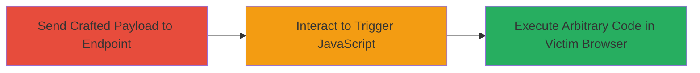

---
tags:
  - xss
  - reflected-xss
  - waf-bypass
  - javascript-injection
  - dod
type: attack_chain
tools: []
tactics:
  - '[[Initial Access]]'
  - '[[Execution]]'
  - '[[Collection]]'
verified: false
platforms:
  - Web
submitted: true
complexity: medium
created_at: '2023-10-01T00:00:00Z'
procedures:
  - '[[procedures/Exploit-Reflected-XSS-via-Onauxclick-Payload]]'
step_count: 2
techniques:
  - '[[Exploit Public-Facing Application]]'
  - '[[JavaScript]]'
updated_at: '2025-12-14T03:15:53.606Z'
description: >-
  A multi-stage attack exploiting a reflected XSS vulnerability in the 'plot'
  parameter of a DoD web endpoint, bypassing WAF with URL-encoded payload and
  onauxclick handler to execute JavaScript.
skill_level: intermediate
impact_level: high
id: 6a50571f-2076-45fe-ad37-72e6d20dbddc
validated: true
mitre_tactics:
  - '[[Initial Access]]'
  - '[[Execution]]'
  - '[[Collection]]'
mitre_techniques:
  - '[[Exploit Public-Facing Application]]'
  - '[[JavaScript]]'
---
# Reflected XSS in Plot Parameter Bypassing WAF on DoD Website

Multi-stage attack chain demonstrating exploitation of a reflected Cross-Site Scripting (XSS) vulnerability on a U.S. Department of Defense website, allowing arbitrary JavaScript execution in a victim's browser to steal credentials or sessions.

## Chain Metrics Dashboard

| Metric | Value |
|--------|-------|
| Chain Status | Unverified |
| Total Steps | 2 |
| Execution Time | ~1 minutes |
| Skill Level | Intermediate |
| Complexity | Medium |
| Impact Level | High |

## Attack Flow Visualization



## Prerequisites & Requirements

### Required Tools

- Browser (e.g., Chrome, Firefox) for interaction
- [[commands/curl-send-xss-payload]] for testing

### Target Environment

- Web platform with Python/FastCGI backend
- Publicly accessible endpoint: /fcgi-bin/getplot.py
- No authentication required

### Initial Access Requirements

- Network access to the target website (https://██████████)
- No prior credentials needed; public-facing application

## Detailed Attack Procedures

### Step 1: Access Vulnerable Endpoint with Payload
procedure: [[procedures/Exploit-Reflected-XSS-via-Onauxclick-Payload]]

**Objective**: Inject a URL-encoded XSS payload into the 'plot' parameter to bypass WAF and reflect malicious HTML/JavaScript into the response.

**Instructions**: Use [[commands/curl-send-xss-payload]] to send the request to the endpoint:

```bash
curl "https://██████████/fcgi-bin/getplot.py?plot=aaa%3Ch1%20onauxclick=confirm(document.domain)%3ERIGHT%20CLICK%20HERE"
```

Examine the response for the reflected payload, which renders an <h1> tag with the onauxclick event handler.

**Expected Output**: HTML response containing the injected <h1>RIGHT CLICK HERE</h1> element, confirming reflection without sanitization.

**Success Indicators**:
- Payload reflected in response without blocking by WAF
- No error or sanitization altering the HTML/JS

### Step 2: Trigger JavaScript Execution
procedure: [[procedures/Exploit-Reflected-XSS-via-Onauxclick-Payload]]

**Objective**: Interact with the injected element in the victim's browser to execute the JavaScript payload, demonstrating domain access or potential credential theft.

**Instructions**: Load the crafted URL in a browser and right-click on the rendered "RIGHT CLICK HERE" text to trigger the onauxclick event. In a real attack, replace confirm(document.domain) with code to steal session cookies or keylogs.

**Expected Output**: JavaScript alert popup displaying the document.domain (e.g., the DoD site's domain).

**Success Indicators**:
- Alert or execution of JS in browser context
- Confirmation of arbitrary code execution capability

## Attack Chain Summary

### Key Achievements

1. Bypassed WAF using URL encoding and uncommon onauxclick event
2. Achieved reflected XSS on a high-value DoD target
3. Enabled potential theft of user credentials or session hijacking

## Technique & Tactic Coverage

### MITRE ATT&CK Techniques

- [[Exploit Public-Facing Application]]
- [[JavaScript]]

### MITRE ATT&CK Tactics

- [[Initial Access]]
- [[Execution]]
- [[Collection]]

---
*Last updated: 2023-10-01T00:00:00Z*
