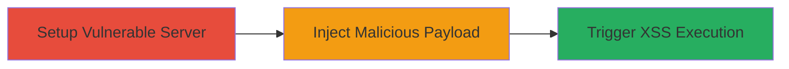

# Reflected XSS in Python DocXMLRPCServer for Arbitrary JavaScript Execution

Multi-stage attack chain demonstrating exploitation of a reflected XSS vulnerability in Python's Lib/DocXMLRPCServer.py module, which generates self-documenting HTML for XML-RPC servers. An attacker crafts a malicious request that injects unsanitized user input into the HTML documentation, executing JavaScript in the victim's browser upon access.

## Chain Metrics Dashboard

| Metric | Value |
|--------|-------|
| Chain Status | Unverified |
| Total Steps | 2 |
| Execution Time | ~5 minutes |
| Skill Level | Intermediate |
| Complexity | Low |
| Impact Level | Medium |

## Attack Flow Visualization



## Prerequisites & Requirements

### Required Tools

- [[tools/NoXss]]

### Target Environment

- Python runtime (version affected by CVE-2019-16935, e.g., 2.7.x or 3.x prior to patch)
- DocXMLRPCServer service running and accessible via HTTP
- Network access to the server's documentation endpoint (typically /RPC2 on port 80/8000)

### Initial Access Requirements

- No credentials required; assumes public-facing XML-RPC server
- Attacker must be able to send HTTP requests to the target
- Victim must visit the crafted malicious URL

## Detailed Attack Procedures

### Step 1: Setup Vulnerable Server

procedure: [[procedures/Setup-Vulnerable-DocXMLRPCServer]]

**Objective**: Deploy or identify a Python XML-RPC server using the vulnerable DocXMLRPCServer module to expose the documentation endpoint.

**Instructions**: Start a simple XML-RPC server using Python's built-in modules. For testing, create a server script that imports and uses DocXMLRPCServer:

```python
# server.py
from SimpleXMLRPCServer import SimpleXMLRPCServer
from DocXMLRPCServer import DocXMLRPCServer

server = DocXMLRPCServer(('localhost', 8000))
server.register_function(lambda: 'Hello', 'hello')
server.serve_forever()
```

Run the server with `python server.py`. The documentation is accessible at http://localhost:8000/RPC2, where user input may be reflected without sanitization.

**Expected Output**: Server listening on port 8000; accessing /RPC2 shows generated HTML documentation.

**Success Indicators**:
- Server starts without errors
- Documentation page loads, confirming vulnerability exposure

### Step 2: Exploit Reflected XSS

procedure: [[procedures/Exploit-Reflected-XSS-in-DocXMLRPCServer]]

**Objective**: Craft and deliver a malicious URL that injects JavaScript into the reflected input field of the documentation generator, executing code in the victim's browser.

**Instructions**: Use a tool like NoXss or manual crafting to test payloads. Send a request to the /RPC2 endpoint with a parameter that gets reflected into HTML, such as a query string simulating user input for method documentation. Example payload using curl to test:

```bash
curl "http://localhost:8000/RPC2?method=hello<script>alert('XSS')</script>"
```

Trick a victim into visiting the full URL: http://target:8000/RPC2?method=hello<script>alert(document.cookie)</script>. Upon loading, the script executes, potentially stealing cookies.

**Expected Output**: Alert box or console log showing executed JavaScript; network requests for exfiltration if payload includes beaconing.

**Success Indicators**:
- JavaScript executes in browser (e.g., alert fires)
- Session data (cookies) can be exfiltrated to attacker-controlled server

## Attack Chain Summary

### Key Achievements

1. Identified and exploited improper input sanitization in DocXMLRPCServer's HTML generation
2. Achieved arbitrary JavaScript execution in victim browsers
3. Demonstrated potential for session hijacking or phishing via client-side attacks

## Technique & Tactic Coverage

### MITRE ATT&CK Techniques

- [[JavaScript]]

### MITRE ATT&CK Tactics

- [[Execution]]

---
*Last updated: 2023-10-01T00:00:00Z*
