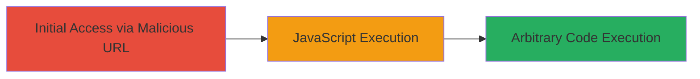

---
tags:
  - xss
  - reflected-xss
  - javascript
  - web-vulnerability
type: attack_chain
tools: []
tactics:
  - '[[Execution]]'
  - '[[Collection]]'
verified: false
platforms:
  - Web
submitted: true
complexity: low
created_at: '2023-10-01T00:00:00Z'
procedures:
  - '[[procedures/Exploit-Reflected-XSS-in-Redirect-Parameter]]'
step_count: 2
techniques:
  - '[[JavaScript]]'
updated_at: '2025-12-13T23:56:03.932Z'
description: >-
  A multi-step attack chain exploiting a reflected XSS vulnerability in the
  redirect parameter of the /webview/v1/refresh-jwt endpoint to execute
  arbitrary JavaScript in the victim's browser.
skill_level: beginner
impact_level: high
id: 64d9ed2c-ffa9-4a43-9f0c-ced95a61c904
validated: true
mitre_tactics:
  - '[[Execution]]'
  - '[[Collection]]'
mitre_techniques:
  - '[[JavaScript]]'
---
# Reflected XSS in Redirect Parameter on watchdocs.indriverapp.com

Multi-stage attack chain demonstrating a complete attack workflow exploiting a reflected cross-site scripting vulnerability.

## Chain Metrics Dashboard

| Metric | Value |
|--------|-------|
| Chain Status | Unverified |
| Total Steps | 2 |
| Execution Time | ~1 minutes |
| Skill Level | Beginner |
| Complexity | Low |
| Impact Level | High |

## Attack Flow Visualization



## Prerequisites & Requirements

### Required Tools

- Web Browser (e.g., Chrome, Firefox)

### Target Environment

- Web platform
- Accessible HTTPS endpoint on watchdocs.indriverapp.com
- No specific ports required beyond standard HTTPS (443)

### Initial Access Requirements

- No credentials required
- Direct network access to the target domain
- Victim must visit the crafted URL

## Detailed Attack Procedures

### Step 1: Navigate to Vulnerable Endpoint with Payload
procedure: [[procedures/Exploit-Reflected-XSS-in-Redirect-Parameter]]

**Objective**: Inject a malicious payload into the 'redirect' parameter to break out of the string context and insert executable HTML/JavaScript.

**Instructions**: Use a web browser to access the crafted URL that includes the XSS payload in the redirect parameter. The payload ">%3Cimg%20src=faw%20onerror=alert(1)%3E" URL-encodes to inject ">  " into the page response.

Open your browser and navigate to:

```url
https://watchdocs.indriverapp.com/webview/v1/refresh-jwt?redirect=%22%3E%3Cimg%20src=faw%20onerror=alert(1)%3E
```

**Expected Output**: The page loads with the injected HTML, triggering the onerror event due to the invalid src="faw".

**Success Indicators**:
- Payload appears in the page source as unescaped HTML
- No immediate errors in browser console related to sanitization

### Step 2: Observe JavaScript Execution
procedure: [[procedures/Exploit-Reflected-XSS-in-Redirect-Parameter]]

**Objective**: Confirm the successful execution of arbitrary JavaScript by observing the triggered alert, demonstrating potential for session theft or other client-side attacks.

**Instructions**: After navigating to the URL from Step 1, monitor for the execution of the injected script. The onerror handler will fire when the img src fails to load, executing alert(1).

Inspect the page in browser developer tools (F12) to verify the injection point in the response.

**Expected Output**: An alert dialog box pops up displaying "1", confirming JavaScript execution in the victim's browser context.

**Success Indicators**:
- Alert window appears
- Browser console shows no blocking (e.g., CSP violations)
- Potential to replace alert(1) with more malicious code like document.cookie for session theft

## Attack Chain Summary

### Key Achievements

1. Successful injection of HTML/JavaScript via unsanitized redirect parameter
2. Execution of arbitrary code in browser context
3. Demonstration of high-impact client-side attack vector like session hijacking

## Technique & Tactic Coverage

### MITRE ATT&CK Techniques

- [[JavaScript]]

### MITRE ATT&CK Tactics

- [[Execution]]
- [[Collection]]

---
*Last updated: 2023-10-01T00:00:00Z*
