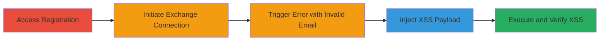

---
tags:
  - xss
  - reflected-xss
  - web-vulnerability
  - email-connection
  - microsoft-exchange
type: attack_chain
tools: []
tactics:
  - '[[Initial Access]]'
  - '[[Execution]]'
verified: false
platforms:
  - Web
submitted: true
complexity: low
created_at: '2023-10-01T00:00:00Z'
procedures:
  - '[[procedures/Access-RelateIQ-Registration-and-Initiate-Exchange-Connection]]'
  - '[[procedures/Trigger-Error-Page-with-Invalid-Email]]'
  - '[[procedures/Inject-and-Execute-XSS-Payload-in-Email-Field]]'
step_count: 5
techniques:
  - '[[Drive-by Compromise]]'
  - '[[JavaScript]]'
updated_at: '2025-12-14T03:15:53.212Z'
description: >-
  A multi-step attack exploiting a reflected XSS vulnerability in the RelateIQ
  registration process when connecting to Microsoft Exchange, allowing arbitrary
  JavaScript execution in the victim's browser.
skill_level: beginner
impact_level: medium
id: b87cc5b9-c0b4-4190-99d9-741982469d7f
validated: true
mitre_tactics:
  - '[[Initial Access]]'
  - '[[Execution]]'
mitre_techniques:
  - '[[Drive-by Compromise]]'
  - '[[JavaScript]]'
---
# Reflected XSS in RelateIQ MS Exchange Email Connection Feature

Multi-stage attack chain demonstrating exploitation of a Cross-Site Scripting (XSS) vulnerability in the Microsoft Exchange email connection feature during user registration on app.relateiq.com. The attack leverages unsanitized user input reflection in an error page to execute arbitrary JavaScript, potentially enabling session hijacking, data theft, or phishing in the victim's browser.

## Chain Metrics Dashboard

| Metric | Value |
|--------|-------|
| Chain Status | Unverified |
| Total Steps | 5 |
| Execution Time | ~2 minutes |
| Skill Level | Beginner |
| Complexity | Low |
| Impact Level | Medium |

## Attack Flow Visualization

## Prerequisites & Requirements

### Required Tools

- Web browser (e.g., Chrome, Firefox)

### Target Environment

- Web platform
- RelateIQ application at https://app.relateiq.com/
- Access to Microsoft Exchange or Office365 connection feature
- No specific ports required; standard HTTPS (443)

### Initial Access Requirements

- Public internet access to the target site
- No prior credentials needed; exploits during anonymous registration attempt
- Victim must interact with the registration form

## Detailed Attack Procedures

### Step 1: Navigate to Registration Page
procedure: [[procedures/Access-RelateIQ-Registration-and-Initiate-Exchange-Connection]]

**Objective**: Gain access to the RelateIQ registration flow to set up the environment for the exploit.

**Instructions**: Open a web browser and visit the target URL. Locate and click the registration option to begin the process.

**Expected Output**: Registration page loads, prompting for user details and connection options.

**Success Indicators**:
- Registration form visible
- Option to connect email services available

### Step 2: Agree to Terms and Select MS Exchange Connection
procedure: [[procedures/Access-RelateIQ-Registration-and-Initiate-Exchange-Connection]]

**Objective**: Proceed through initial setup to reach the email connection interface.

**Instructions**: Accept the terms of service, click continue, and select the Microsoft Exchange or Office365 connection option from the available choices.

**Expected Output**: Email connection form appears, requesting email address and related details.

**Success Indicators**:
- Terms accepted successfully
- MS Exchange connection form loaded

### Step 3: Attempt Connection with Random Email to Trigger Error
procedure: [[procedures/Trigger-Error-Page-with-Invalid-Email]]

**Objective**: Input invalid credentials to generate an error page that reflects user input, exposing the XSS entry point.

**Instructions**: Enter a random, invalid email address in the email field and click 'Connect email'. This should fail and display an error message with additional input fields.

**Expected Output**: Error page renders with reflected input and new fields like 'Override Endpoint Address'.

**Success Indicators**:
- Error message displayed
- Additional form fields appear for endpoint override

### Step 4: Inject XSS Payload into Email Field
procedure: [[procedures/Inject-and-Execute-XSS-Payload-in-Email-Field]]

**Objective**: Craft and insert a malicious JavaScript payload into the vulnerable input field to prepare for execution.

**Instructions**: In the email field, input the payload: `dada@c.com">`. In the 'Override Endpoint Address' field, enter a benign value like `google.com` to avoid unrelated errors.

**Expected Output**: Payload accepted in the form without immediate execution.

**Success Indicators**:
- Payload entered successfully
- No form validation errors on input

### Step 5: Submit Form to Trigger XSS
procedure: [[procedures/Inject-and-Execute-XSS-Payload-in-Email-Field]]

**Objective**: Submit the form to cause the reflected input to execute the injected JavaScript in the browser context.

**Instructions**: Click 'Connect email' to process the form. The error handling will reflect the payload, triggering the script.

**Expected Output**: Alert box pops up displaying the document domain (e.g., app.relateiq.com), confirming XSS execution.

**Success Indicators**:
- JavaScript alert executes
- Arbitrary code runs in the victim's browser session

## Attack Chain Summary

### Key Achievements

1. Successful navigation and initiation of the vulnerable registration flow
2. Triggering of the error page that reflects unsanitized input
3. Execution of arbitrary JavaScript, demonstrating potential for session hijacking or data exfiltration

## Technique & Tactic Coverage

### MITRE ATT&CK Techniques

- [[Drive-by Compromise]]
- [[JavaScript]]

### MITRE ATT&CK Tactics

- [[Initial Access]]
- [[Execution]]

---

*Last updated: 2023-10-01T00:00:00Z*
