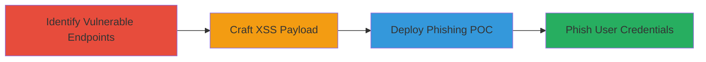

---
tags:
  - xss
  - reflected-xss
  - phishing
  - spoofing
type: attack_chain
tools: []
tactics:
  - '[[Initial Access]]'
verified: false
platforms:
  - Web
submitted: true
complexity: medium
created_at: '2023-10-01T00:00:00Z'
procedures:
  - '[[procedures/Identify-Reflected-XSS-in-Reverb-Endpoints]]'
  - '[[procedures/Craft-and-Test-XSS-Payload-for-Spoofing]]'
  - '[[procedures/Demonstrate-XSS-Impact-with-Phishing-POC]]'
step_count: 3
techniques:
  - '[[Exploit Public-Facing Application]]'
  - '[[JavaScript]]'
updated_at: '2025-12-14T03:47:12.623Z'
description: >-
  A multi-step attack exploiting a reflected XSS vulnerability in Reverb.com's
  buying and selling pages to inject spoofed HTML content, mimicking official
  login alerts to phish user credentials.
skill_level: intermediate
impact_level: high
id: 36f0ce73-5063-46c4-956a-e16d1a298319
validated: true
mitre_tactics:
  - '[[Initial Access]]'
mitre_techniques:
  - '[[Exploit Public-Facing Application]]'
  - '[[JavaScript]]'
---
# Reflected XSS in Reverb Query Parameters for Spoofed Phishing Alerts

Multi-stage attack chain demonstrating exploitation of a reflected Cross-Site Scripting (XSS) vulnerability in Reverb.com's user dashboard pages to inject arbitrary HTML, enabling the creation of convincing phishing prompts that trick users into interacting with malicious links.

## Chain Metrics Dashboard

| Metric | Value |
|--------|-------|
| Chain Status | Unverified |
| Total Steps | 3 |
| Execution Time | ~15 minutes |
| Skill Level | Intermediate |
| Complexity | Medium |
| Impact Level | High |

## Attack Flow Visualization

## Prerequisites & Requirements

### Required Tools

- Web browser with developer tools (e.g., Chrome DevTools for inspecting rendered HTML)
- URL encoder/decoder (built-in browser tools or online)

### Target Environment

- Web platform
- Access to Reverb.com sandbox or production (logged-in user session for dashboard pages)
- No specific services/ports beyond standard HTTPS (443)

### Initial Access Requirements

- Valid user account on Reverb.com to access /my/ pages
- Network access to sandbox.reverb.com or reverb.com
- No prior elevated access needed; targets logged-in users via shared links

## Detailed Attack Procedures

### Step 1: Identify Vulnerable Endpoints
procedure: [[procedures/Identify-Reflected-XSS-in-Reverb-Endpoints]]

**Objective**: Locate query parameters in Reverb's dashboard pages that unsafely render user input as HTML, allowing tag and class injection.

**Instructions**: Manually explore the sandbox environment, focusing on pages like /my/buying/orders, /my/selling/listings, and /my/selling/orders. Append test parameters (e.g., ?query=<test>) and inspect the page source or rendered output to check for direct HTML insertion without escaping.

**Expected Output**: Confirmation that the query parameter renders HTML tags and classes directly in the DOM.

**Success Indicators**:
- Input appears as raw HTML in the page (e.g., test)
- No sanitization errors or blocking observed

### Step 2: Craft and Test XSS Payload
procedure: [[procedures/Craft-and-Test-XSS-Payload-for-Spoofing]]

**Objective**: Develop an encoded HTML payload that leverages Reverb's CSS classes to create a branded spoofed message, such as a fake account lockout alert with a malicious link.

**Instructions**: Encode a payload like <strong>Log In to Reverb</strong> <code>Due to multiple unsuccessful attempts... Click below to unlock</code>  <a href="http://badwebsite.com">Unlock</a>. Append it to the query parameter (e.g., ?query=%3Cspan%20class%3D...%3E) and load the URL in a browser. Verify rendering by checking if the spoofed content appears styled like official Reverb alerts.

**Expected Output**: A visually convincing fake alert rendered on the page, indistinguishable from legitimate UI elements.

**Success Indicators**:
- Payload executes without errors, displaying custom HTML
- Link is clickable and leads to the attacker's controlled site

### Step 3: Demonstrate Impact with Phishing POC
procedure: [[procedures/Demonstrate-XSS-Impact-with-Phishing-POC]]

**Objective**: Construct a full proof-of-concept URL to showcase how the XSS can phish logged-in users by tricking them into clicking the malicious link.

**Instructions**: Assemble the complete POC URL: https://sandbox.reverb.com/my/buying/orders?query=%3Cspan%20class%3D%22bottom-alert%20%20videos-header%22%3E%3Cstrong%3ELog%20In%20to%20Reverb%3C%2Fstrong%3E%3Cbr%3E%3Ccode%3EDue%20to%20multiple%20unsuccessful%20attempts%20to%20login%20to%20your%20account.%20Your%20account%20has%20been%20locked%20for%20your%20protection.%20Please%20click%20below%20to%20unlock%20it%3C%2Fcode%3E%20%3Cbr%3E%3Cbr%3E%3Ca%20href%3D%22http%3A%2F%2Fbadwebsite.com%22%3E%3Cspan%20class%3D%22btn%20button%20button--orange%20button--wide%22%3EUnlock%3C%2Fspan%3E%3C%2Fa%3E. Share this URL with a test victim (logged-in user) and observe if they interact with the link.

**Expected Output**: Victim sees branded phishing alert and potentially clicks through to the malicious site, enabling credential theft.

**Success Indicators**:
- POC URL renders spoofed content successfully
- User engagement with the fake link (e.g., traffic to badwebsite.com)

## Attack Chain Summary

### Key Achievements

1. Identified unsanitized query parameters in sensitive dashboard pages.
2. Injected HTML payload to spoof official Reverb UI elements.
3. Demonstrated phishing potential leading to account compromise.

## Technique & Tactic Coverage

### MITRE ATT&CK Techniques

- [[Exploit Public-Facing Application]]
- [[JavaScript]]

### MITRE ATT&CK Tactics

- [[Initial Access]]

---
*Last updated: 2023-10-01T00:00:00Z*
