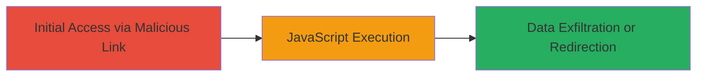

---
tags:
  - xss
  - reflected-xss
  - javascript-injection
  - revive-adserver
type: attack_chain
tools: []
tactics:
  - '[[Initial Access]]'
  - '[[Execution]]'
  - '[[Collection]]'
commands:
  - '[[commands/curl-exploit-reflected-xss-revive]]'
platforms:
  - Web
complexity: low
procedures:
  - '[[procedures/Exploit-Reflected-XSS-in-Revive-Adserver-Status-Parameter]]'
step_count: 1
techniques:
  - '[[JavaScript]]'
description: >-
  A single-step attack exploiting a reflected XSS vulnerability in the Revive
  Adserver admin panel by injecting malicious JavaScript through the 'status'
  parameter, allowing arbitrary code execution in the victim's browser.
skill_level: beginner
impact_level: medium
id: 74956081-639e-4eb1-8257-e840cac82731
created_at: '2025-12-14T03:16:20.140Z'
updated_at: '2025-12-14T03:16:20.140Z'
verified: false
validated: true
submitted: true
mitre_tactics:
  - '[[Initial Access]]'
  - '[[Execution]]'
  - '[[Collection]]'
mitre_techniques:
  - '[[JavaScript]]'
---
# Reflected XSS in Revive Adserver Admin Panel via Status Parameter

## Overview

This attack chain demonstrates a reflected cross-site scripting (XSS) vulnerability in Revive Adserver version 5.1.1. The 'status' parameter in the /admin/campaign-zone-zones.php endpoint is not properly sanitized, allowing attackers to inject arbitrary JavaScript. By crafting a malicious URL and delivering it via phishing or social engineering, an attacker can execute JavaScript in the victim's browser upon page load, potentially stealing session cookies or redirecting to malicious sites. The vulnerability was identified by testing the endpoint with payloads that reflect unescaped HTML and JavaScript back into the page.

## Chain Metrics Dashboard

| Metric | Value |
|--------|-------|
| Chain Status | Unverified |
| Total Steps | 1 |
| Execution Time | ~1 minute |
| Skill Level | Beginner |
| Complexity | Low |
| Impact Level | Medium |

## Attack Flow Visualization



## Prerequisites & Requirements

### Required Tools

- [[commands/curl-exploit-reflected-xss-revive]] (or a web browser for manual testing)

### Target Environment

- Revive Adserver version 5.1.1 or vulnerable equivalents
- Web platform with PHP backend
- Access to the admin panel endpoint (/admin/campaign-zone-zones.php)

### Initial Access Requirements

- No credentials required if the endpoint is publicly accessible; otherwise, valid admin session via phishing
- Network access to the target server
- Ability to deliver the malicious URL to the victim (e.g., email, social engineering)

## Detailed Attack Procedures

### Step 1: Inject Malicious Payload
procedure: [[procedures/Exploit-Reflected-XSS-in-Revive-Adserver-Status-Parameter]]

**Objective**: Deliver a crafted URL to the victim that injects and executes arbitrary JavaScript in their browser by exploiting the unsanitized 'status' parameter.

**Instructions**: Construct a URL targeting the vulnerable endpoint with a payload in the 'status' parameter. For testing, use [[commands/curl-exploit-reflected-xss-revive]] to simulate the request and observe the reflection:

```bash
curl -X GET "http://revive-adserver.loc/admin/campaign-zone-zones.php?_=&clientid=1&campaignid=1&status=available%22%3E%3Cimg%20src=1%20onerror=alert(document.domain)%3E&text=" -v
```

To deliver to a victim, encode the payload and send the full URL via phishing. The payload "available"> breaks out of the attribute and injects an onerror handler that executes JavaScript on load failure.

**Expected Output**: The server responds with HTML containing the reflected payload, e.g., a script tag or event handler that triggers alert(document.domain) or similar, confirming execution.

**Success Indicators**:
- JavaScript alert or console output executes in the browser
- Reflected payload visible in the response HTML without escaping
- Victim's cookies or session data potentially accessible via further payload customization (e.g., document.cookie exfiltration)

## Attack Chain Summary

### Key Achievements

1. Successful injection and execution of arbitrary JavaScript via the 'status' parameter
2. Potential theft of admin session cookies or redirection to attacker-controlled sites
3. Demonstration of impact through phishing delivery

## Technique & Tactic Coverage

### MITRE ATT&CK Techniques

- [[JavaScript]]

### MITRE ATT&CK Tactics

- [[Initial Access]]
- [[Execution]]
- [[Collection]]

---
*Last updated: 2023-10-01*
