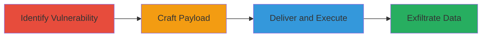

# Reflected XSS in Revive Adserver Admin Search via Compact Parameter

Multi-stage attack chain demonstrating a complete reflected XSS workflow in Revive Adserver 5.5.2, targeting the admin search functionality to inject and execute arbitrary JavaScript in an administrator's browser context.

## Chain Metrics Dashboard

| Metric | Value |
|--------|-------|
| Chain Status | Unverified |
| Total Steps | 3 |
| Execution Time | ~5 minutes |
| Skill Level | Intermediate |
| Complexity | Medium |
| Impact Level | High |

## Attack Flow Visualization

## Prerequisites & Requirements

### Required Tools

- Web browser for testing (e.g., Firefox Developer Tools)
- Optional: [[tools/Burp-Suite]] for URL manipulation

### Target Environment

- Revive Adserver 5.5.2 running on PHP web server
- Access to source code or live instance for inspection
- Administrative interface accessible

### Initial Access Requirements

- No prior credentials needed for identification and crafting
- Social engineering to trick admin into visiting malicious URL
- Network access to the target web application

## Detailed Attack Procedures

### Step 1: Identify the Vulnerable Endpoint
procedure: [[procedures/Identify-XSS-Vulnerability-in-Revive-Adserver]]

**Objective**: Locate the reflected XSS vulnerability by reviewing the source code of the admin search functionality, focusing on the 'compact' parameter handling.

**Instructions**: Access the Revive Adserver source files, specifically examine www/admin/admin-search.php and lib/templates/admin/layout/search.html. Note that the 'compact' parameter is registered globally using phpAds_registerGlobalUnslashed without sanitization and directly inserted into an HTML input field as <input type='hidden' name='compact' value='{$compact}'>. This allows attribute breakout and script injection.

**Expected Output**: Confirmation of unsanitized parameter usage in the template.

**Success Indicators**:
- Identification of direct HTML embedding without escaping
- Understanding of parameter flow from PHP to template

### Step 2: Craft Malicious Payload
procedure: [[procedures/Craft-XSS-Payload-for-Compact-Parameter]]

**Objective**: Develop a JavaScript payload that breaks out of the HTML attribute context to execute arbitrary code, such as alerting document cookies.

**Instructions**: Design a payload like compact=1'> to close the input tag prematurely and inject a script tag. Test the payload in a local or staging environment by appending it to the parameter in a search URL.

**Expected Output**: Payload that triggers JavaScript execution when reflected in the page.

**Success Indicators**:
- Payload successfully breaks out of the value attribute
- Script executes in the browser console without errors

### Step 3: Deliver the Malicious URL
procedure: [[procedures/Deliver-Reflected-XSS-Payload-via-Malicious-URL]]

**Objective**: Construct and deliver a full malicious URL to an administrator, resulting in XSS execution upon visit.

**Instructions**: Build the exploit URL: http://target-ip/www/admin/admin-search.php?affiliate=1&banner=1&campaign=1&client=1&compact=1'>&keyword=1&zone=1. Use social engineering (e.g., phishing email) to lure the admin to click the link. Upon visit, the payload reflects and executes in the browser.

**Expected Output**: JavaScript alert displaying session cookies or other malicious action.

**Success Indicators**:
- Victim's browser executes the injected script
- Cookies or session data are accessible to the attacker

## Attack Chain Summary

### Key Achievements

1. Successful identification of unsanitized input in admin interface
2. Crafting and testing of effective XSS payload
3. Delivery leading to JavaScript execution and potential session theft

## Technique & Tactic Coverage

### MITRE ATT&CK Techniques

- [[JavaScript]]

### MITRE ATT&CK Tactics

- [[Execution]]
- [[Collection]]

---
*Last updated: 2023-10-01T00:00:00Z*
