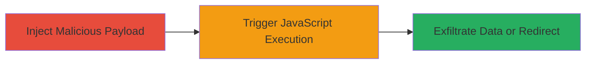

# Reflected XSS in Revive Adserver Admin Stats via setPerPage Parameter

Multi-stage attack chain demonstrating a complete reflected XSS workflow in Revive Adserver 5.1.0, allowing arbitrary JavaScript execution in the victim's browser through unsanitized HTML attribute injection.

## Chain Metrics Dashboard

| Metric | Value |
|--------|-------|
| Chain Status | Unverified |
| Total Steps | 2 |
| Execution Time | ~2 minutes |
| Skill Level | Intermediate |
| Complexity | Low |
| Impact Level | Medium |

## Attack Flow Visualization



## Prerequisites & Requirements

### Required Tools

- Web browser (e.g., Firefox for accesskey support)

### Target Environment

- Revive Adserver 5.1.0 running on PHP web server
- Access to /admin/stats.php endpoint (typically requires admin privileges or social engineering to lure victim)
- Open ports: 80/443 (HTTP/HTTPS)

### Initial Access Requirements

- Valid session or link to trick authenticated admin user into visiting the crafted URL
- No prior network access beyond internet connectivity

## Detailed Attack Procedures

### Step 1: Inject Malicious Payload
procedure: [[procedures/Inject-XSS-Payload-in-setPerPage-Parameter]]

**Objective**: Craft and deliver a URL with injected JavaScript payload in the setPerPage parameter to embed malicious HTML attributes in the admin stats page.

**Instructions**: Construct the vulnerable URL by appending the payload to the setPerPage parameter. The payload uses ' onclick=alert(document.domain) accesskey=X' to inject an onclick event tied to an accesskey. Encode special characters for URL safety (e.g., spaces as %20, quotes as %27).

Example crafted URL:

```url
http://revive-adserver.loc/admin/stats.php?statsBreakdown=day&listorder=key&orderdirection=up&day=&setPerPage=15%27%20onclick=alert(document.domain)%20accesskey=X%20&entity=global&breakdown=history&period_preset=last_month&period_start=01+December+2020&period_end=31+December+2020
```

Send this URL to the target victim (e.g., via phishing email) to have them access the /admin/stats.php page, where the payload reflects into a hidden input field.

**Expected Output**: The page loads with the injected attribute in the HTML, visible in source as <input ... setPerPage="15' onclick=alert(document.domain) accesskey=X ">, but no immediate execution.

**Success Indicators**:
- Page loads without errors
- Inspect element shows injected onclick and accesskey attributes

### Step 2: Trigger Execution
procedure: [[procedures/Trigger-XSS-Execution-via-Accesskey]]

**Objective**: Activate the injected JavaScript by simulating user interaction on the accesskey, executing the payload in the victim's browser context.

**Instructions**: Once the victim accesses the crafted URL and the page renders, press the accesskey combination to trigger the onclick event. In Firefox, use Alt+Shift+X; adjust for other browsers (e.g., Alt+X in Chrome).

No additional commands needed; this is a manual keyboard shortcut on the loaded page.

**Expected Output**: JavaScript alert pops up displaying the document.domain, confirming execution. In a real attack, replace alert() with code to steal cookies (e.g., fetch to attacker server) or redirect.

**Success Indicators**:
- Alert or scripted action executes
- Browser console logs no errors; network requests (if exfiltrating) succeed

## Attack Chain Summary

### Key Achievements

1. Successful injection of arbitrary JavaScript via reflected XSS without direct input sanitization
2. Bypassed basic filtering by leveraging HTML attributes like onclick and accesskey
3. Demonstrated potential for session hijacking or phishing redirection with user interaction

## Technique & Tactic Coverage

### MITRE ATT&CK Techniques

- [[JavaScript]]

### MITRE ATT&CK Tactics

- [[Execution]]
- [[Collection]]

---

*Last updated: 2024-01-01T00:00:00Z*
