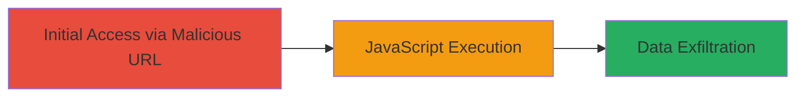

# Reflected XSS in Revive Adserver User Log Endpoint

Multi-stage attack chain demonstrating a complete attack workflow.

## Chain Metrics Dashboard

| Metric | Value |
|--------|-------|
| Chain Status | Unverified |
| Total Steps | 1 |
| Execution Time | ~1 minute |
| Skill Level | Beginner |
| Complexity | Low |
| Impact Level | Medium |

## Attack Flow Visualization



## Prerequisites & Requirements

### Required Tools

- Web browser (e.g., Chrome, Firefox)

### Target Environment

- Revive Adserver version 5.1.0 or vulnerable equivalent
- Web platform with PHP backend
- Access to the /admin/userlog-index.php endpoint (typically requires admin privileges, but reflected XSS can target any user viewing the log)

### Initial Access Requirements

- No credentials needed for crafting the URL, but victim must access the admin panel
- Network access to the target server
- No prior access needed beyond sending the malicious link to the victim

## Detailed Attack Procedures

### Step 1: Inject Malicious Payload
procedure: [[procedures/Exploit-Reflected-XSS-via-period_preset-Parameter]]

**Objective**: Craft and deliver a malicious URL that injects JavaScript via the period_preset parameter, leading to arbitrary code execution in the victim's browser.

**Instructions**: Construct a URL targeting the vulnerable endpoint with a payload that breaks out of the existing script context and injects a new script tag. The payload exploits insufficient sanitization, reflecting the input directly into the HTML without escaping.

Example malicious URL:

```url
http://revive-adserver.loc/admin/userlog-index.php?advertiserId=0&publisherId=0&period_preset=all_events%3C/script%3E%3Cscript%3Ealert(document.domain)%3C/script%3E%3Cscript%3E&period_start=&period_end=&setPerPage=10
```

Send this URL to a victim (e.g., via email or phishing). When the victim visits it in their browser, the payload decodes to `all_events</script><script>alert(document.domain)</script><script>`, closing the original script tag and executing the alert (replace with malicious code like cookie theft).

**Expected Output**: Upon visiting the URL, a JavaScript alert pops up showing the document domain, confirming execution. In a real attack, this could log cookies to an attacker-controlled server.

**Success Indicators**:
- JavaScript alert or equivalent payload executes in the browser
- Reflected payload visible in the page source without escaping
- Victim's session cookies can be exfiltrated if payload is modified accordingly

## Attack Chain Summary

### Key Achievements

1. Successful injection of arbitrary JavaScript via URL parameter
2. Execution of client-side code in the victim's browser context
3. Potential for session hijacking or phishing through cookie theft or redirects

## Technique & Tactic Coverage

### MITRE ATT&CK Techniques

- [[JavaScript]]

### MITRE ATT&CK Tactics

- [[Execution]]
- [[Collection]]

---
*Last updated: 2023-10-01T00:00:00Z*
